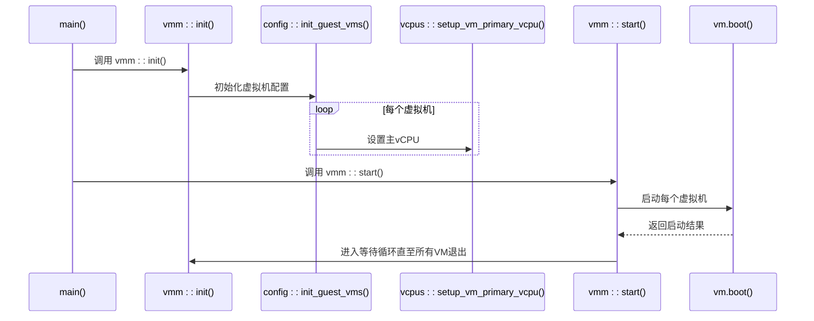
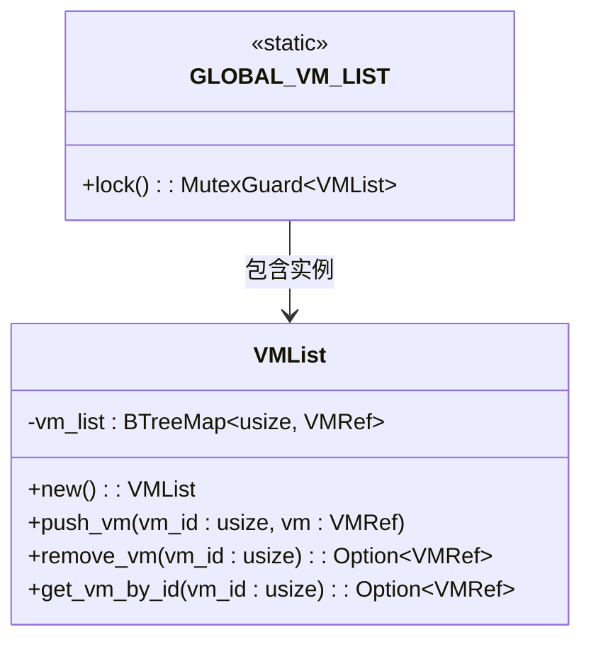
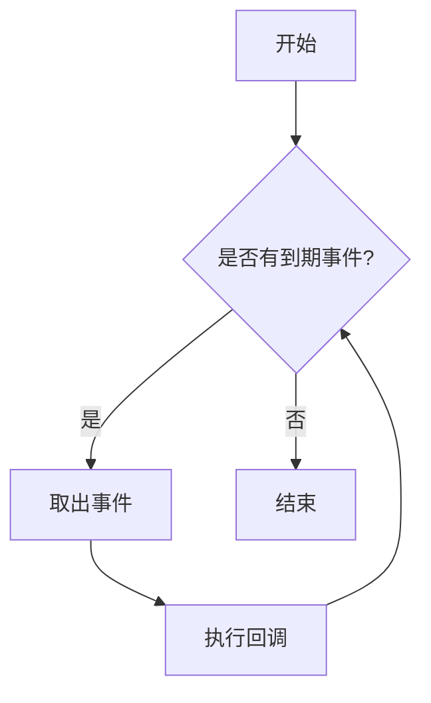
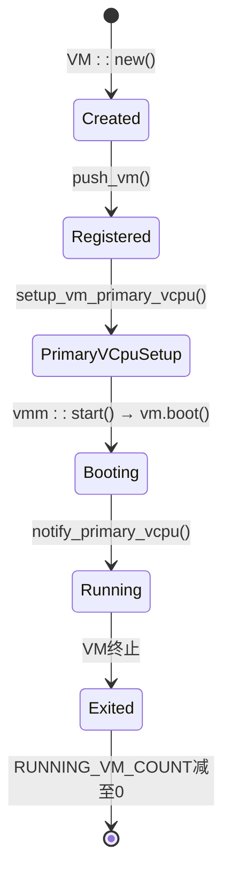

# VMM核心API

<cite>
**本文档中引用的文件**
- [mod.rs](file://src/vmm/mod.rs)
- [vm_list.rs](file://src/vmm/vm_list.rs)
- [timer.rs](file://src/vmm/timer.rs)
- [main.rs](file://src/main.rs)
- [config.rs](file://src/vmm/config.rs)
- [vcpus.rs](file://src/vmm/vcpus.rs)
</cite>

## 目录
1. [简介](#简介)
2. [初始化流程与系统启动时序](#初始化流程与系统启动时序)
3. [虚拟机列表管理接口](#虚拟机列表管理接口)
4. [定时器管理与时间虚拟化](#定时器管理与时间虚拟化)
5. [调用上下文与使用示例](#调用上下文与使用示例)
6. [生命周期协同机制](#生命周期协同机制)

## 简介
本文档详细描述了VMM（虚拟机监视器）模块的核心公共API，重点涵盖`vmm::init()`和`vmm::start()`函数的初始化流程与系统启动时序。文档化了`vm_list.rs`中的虚拟机列表管理接口，包括VM注册、查找和状态查询方法，并解释了`timer.rs`中定时器管理功能及虚拟机时间虚拟化的实现机制。每个API均提供函数签名、参数含义、返回值类型及可能的错误码，并结合`main.rs`中的调用上下文给出使用示例，说明这些接口如何协同支撑虚拟机生命周期的基础操作。

**Section sources**
- [mod.rs](file://src/vmm/mod.rs#L0-L127)
- [main.rs](file://src/main.rs#L0-L37)

## 初始化流程与系统启动时序

### `vmm::init()` 函数
该函数负责初始化VMM环境，创建所有虚拟机结构并为每个虚拟机设置主vCPU。

- **函数签名**: `pub fn init()`
- **功能描述**:
  1. 调用 `config::init_guest_vms()` 根据配置文件初始化客户虚拟机。
  2. 遍历虚拟机列表，调用 `vcpus::setup_vm_primary_vcpu(vm)` 为每个虚拟机设置主vCPU并生成相应的任务。
- **执行时机**: 在内核启动后由 `main.rs` 中的 `main()` 函数调用。

### `vmm::start()` 函数
该函数启动VMM并引导所有已配置的虚拟机运行。

- **函数签名**: `pub fn start()`
- **功能描述**:
  1. 遍历虚拟机列表，调用每个虚拟机的 `boot()` 方法尝试启动。
  2. 若启动成功，则通过 `vcpus::notify_primary_vcpu(vm.id())` 通知主vCPU开始执行，并递增运行中的虚拟机计数。
  3. 使用等待队列阻塞主线程，直到所有虚拟机停止运行。
- **同步机制**: 利用原子变量 `RUNNING_VM_COUNT` 和等待队列 `VMM` 实现多虚拟机运行状态的监控与退出控制。



**Diagram sources**
- [mod.rs](file://src/vmm/mod.rs#L35-L92)
- [main.rs](file://src/main.rs#L30-L35)

**Section sources**
- [mod.rs](file://src/vmm/mod.rs#L35-L92)
- [main.rs](file://src/main.rs#L30-L35)

## 虚拟机列表管理接口

### 接口概述
`vm_list.rs` 提供全局线程安全的虚拟机列表管理功能，基于 `BTreeMap<usize, VMRef>` 存储，通过自旋锁保护访问。

### 核心API

#### `push_vm(vm: VMRef)`
- **功能**: 将指定虚拟机添加到全局列表。
- **参数**: `vm` - 虚拟机引用对象。
- **行为**: 若ID已存在则记录警告并不插入。
- **线程安全**: 使用 `Mutex` 保证并发安全。

#### `get_vm_by_id(vm_id: usize) -> Option<VMRef>`
- **功能**: 根据虚拟机ID获取其引用。
- **参数**: `vm_id` - 目标虚拟机唯一标识符。
- **返回值**: 成功返回 `Some(VMRef)`，否则 `None`。

#### `get_vm_list() -> Vec<VMRef>`
- **功能**: 获取当前所有虚拟机的克隆引用列表。
- **用途**: 用于批量操作或遍历所有运行中虚拟机。



**Diagram sources**
- [vm_list.rs](file://src/vmm/vm_list.rs#L0-L116)

**Section sources**
- [vm_list.rs](file://src/vmm/vm_list.rs#L0-L116)

## 定时器管理与时间虚拟化

### 模块职责
`timer.rs` 实现VMM级别的定时器管理，支持高精度定时事件注册与回调处理，服务于虚拟机时间虚拟化需求。

### 核心API

#### `init_percpu()`
- **功能**: 初始化每CPU核心的定时器列表。
- **调用位置**: 在 `hal::enable_virtualization()` 中为每个核心调用。
- **数据结构**: 使用 `LazyInit<SpinNoIrq<TimerList<VmmTimerEvent>>>` 实现每核惰性初始化。

#### `register_timer<F>(deadline: u64, handler: F) -> usize`
- **功能**: 注册一个在指定截止时间触发的定时器。
- **参数**:
  - `deadline`: 绝对时间戳（纳秒）。
  - `handler`: 一次性回调函数。
- **返回值**: 唯一令牌（token），可用于后续取消。
- **内部机制**: 将用户闭包包装为 `VmmTimerEvent` 并插入红黑树组织的定时器队列。

#### `cancel_timer(token: usize)`
- **功能**: 取消已注册的定时器。
- **参数**: `token` - 由 `register_timer` 返回的唯一标识。

#### `check_events()`
- **功能**: 检查并处理所有到期的定时器事件。
- **调用时机**: 通常在中断上下文或调度点调用。
- **执行方式**: 循环调用 `expire_one()` 直至无更多到期事件。



**Diagram sources**
- [timer.rs](file://src/vmm/timer.rs#L0-L113)

**Section sources**
- [timer.rs](file://src/vmm/timer.rs#L0-L113)
- [mod.rs](file://src/vmm/mod.rs#L14-L15)

## 调用上下文与使用示例

### 主程序入口 (`main.rs`)
```rust
fn main() {
    logo::print_logo();
    info!("Starting virtualization...");
    hal::enable_virtualization(); // 包括 init_timer_percpu()

    vmm::init();   // 创建VM并设置主vCPU
    vmm::start();  // 启动所有VM并等待退出
}
```

### 典型使用场景
1. **虚拟机创建流程**:
   - `config::init_guest_vms()` → `VM::new(config)` → `push_vm(vm)`
2. **主vCPU启动流程**:
   - `vmm::init()` → `vcpus::setup_vm_primary_vcpu()` → 创建任务并加入等待队列
3. **定时器使用示例**:
   ```rust
   let token = timer::register_timer(deadline_ns, || {
       info!("Timer expired!");
   });
   // ... later
   timer::cancel_timer(token);
   ```

**Section sources**
- [main.rs](file://src/main.rs#L0-L37)
- [config.rs](file://src/vmm/config.rs#L164-L283)
- [vcpus.rs](file://src/vmm/vcpus.rs#L218-L366)

## 生命周期协同机制

### 协同工作流程
各组件通过以下方式共同支撑虚拟机全生命周期管理：

1. **配置解析层** (`config.rs`)：读取 `.toml` 配置，创建 `VM` 实例并完成内存、镜像加载。
2. **列表管理层** (`vm_list.rs`)：集中维护所有 `VMRef`，提供统一访问入口。
3. **CPU调度层** (`vcpus.rs`)：将vCPU映射为ArceOS任务，实现调度与运行控制。
4. **时间管理层** (`timer.rs`)：提供精确计时能力，支持虚拟中断注入与周期性服务。
5. **启动协调层** (`mod.rs`)：串联上述模块，确保按序初始化并最终进入稳定运行态。

### 状态流转图


**Diagram sources**
- [mod.rs](file://src/vmm/mod.rs#L0-L92)
- [config.rs](file://src/vmm/config.rs#L164-L283)
- [vcpus.rs](file://src/vmm/vcpus.rs#L218-L366)

**Section sources**
- [mod.rs](file://src/vmm/mod.rs#L0-L92)
- [config.rs](file://src/vmm/config.rs#L164-L283)
- [vcpus.rs](file://src/vmm/vcpus.rs#L218-L366)