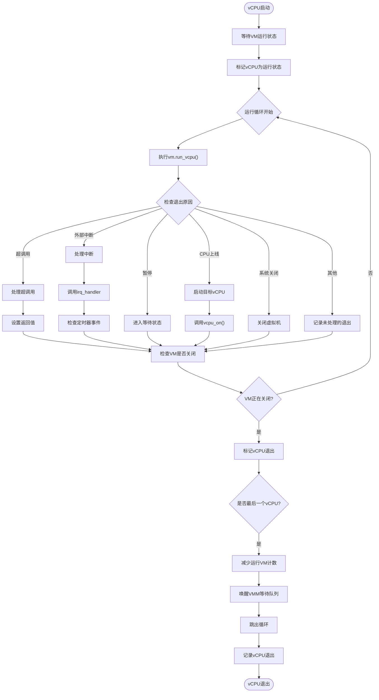
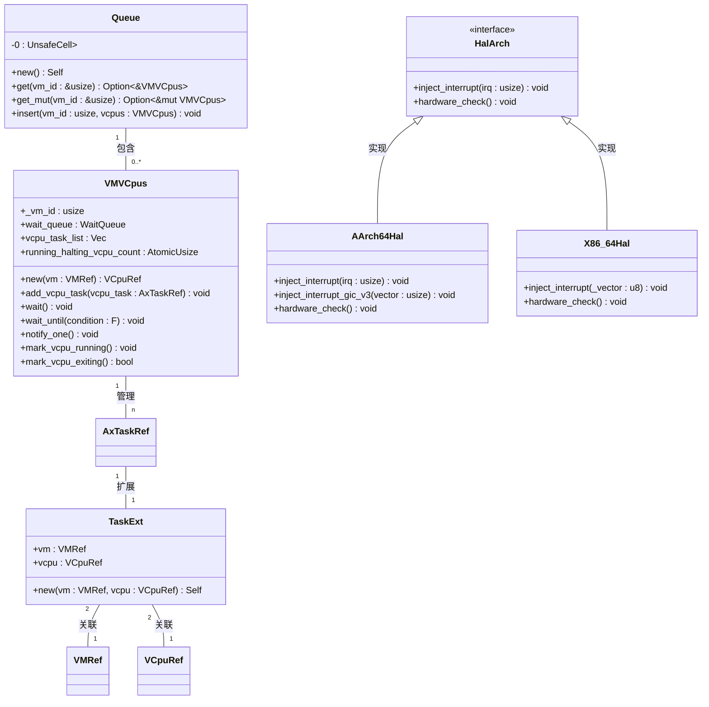
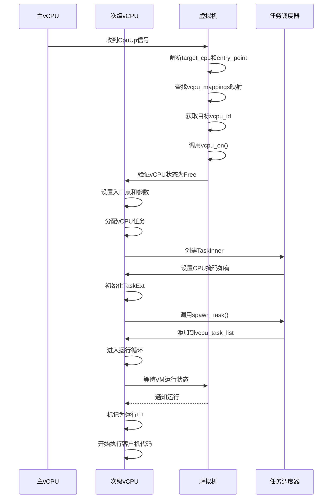

# vCPU管理API

<cite>
**本文档中引用的文件**
- [vcpus.rs](file://src/vmm/vcpus.rs)
- [hal/arch/aarch64/api.rs](file://src/hal/arch/aarch64/api.rs)
- [hal/arch/x86_64/mod.rs](file://src/hal/arch/x86_64/mod.rs)
- [hal/mod.rs](file://src/hal/mod.rs)
- [task.rs](file://src/task.rs)
</cite>

## 目录
1. [vCPU创建与任务初始化](#vcpu创建与任务初始化)
2. [vCPU运行循环与状态切换](#vcpu运行循环与状态切换)
3. [VCpuRef安全访问模式](#vcpuref安全访问模式)
4. [HAL层寄存器上下文保存与恢复](#hal层寄存器上下文保存与恢复)
5. [多核SMP启动序列](#多核smp启动序列)
6. [异常注入与拦截接口](#异常注入与拦截接口)

## vCPU创建与任务初始化

vCPU的创建过程由`setup_vm_primary_vcpu`函数启动，该函数为虚拟机设置主vCPU并初始化其等待队列和任务列表。系统首先通过`VMVCpus::new`创建一个包含等待队列、vCPU任务列表和运行计数器的结构体，然后为每个vCPU分配一个Arceos任务。

vCPU任务的分配通过`alloc_vcpu_task`函数完成，该函数创建一个以`vcpu_run`为入口函数的任务，并为其分配256 KiB的内核栈空间。如果vCPU有指定的物理CPU集，则会初始化相应的CPU掩码。任务扩展数据`TaskExt`被初始化以包含对VM和vCPU的引用，确保任务能够访问其所属的虚拟机和虚拟CPU资源。

**Section sources**
- [vcpus.rs](file://src/vmm/vcpus.rs#L254-L298)
- [vcpus.rs](file://src/vmm/vcpus.rs#L300-L335)
- [task.rs](file://src/task.rs#L0-L18)

## vCPU运行循环与退出处理

vCPU的主要执行流程在`vcpu_run`函数中实现，这是一个无限循环，持续运行vCPU并处理各种退出原因。当vCPU首次启动时，它会等待虚拟机进入运行状态，然后标记自己为正在运行。

运行循环的核心是`vm.run_vcpu(vcpu_id)`调用，该调用返回不同的退出原因，包括超调用、外部中断、暂停、CPU下线等。对于每种退出原因，都有相应的处理逻辑：超调用会被转发给`HyperCall`处理器；外部中断会触发中断处理程序；暂停状态会使vCPU进入等待状态；而系统关闭信号会导致虚拟机关闭。

当检测到虚拟机正在关闭时，vCPU会调用`mark_vcpu_exiting`减少运行计数，如果是最后一个退出的vCPU，则会减少运行中的虚拟机总数并唤醒VMM等待队列。

**Diagram sources**
- [vcpus.rs](file://src/vmm/vcpus.rs#L329-L505)

**Section sources**
- [vcpus.rs](file://src/vmm/vcpus.rs#L329-L505)

## VCpuRef安全访问模式

`VCpuRef`类型通过Arc智能指针实现线程安全的共享访问，确保多个线程可以安全地引用同一个vCPU实例。系统通过`with_vcpu_task`函数提供了一种安全的访问模式，该函数接受一个闭包并在获取到vCPU任务引用后执行该闭包。

这种设计模式避免了直接暴露vCPU引用可能带来的竞态条件，而是通过受控的访问路径来操作vCPU资源。`TaskExt`结构体作为任务扩展数据，包含了对VM和VCPU的引用，这些引用在任务创建时被初始化，并在整个任务生命周期内保持有效。

跨线程传递遵循Rust的所有权规则，通过克隆Arc引用来实现共享所有权，而不是转移所有权。这种方式既保证了内存安全，又实现了高效的资源共享。

**Section sources**
- [vcpus.rs](file://src/vmm/vcpus.rs#L294-L298)
- [task.rs](file://src/task.rs#L0-L18)

## HAL层寄存器上下文保存与恢复

不同平台下的vCPU寄存器上下文保存与恢复机制存在显著差异。在ARM64架构中，`inject_interrupt`函数负责将虚拟中断注入到vCPU，它通过GIC驱动程序操作虚拟中断控制器。对于GICv2，使用`gic.hypervisor_interface()`获取超管理模式接口并设置虚拟中断；对于GICv3，则直接操作ICH寄存器。

x86_64架构的实现相对简单，`inject_interrupt`函数目前为空实现，表明该平台的中断注入机制可能在其他地方实现或尚未完全支持。这种差异反映了不同硬件架构在虚拟化支持方面的特性：ARM64需要显式管理虚拟中断控制器状态，而x86_64可能依赖于更底层的硬件辅助虚拟化特性。

**Diagram sources**
- [vcpus.rs](file://src/vmm/vcpus.rs#L72-L144)
- [hal/arch/aarch64/mod.rs](file://src/hal/arch/aarch64/mod.rs#L0-L49)
- [hal/arch/x86_64/mod.rs](file://src/hal/arch/x86_64/mod.rs#L0-L3)

**Section sources**
- [hal/arch/aarch64/mod.rs](file://src/hal/arch/aarch64/mod.rs#L0-L49)
- [hal/arch/x86_64/mod.rs](file://src/hal/arch/x86_64/mod.rs#L0-L3)

## 多核SMP启动序列

多核SMP场景下的vCPU启动序列始于主vCPU的初始化，随后通过`CpuUp`退出原因触发次级vCPU的启动。当一个vCPU收到`CpuUp`信号时，它会解析目标物理CPU ID，查找对应的vCPU ID，然后调用`vcpu_on`函数启动目标vCPU。

启动过程包括验证vCPU处于空闲状态、设置入口点和参数、分配任务并将其添加到VM的vCPU任务列表中。系统通过`vcpu_mappings`配置获取vCPU与物理CPU的映射关系，确保正确的亲和性设置。每个新启动的vCPU都会经历相同的初始化流程，包括延迟启动、等待VM运行状态和标记为运行中。

**Diagram sources**
- [vcpus.rs](file://src/vmm/vcpus.rs#L424-L457)
- [vcpus.rs](file://src/vmm/vcpus.rs#L218-L258)

**Section sources**
- [vcpus.rs](file://src/vmm/vcpus.rs#L395-L422)
- [vcpus.rs](file://src/vmm/vcpus.rs#L218-L258)

## 异常注入与拦截接口

异常注入接口主要通过`inject_interrupt`函数族实现，允许hypervisor向特定vCPU注入虚拟中断。在ARM64平台上，这涉及复杂的GICv2/v3寄存器操作，包括查找空闲列表寄存器、设置虚拟中断ID和状态位。系统会检查中断是否已挂起或激活，避免重复注入。

异常拦截则通过vCPU运行循环中的退出原因处理实现。当发生外部中断时，系统调用`axhal::irq::irq_handler`处理中断并向量分发。发送IPI（处理器间中断）时，如果目标是当前vCPU，则直接注入中断；否则通过`vm.inject_interrupt_to_vcpu`向目标vCPU发送中断。

这些接口共同构成了完整的异常处理框架，使hypervisor能够精确控制虚拟机的中断行为，实现高效的虚拟化性能。

**Section sources**
- [hal/arch/aarch64/mod.rs](file://src/hal/arch/aarch64/mod.rs#L0-L49)
- [vcpus.rs](file://src/vmm/vcpus.rs#L459-L482)