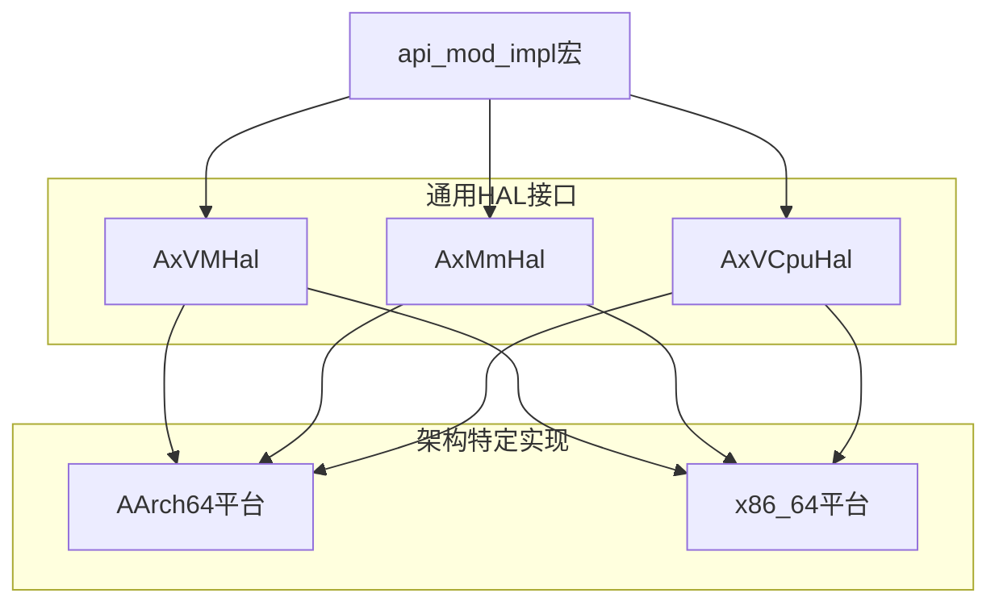
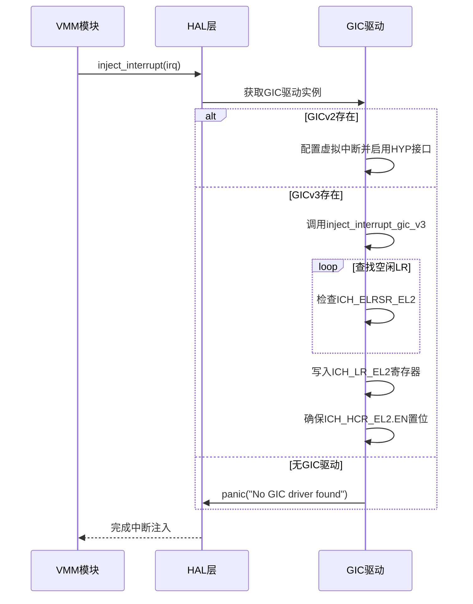
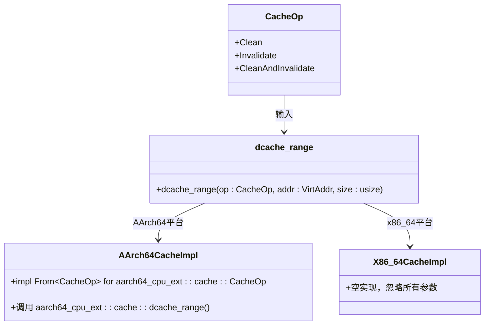

# 硬件抽象层API

<cite>
**本文档中引用的文件**  
- [api.rs](file://src/hal/arch/aarch64/api.rs)
- [cache.rs](file://src/hal/arch/aarch64/cache.rs)
- [cache.rs](file://src/hal/arch/x86_64/cache.rs)
- [mod.rs](file://src/hal/arch/aarch64/mod.rs)
- [mod.rs](file://src/hal/arch/x86_64/mod.rs)
- [mod.rs](file://src/hal/mod.rs)
</cite>

## 目录
1. [引言](#引言)
2. [HAL架构与接口路由机制](#hal架构与接口路由机制)
3. [异常向量与中断控制器访问接口](#异常向量与中断控制器访问接口)
4. [缓存管理API跨平台抽象设计](#缓存管理api跨平台抽象设计)
5. [内存屏障与原子操作保证](#内存屏障与原子操作保证)
6. [新平台HAL接口实现契约](#新平台hal接口实现契约)

## 引言
硬件抽象层（HAL）为虚拟化监控器（Hypervisor）提供了一组统一的底层硬件操作接口，屏蔽了不同架构间的差异。本系统通过静态调度表将通用调用路由到底层平台适配层，确保在AArch64和x86_64等不同平台上的一致性行为。核心功能包括异常处理、中断注入、缓存控制及电源管理指令封装。

## HAL架构与接口路由机制

**图示来源**
- [mod.rs](file://src/hal/mod.rs#L0-L282)

**节来源**
- [mod.rs](file://src/hal/mod.rs#L0-L282)

## 异常向量与中断控制器访问接口

HAL层通过`api.rs`暴露架构特定的原语，用于异常向量安装和中断控制器访问。在AArch64平台上，这些接口直接与GIC（通用中断控制器）驱动交互，支持GICv2和GICv3两种模式。

关键接口包括：
- `hardware_inject_virtual_interrupt`：向虚拟CPU注入中断
- `read_vgicd_typer`：读取虚拟GIC分发器TYPER寄存器
- `read_vgicd_iidr`：读取IIDR寄存器以识别GIC版本
- `get_host_gicd_base` 和 `get_host_gicr_base`：获取物理GIC寄存器基地址

中断注入流程涉及查找空闲列表寄存器（List Register），检查状态位，并写入虚拟中断ID和状态字段。若无空闲LR，则尝试复用无效条目或触发panic。

**图示来源**
- [api.rs](file://src/hal/arch/aarch64/api.rs#L0-L75)
- [mod.rs](file://src/hal/arch/aarch64/mod.rs#L0-L154)

**节来源**
- [api.rs](file://src/hal/arch/aarch64/api.rs#L0-L75)
- [mod.rs](file://src/hal/arch/aarch64/mod.rs#L0-L154)

## 缓存管理API跨平台抽象设计

缓存管理API在`cache.rs`中实现了跨平台抽象，定义了统一的操作枚举`CacheOp`，包含清理（Clean）、无效化（Invalidate）和清理并无效化（CleanAndInvalidate）三种操作。

### AArch64实现
在AArch64架构下，`dcache_range`函数将`CacheOp`转换为底层CPU扩展库中的对应操作，并调用`aarch64_cpu_ext::cache::dcache_range`执行实际的缓存操作。该实现充分利用了ARM架构提供的数据缓存维护指令。

### x86_64实现
相比之下，x86_64平台的`dcache_range`为空实现，参数被标记为未使用（`_op`, `_addr`, `_size`）。这表明当前系统假设x86_64平台的缓存一致性由硬件自动管理，无需显式软件干预。

**图示来源**
- [cache.rs](file://src/hal/arch/aarch64/cache.rs#L0-L17)
- [cache.rs](file://src/hal/arch/x86_64/cache.rs#L0-L5)
- [mod.rs](file://src/hal/mod.rs#L0-L282)

**节来源**
- [cache.rs](file://src/hal/arch/aarch64/cache.rs#L0-L17)
- [cache.rs](file://src/hal/arch/x86_64/cache.rs#L0-L5)

## 内存屏障与原子操作保证

HAL层通过依赖ArceOS内核模块中的`axhal`组件来保证内存屏障与原子操作的正确性。虽然具体实现未在当前代码片段中展示，但其设计原则是利用各架构提供的内存屏障指令（如AArch64的`DSB`, `DMB`和x86_64的`MFENCE`）以及原子指令（如`LDXR/STXR`或`CMPXCHG`）来确保多核环境下的数据一致性。

在虚拟化上下文中，这些原语对于同步虚拟机监控器与客户操作系统之间的共享数据结构至关重要，尤其是在IVC（Inter-VM Communication）通道建立和超调用处理过程中。

## 新平台HAL接口实现契约

要在新平台上实现HAL接口，必须遵循以下契约要求：

1. **提供架构特定模块**：在`src/hal/arch/<new_arch>/mod.rs`中实现必要的函数，如`hardware_check`、`inject_interrupt`等。
2. **实现缓存操作**：根据目标架构特性，在`cache.rs`中实现`dcache_range`函数，或将不支持的操作留空。
3. **中断控制器集成**：确保能够访问并操作本地中断控制器（如APIC、GIC等），提供读取寄存器和注入中断的能力。
4. **硬件兼容性检查**：在`hardware_check`函数中验证关键硬件特性（如页表级数、虚拟化支持等）是否满足运行时需求。
5. **静态调度表注册**：使用`#[axvisor_api::api_mod_impl]`宏将新实现的接口绑定到对应的API模块上，确保调用能正确路由。

此外，所有平台都应保持对`AxVMHal`、`AxMmHal`和`AxVCpuHal`等核心trait的一致实现，以维持上层VMM逻辑的可移植性。

**节来源**
- [mod.rs](file://src/hal/mod.rs#L0-L282)
- [mod.rs](file://src/hal/arch/aarch64/mod.rs#L0-L154)
- [mod.rs](file://src/hal/arch/x86_64/mod.rs#L0-L4)