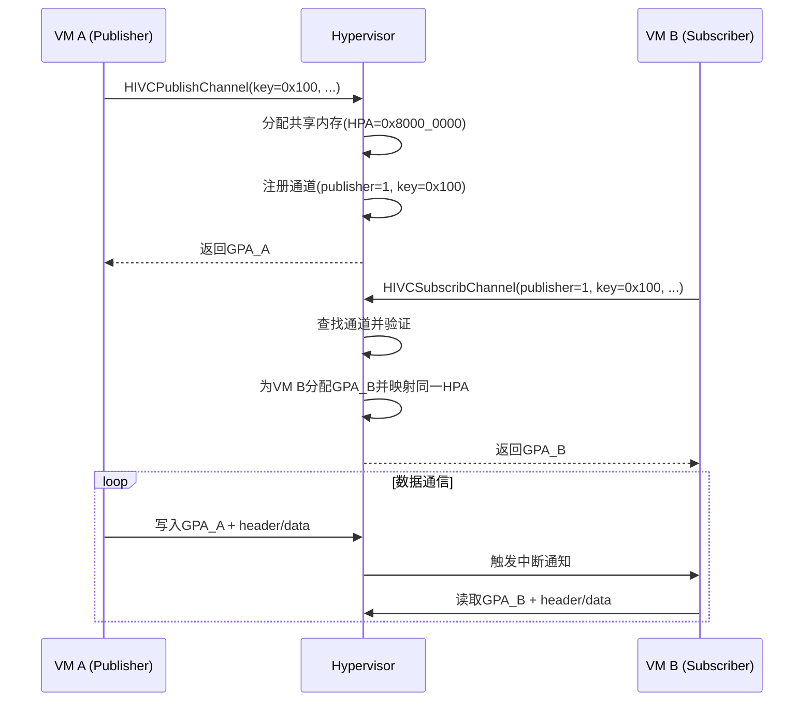
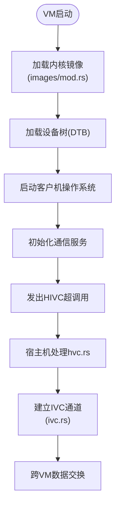

# 通信机制API

<cite>
**本文档引用的文件**
- [hvc.rs](file://src/vmm/hvc.rs)
- [ivc.rs](file://src/vmm/ivc.rs)
- [mod.rs](file://src/vmm/images/mod.rs)
</cite>

## 目录
1. [引言](#引言)
2. [超调用机制实现](#超调用机制实现)
3. [跨虚拟机通信（IVC）通道机制](#跨虚拟机通信ivc通道机制)
4. [客户机镜像加载与IVC初始化](#客户机镜像加载与ivc初始化)
5. [安全边界与权限校验](#安全边界与权限校验)
6. [总结](#总结)

## 引言
本文档详细描述了`axvisor`中基于`hvc.rs`、`ivc.rs`和`images/mod.rs`模块实现的虚拟化通信机制。重点涵盖超调用（Hypercall）请求处理流程、服务分发逻辑、权限控制策略，以及跨虚拟机通信（Inter-VM Communication, IVC）的数据通道建立方式、帧格式定义、同步原语和中断触发机制。同时结合客户机镜像加载过程，说明IVC端点如何在虚拟机启动时被初始化并暴露给客户操作系统。

## 超调用机制实现

`hvc.rs`模块实现了宿主机与客户机之间通过超调用接口进行交互的核心逻辑。该机制允许客户机以受控方式请求宿主机执行特定操作，如创建或订阅共享内存通道。

### HyperCall 结构体与初始化
`HyperCall`结构体封装了一次超调用请求所需的所有上下文信息，包括发起调用的vCPU引用、所属虚拟机引用、调用码（`code`）及最多六个通用参数（`args`）。构造函数`new()`负责将原始u64类型的调用码转换为类型安全的`HyperCallCode`枚举，并验证其合法性。

### 请求处理与服务分发
`execute()`方法根据不同的`HyperCallCode`值分发至相应的处理分支，当前支持以下四种核心hypercall编号及其功能：

| 超调用编号 | 功能接口 | 输入参数格式 | 输出参数格式 | 安全边界 |
|------------|--------|-------------|-------------|---------|
| `HIVCPublishChannel` | 发布一个IVC共享内存通道 | `[key: usize, shm_base_gpa_ptr: GPA*, shm_size_ptr: usize*]` | 写入`shm_base_gpa_ptr`返回分配的GPA，写入`shm_size_ptr`返回实际大小 | 仅允许VM自身发布通道；共享内存大小限制为4KB以内 |
| `HIVCUnPublishChannel` | 撤销已发布的IVC通道 | `[key: usize]` | 无输出 | 必须由原发布者VM调用；若存在订阅者则仅标记为不可用 |
| `HIVCSubscribChannel` | 订阅另一VM发布的IVC通道 | `[publisher_vm_id: usize, key: usize, shm_base_gpa_ptr: GPA*, shm_size_ptr: usize*]` | 写入指针返回映射后的本地GPA和大小 | 需目标VM已发布对应key的通道；需有足够的地址空间用于映射 |
| `HIVCUnSubscribChannel` | 取消对远程IVC通道的订阅 | `[publisher_vm_id: usize, key: usize]` | 无输出 | 必须是有效的订阅关系才能取消 |

所有hypercall均通过严格的输入验证和错误处理确保系统稳定性，非法调用码会返回`Unsupported`错误，无效参数则返回`InvalidInput`。

**本节来源**
- [hvc.rs](file://src/vmm/hvc.rs#L1-L148)

## 跨虚拟机通信ivc通道机制

`ivc.rs`模块提供了完整的跨虚拟机通信基础设施，基于全局静态哈希表管理所有活动的IVC通道，并提供线程安全的操作接口。

### IVC通道建立流程
IVC通信采用“发布-订阅”模型：
1. **发布者**调用`HIVCPublishChannel`，指定唯一`key`标识通道。
2. 宿主机为其分配一页物理内存作为共享区域，并记录其宿主物理地址（HPA）和客户机物理地址（GPA）。
3. 通道元数据注册至全局`IVC_CHANNELS`映射中，键为`(publisher_vm_id, key)`。
4. **订阅者**调用`HIVCSubscribChannel`，提供发布者ID和`key`。
5. 宿主机查找对应通道，为订阅者分配本地GPA并将映射关系加入该通道的`subscriber_vms`列表。
6. 双方通过映射到各自地址空间的同一块物理内存进行数据交换。



**图示来源**
- [ivc.rs](file://src/vmm/ivc.rs#L1-L285)

### 数据帧格式
每个IVC通道的共享内存起始处包含一个固定格式的头部`IVCChannelHeader`，其布局如下：

```rust
#[repr(C)]
struct IVCChannelHeader {
    publisher_id: u64,  // 发布者VM ID
    key: u64,           // 通道唯一标识
}
```

紧随其后的是可变长度的数据区域，供应用程序自定义协议使用。此设计保证了通信双方的身份可验证性。

### 读写同步原语与中断触发机制
IVC本身不提供内置的同步机制，依赖客户机操作系统实现基于轮询或中断的通知机制：
- **写操作完成后**，发布者可通过其他手段（如虚拟中断）通知订阅者有新数据到达。
- **读操作前**，订阅者应检查头部信息确认数据完整性。
- 实际中断触发逻辑通常集成在设备模拟层或专用中断控制器中，不在`ivc.rs`直接实现。

当最后一个订阅者取消订阅且通道已被撤销时，底层共享内存页会被自动释放（通过`Drop` trait）。

**本节来源**
- [ivc.rs](file://src/vmm/ivc.rs#L1-L285)

## 客户机镜像加载与ivc初始化

`images/mod.rs`模块负责客户机内核及其他镜像文件的加载，虽然它本身不直接初始化IVC通道，但为IVC的运行奠定了基础环境。

### 镜像加载流程
1. `ImageLoader::load()`根据配置决定从内存还是文件系统加载镜像。
2. 支持加载内核、BIOS、DTB（设备树）和ramdisk等组件。
3. 所有镜像被复制到客户机的主内存区域（`VMMemoryRegion`），并通过缓存清理确保一致性。

### IVC端点的暴露时机
IVC通道并非在镜像加载阶段创建，而是在客户机操作系统启动后，通过执行特定hypercall指令动态建立。典型流程如下：
1. 客户机操作系统完成基本初始化。
2. 用户空间服务或驱动程序决定与其他VM通信。
3. 通过SBI（RISC-V）或SMCCC（AArch64）等标准接口陷入宿主机，发起`HIVCPublishChannel`或`HIVCSubscribChannel`调用。
4. 宿主机执行相应逻辑，完成通道建立或订阅。

因此，`images/mod.rs`的作用是确保客户机具备执行这些hypercall的能力——即正确加载了支持IVC协议的内核或用户程序。



**图示来源**
- [mod.rs](file://src/vmm/images/mod.rs#L1-L337)
- [hvc.rs](file://src/vmm/hvc.rs#L1-L148)
- [ivc.rs](file://src/vmm/ivc.rs#L1-L285)

**本节来源**
- [mod.rs](file://src/vmm/images/mod.rs#L1-L337)

## 安全边界与权限校验

整个通信机制设计遵循最小权限原则，关键安全措施包括：
- **调用码验证**：`HyperCall::new()`确保只有预定义的`HyperCallCode`值被接受。
- **所有权检查**：`HIVCUnPublishChannel`只能由原始发布者调用。
- **访问控制**：`HIVCSubscribChannel`要求明确指定发布者VM ID和密钥，防止任意访问。
- **资源隔离**：每个IVC通道的共享内存独立分配，避免越界访问。
- **生命周期管理**：利用Rust的RAII机制，在`IVCChannel`析构时自动释放物理内存。

此外，共享内存映射时设置了`READ \| WRITE`权限标志，禁止执行权限，防范代码注入攻击。

**本节来源**
- [hvc.rs](file://src/vmm/hvc.rs#L1-L148)
- [ivc.rs](file://src/vmm/ivc.rs#L1-L285)

## 总结
`axvisor`中的通信机制通过`hvc.rs`提供标准化的超调用接口，`ivc.rs`实现高效安全的跨虚拟机共享内存通信，并由`images/mod.rs`保障客户机环境的正确初始化。三者协同工作，构建了一个灵活、可靠且安全的虚拟化通信框架，适用于多VM协作场景下的高性能数据交换需求。