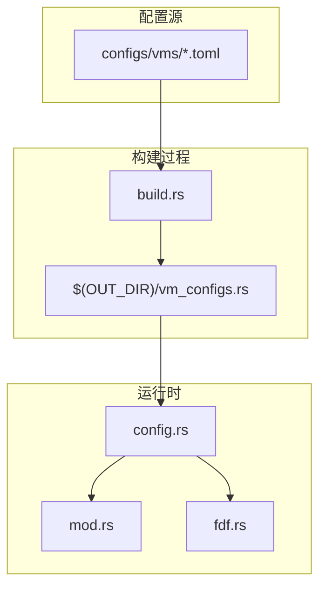
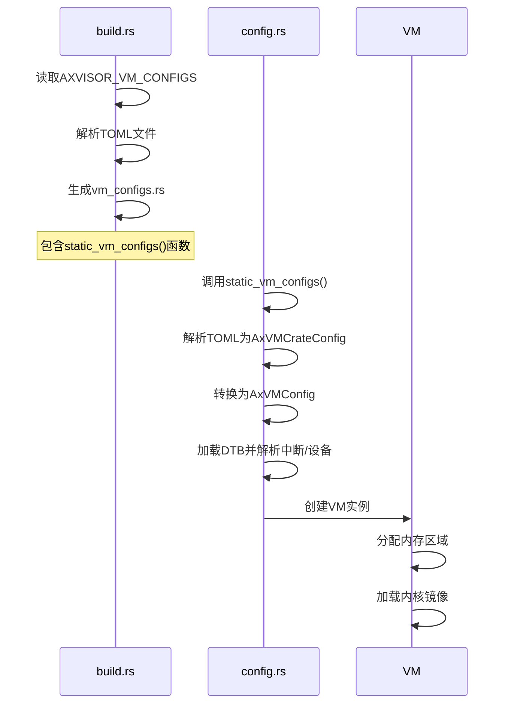
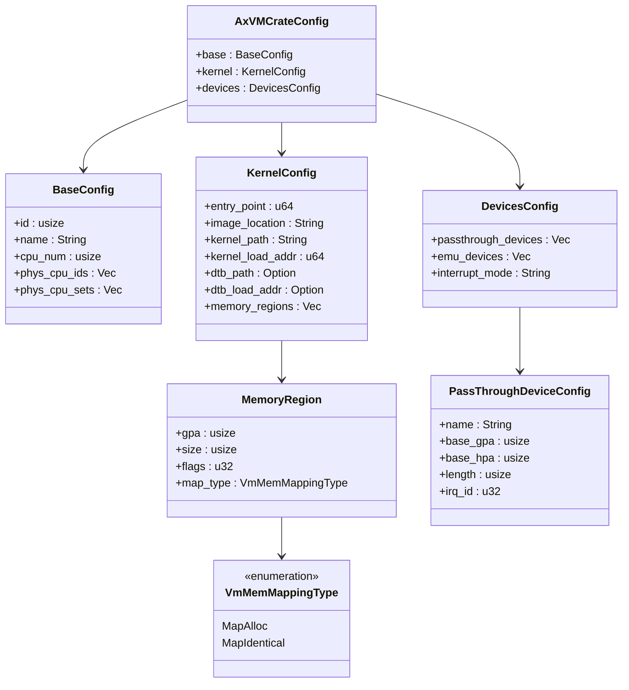
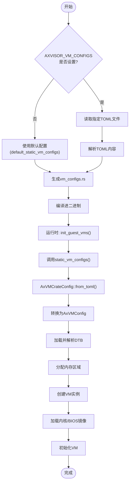

# 配置管理API

<cite>
**本文档引用的文件**
- [config.rs](file://src/vmm/config.rs)
- [build.rs](file://build.rs)
- [mod.rs](file://src/vmm/mod.rs)
- [fdt.rs](file://src/vmm/fdt.rs)
- [linux.rs](file://src/vmm/images/linux.rs)
- [nimbos-aarch64-qemu-smp1.toml](file://configs/vms/nimbos-aarch64-qemu-smp1.toml)
- [linux-aarch64-qemu-smp1.toml](file://configs/vms/linux-aarch64-qemu-smp1.toml)
</cite>

## 目录
1. [简介](#简介)
2. [项目结构](#项目结构)
3. [核心组件](#核心组件)
4. [架构概述](#架构概述)
5. [详细组件分析](#详细组件分析)
6. [依赖分析](#依赖分析)
7. [性能考虑](#性能考虑)
8. [故障排除指南](#故障排除指南)
9. [结论](#结论)

## 简介
本文档深入文档化`config.rs`中定义的虚拟机配置数据结构，重点分析`AxVMCrateConfig`等关键类型。涵盖配置字段语义、默认值、约束条件以及从TOML文件到内存对象的解析流程。解释`build.rs`如何参与静态配置生成，并说明各配置项对虚拟机行为的影响，如CPU拓扑、内存布局和设备映射。提供合法配置示例和常见错误排查指南，确保开发者能正确构造VM实例。

## 项目结构
项目采用模块化设计，主要配置相关文件位于`src/vmm/`目录下，TOML格式的虚拟机配置文件存放在`configs/vms/`目录中。构建脚本`build.rs`负责将配置文件编译进最终二进制。



**Diagram sources**
- [build.rs](file://build.rs#L1-L310)
- [config.rs](file://src/vmm/config.rs#L1-L285)

**Section sources**
- [config.rs](file://src/vmm/config.rs#L1-L285)
- [build.rs](file://build.rs#L1-L310)

## 核心组件
`AxVMCrateConfig`是虚拟机配置的核心数据结构，由`AxVMConfig`和其他子配置组成。它通过`from_toml`方法从TOML字符串解析而来，并在初始化过程中被转换为运行时可用的`AxVMConfig`。`PassThroughDeviceConfig`用于描述直通设备，而`VmMemMappingType`则定义了内存区域的映射方式（分配或直接映射）。

**Section sources**
- [config.rs](file://src/vmm/config.rs#L7-L285)
- [linux-aarch64-qemu-smp1.toml](file://configs/vms/linux-aarch64-qemu-smp1.toml#L1-L70)

## 架构概述
系统启动时，`build.rs`根据环境变量`AXVISOR_VM_CONFIGS`读取TOML配置文件，将其内容嵌入到生成的`vm_configs.rs`中。运行时，`config::static_vm_configs()`函数返回这些预加载的配置字符串。`init_guest_vms()`函数遍历这些配置，创建并初始化虚拟机实例，处理DTB覆盖和内存分配。



**Diagram sources**
- [build.rs](file://build.rs#L1-L310)
- [config.rs](file://src/vmm/config.rs#L1-L285)

## 详细组件分析

### AxVMCrateConfig 结构分析
该结构体封装了虚拟机的所有配置信息，包括基础信息、内核设置和设备规范。

#### 配置字段语义与约束
| 字段 | 语义 | 默认值/约束 |
| :--- | :--- | :--- |
| `base.id` | 虚拟机唯一标识符 | 必填，正整数 |
| `base.name` | 虚拟机名称 | 必填，字符串 |
| `base.cpu_num` | 虚拟CPU数量 | 必填，正整数 |
| `kernel.entry_point` | 内核入口点 | 必填，物理地址 |
| `kernel.image_location` | 镜像位置 | "memory" 或 "fs" |
| `kernel.memory_regions` | 内存区域列表 | 每个区域包含基址、大小、标志和映射类型 |



**Diagram sources**
- [config.rs](file://src/vmm/config.rs#L7-L285)

**Section sources**
- [config.rs](file://src/vmm/config.rs#L7-L285)
- [linux-aarch64-qemu-smp1.toml](file://configs/vms/linux-aarch64-qemu-smp1.toml#L1-L70)

### 配置解析流程分析
配置解析是一个多阶段过程，涉及构建时和运行时两个阶段。



**Diagram sources**
- [build.rs](file://build.rs#L1-L310)
- [config.rs](file://src/vmm/config.rs#L1-L285)

**Section sources**
- [build.rs](file://build.rs#L1-L310)
- [config.rs](file://src/vmm/config.rs#L1-L285)

## 依赖分析
配置系统依赖于多个外部库和内部模块，形成一个紧密耦合的初始化链。

```mermaid
graph LR
BuildRS[build.rs] -- 生成 --> VmConfigs[vm_configs.rs]
VmConfigs -- 提供 --> StaticConfigs[static_vm_configs()]
StaticConfigs -- 被调用 --> InitGuestVms[init_guest_vms()]
InitGuestVms -- 使用 --> AxVMConfig[axvm::AxVMConfig]
AxVMConfig -- 依赖 --> GuestPhysAddr[axaddrspace::GuestPhysAddr]
InitGuestVms -- 调用 --> PushVM[push_vm()]
PushVM -- 存储 --> VMList[vm_list]
InitGuestVms -- 创建 --> VMInstance[VM::new()]
VMInstance -- 使用 --> VMHal[AxVMHalImpl]
VMInstance -- 使用 --> VCpuHal[AxVCpuHalImpl]
InitGuestVms -- 加载 --> ImageLoader[ImageLoader]
ImageLoader -- 依赖 --> Images[images模块]
```

**Diagram sources**
- [build.rs](file://build.rs#L1-L310)
- [config.rs](file://src/vmm/config.rs#L1-L285)
- [mod.rs](file://src/vmm/mod.rs#L1-L128)

**Section sources**
- [build.rs](file://build.rs#L1-L310)
- [config.rs](file://src/vmm/config.rs#L1-L285)
- [mod.rs](file://src/vmm/mod.rs#L1-L128)

## 性能考虑
配置解析发生在系统启动阶段，其性能直接影响虚拟机的冷启动时间。由于配置在构建时已被预处理，运行时解析主要是反序列化操作，开销较小。内存分配策略（`MapAlloc` vs `MapIdentical`）对后续的内存访问性能有显著影响，应根据实际硬件情况选择合适的映射类型。

## 故障排除指南
以下是一些常见的配置问题及其解决方案：

**Section sources**
- [config.rs](file://src/vmm/config.rs#L1-L285)
- [build.rs](file://build.rs#L1-L310)
- [linux-aarch64-qemu-smp1.toml](file://configs/vms/linux-aarch64-qemu-smp1.toml#L1-L70)

### 常见错误
1. **TOML语法错误**: 确保所有括号匹配，字符串用引号包围。
2. **路径不存在**: `kernel_path` 和 `dtb_path` 必须指向有效的文件路径。
3. **内存区域重叠**: 不同的`memory_regions`不应有重叠的地址空间。
4. **无效的CPU编号**: `phys_cpu_ids`中的ID必须对应真实的物理CPU。

### 排查步骤
1. 检查`AXVISOR_VM_CONFIGS`环境变量是否正确设置。
2. 验证TOML文件的语法正确性。
3. 确认所有引用的镜像文件存在且可读。
4. 查看日志输出，特别是`warn!`和`error!`级别的消息。

## 结论
`config.rs`和`build.rs`共同构成了一个强大而灵活的配置管理系统，支持静态编译和动态解析两种模式。通过深入理解`AxVMCrateConfig`的数据结构和配置解析流程，开发者可以有效地定制虚拟机的行为，满足不同的应用场景需求。遵循最佳实践和避免常见错误，能够确保虚拟机稳定高效地运行。