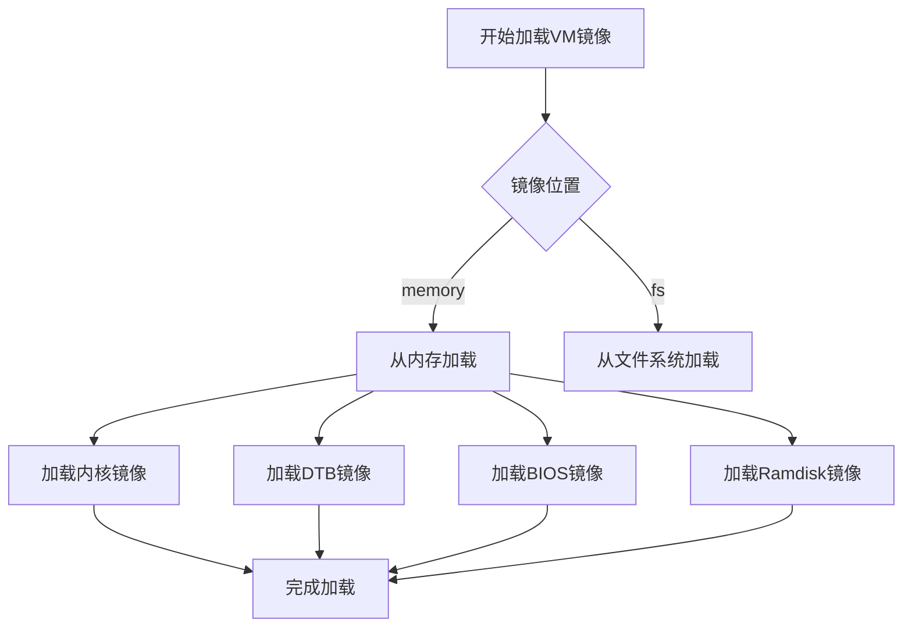
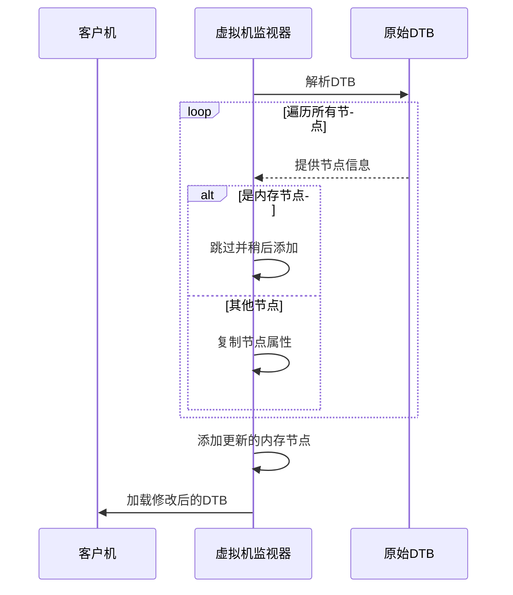
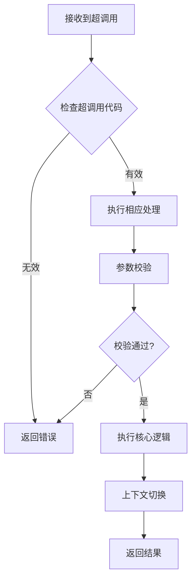
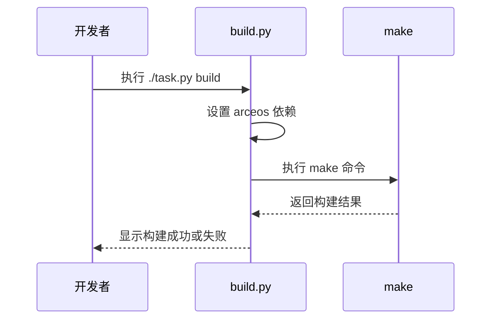
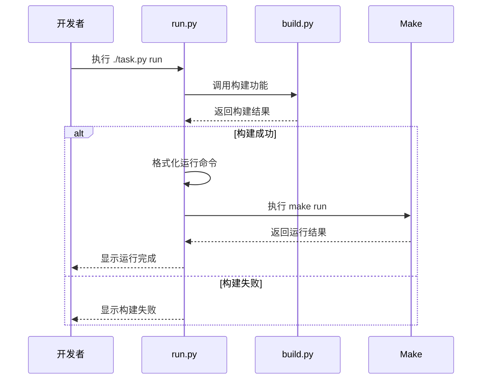

# VMM功能扩展指南

<cite>
**本文档中引用的文件**
- [arceos.rs](file://src/vmm/images/arceos.rs)
- [nimbos.rs](file://src/vmm/images/nimbos.rs)
- [linux.rs](file://src/vmm/images/linux.rs)
- [hvc.rs](file://src/vmm/hvc.rs)
- [fdt.rs](file://src/vmm/fdt.rs)
- [mod.rs](file://src/vmm/images/mod.rs)
- [build.py](file://scripts/build.py)
- [run.py](file://scripts/run.py)
</cite>

## 目录
1. [简介](#简介)
2. [新增客户机操作系统支持](#新增客户机操作系统支持)
3. [实现新的超调用命令](#实现新的超调用命令)
4. [开发与构建流程](#开发与构建流程)
5. [高级调试技巧](#高级调试技巧)
6. [结论](#结论)

## 简介
本指南旨在为开发者提供在axvisor虚拟机监视器（VMM）中扩展核心功能的详细指导。文档涵盖如何添加对新客户机操作系统的支持、实现新的超调用（Hypercall）命令、利用构建脚本加速开发迭代，以及使用高级调试技术定位和解决启动异常问题。

## 新增客户机操作系统支持

在`src/vmm/images/`目录下创建新的OS模块是扩展VMM以支持新客户机操作系统的关键步骤。此过程涉及实现镜像加载、设备树适配和启动参数注入逻辑。开发者应参考现有`linux.rs`模块的实现模式来创建如`arceos.rs`或`nimbos.rs`等新模块。

### 镜像加载逻辑
镜像加载由`ImageLoader`结构体负责，该结构体定义于`src/vmm/images/mod.rs`中。`load_vm_images_from_memory`方法从内存中读取客户机内核、DTB、BIOS和Ramdisk镜像，并将其加载到客户机的物理地址空间。对于新操作系统，需确保其镜像格式与加载逻辑兼容。

**Diagram sources**
- [mod.rs](file://src/vmm/images/mod.rs#L100-L200)

### 设备树适配
设备树（Device Tree）的适配通过`updated_fdt`函数在`src/vmm/fdt.rs`中实现。该函数解析原始设备树二进制（DTB），移除原有的内存节点，并根据客户机配置插入更新后的内存节点。新操作系统可能需要自定义设备树生成逻辑以满足特定硬件需求。

**Diagram sources**
- [fdt.rs](file://src/vmm/fdt.rs#L50-L100)

**Section sources**
- [fdt.rs](file://src/vmm/fdt.rs#L50-L100)
- [mod.rs](file://src/vmm/images/mod.rs#L200-L250)

### 启动参数注入
启动参数的注入通常在配置客户机地址空间时完成，位于`config_guest_address`函数中。该函数根据主内存区域调整内核加载地址和设备树地址。对于新操作系统，可能需要在此处添加特定的参数设置逻辑。

**Section sources**
- [config.rs](file://src/vmm/config.rs#L250-L300)

## 实现新的超调用命令

超调用（Hypercall）是客户机操作系统与VMM之间进行通信的重要机制。在`hvc.rs`中定义新的HC编号并添加相应的请求处理分支是实现新超调用命令的核心。

### 定义新的HC编号
首先，在`axhvc::HyperCallCode`枚举中添加新的超调用代码。这需要修改外部依赖库中的定义，确保新代码不会与现有代码冲突。

### 添加请求处理分支
在`hvc.rs`的`execute`方法中，通过`match`语句为新的超调用代码添加处理逻辑。处理逻辑应包括安全的参数校验、上下文切换以及确保跨vCPU调用的原子性。

**Diagram sources**
- [hvc.rs](file://src/vmm/hvc.rs#L50-L100)

### 参数校验与上下文切换
参数校验是确保系统安全的关键步骤。开发者应验证所有输入参数的有效性和范围。上下文切换涉及保存当前状态、执行超调用逻辑并恢复状态。对于跨vCPU调用，必须使用适当的同步机制（如锁或原子操作）来保证原子性。

**Section sources**
- [hvc.rs](file://src/vmm/hvc.rs#L50-L150)

## 开发与构建流程

高效的开发迭代依赖于自动化构建和运行脚本。`build.py`和`run.py`脚本提供了增量编译和快速启动虚拟机实例的能力。

### 增量编译
`build.py`脚本通过调用底层构建系统（如make）来编译项目。它首先设置arceos依赖，然后执行构建命令。开发者可以通过配置文件避免重复指定命令行参数，从而简化构建过程。

**Diagram sources**
- [build.py](file://scripts/build.py#L10-L60)

### 启动带调试参数的虚拟机
`run.py`脚本在运行前自动执行构建，并通过`format_make_command("run")`启动虚拟机实例。开发者可以传递调试参数以启用更详细的日志输出或特定的调试功能。

**Diagram sources**
- [run.py](file://scripts/run.py#L10-L50)

**Section sources**
- [build.py](file://scripts/build.py#L10-L60)
- [run.py](file://scripts/run.py#L10-L50)

## 高级调试技巧

有效的调试是开发过程中不可或缺的一部分。本节介绍几种高级调试技巧，帮助开发者快速定位和解决问题。

### 日志宏控制
通过修改日志宏（如`info!`, `debug!`, `warn!`）可以控制输出级别。在`src/main.rs`中，`logo::print_logo()`之后的日志输出可以帮助跟踪程序执行流程。增加或减少日志级别有助于聚焦于特定问题区域。

**Section sources**
- [main.rs](file://src/main.rs#L10-L40)

### 分析串口日志
串口日志是诊断启动异常的重要工具。当客户机操作系统无法正常启动时，检查串口输出可以揭示内核崩溃、驱动加载失败等问题。开发者应在启动配置中启用串口重定向，并仔细分析输出信息。

**Section sources**
- [vcpus.rs](file://src/vmm/vcpus.rs#L400-L500)

### 远程源码级调试
配置QEMU的GDB stub可实现远程源码级调试vCPU执行流。通过在QEMU启动参数中添加`-gdb tcp::1234`，开发者可以使用GDB连接到虚拟机，设置断点、单步执行和检查变量状态，极大地提高了调试效率。

**Section sources**
- [vcpus.rs](file://src/vmm/vcpus.rs#L450-L500)

## 结论
本文档详细介绍了在axvisor VMM中扩展核心功能的方法。通过遵循上述指南，开发者可以顺利地添加对新客户机操作系统的支持，实现新的超调用命令，并利用高效的开发和调试工具加速开发进程。持续关注代码质量和安全性是确保VMM稳定可靠的关键。