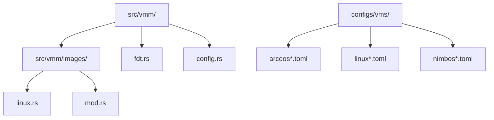
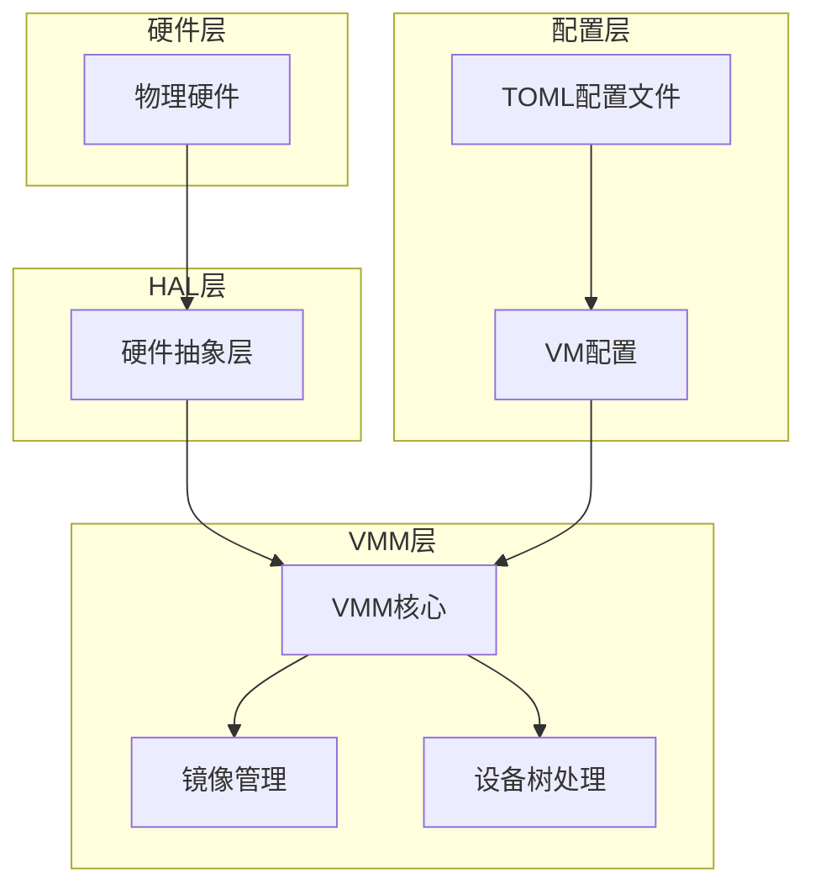
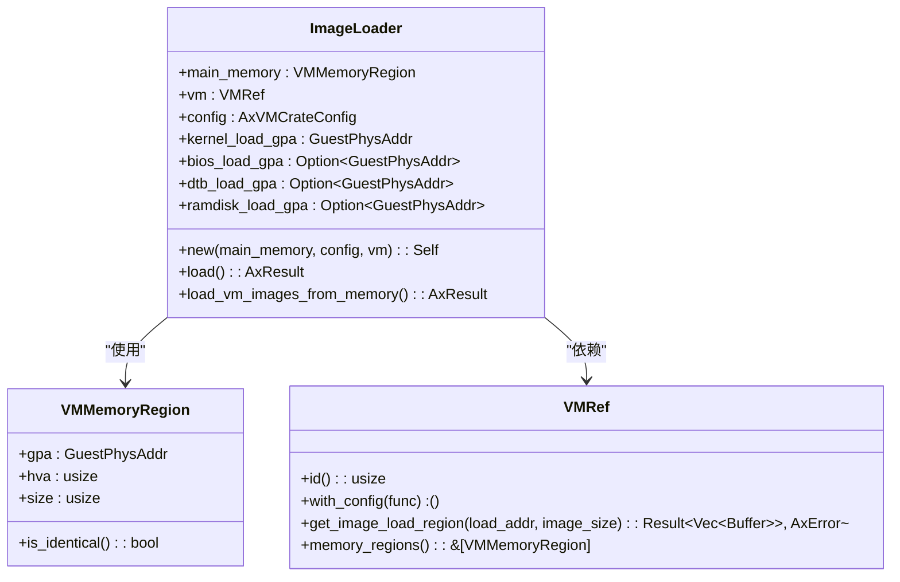
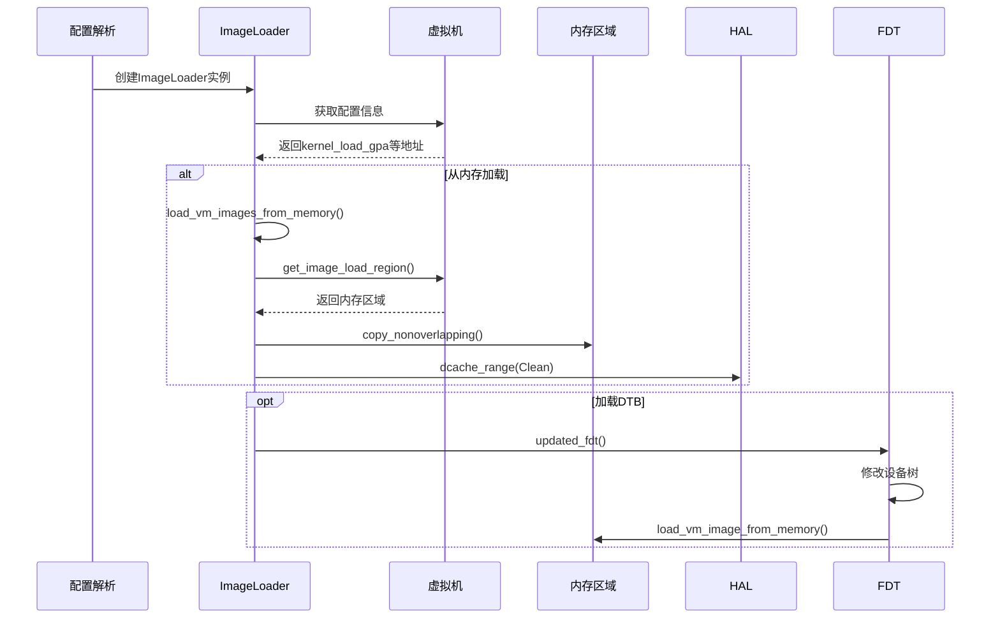
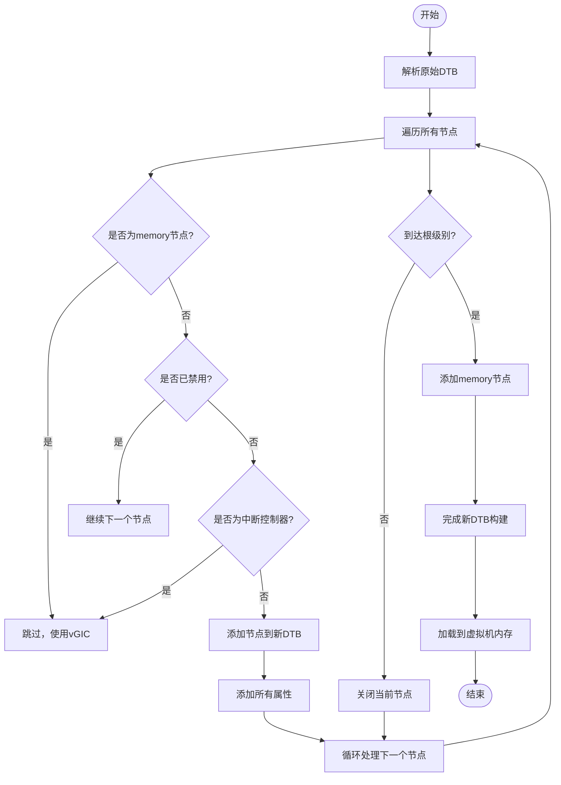
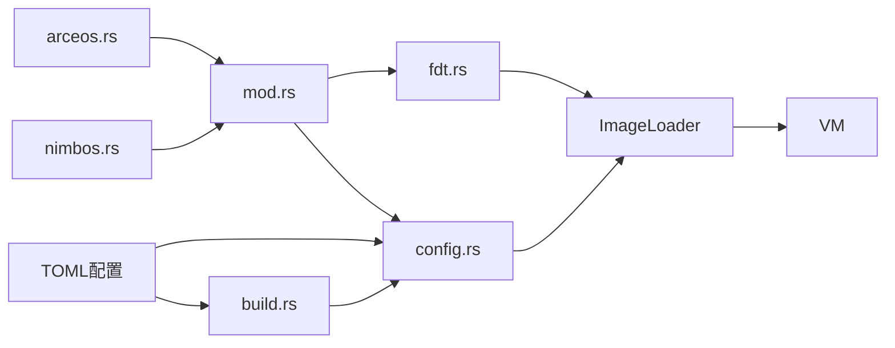

# 新增客户机操作系统支持

<cite>
**本文档引用的文件**
- [arceos.rs](file://src/vmm/images/arceos.rs)
- [nimbos.rs](file://src/vmm/images/nimbos.rs)
- [linux.rs](file://src/vmm/images/linux.rs)
- [mod.rs](file://src/vmm/images/mod.rs)
- [fdt.rs](file://src/vmm/fdt.rs)
- [config.rs](file://src/vmm/config.rs)
- [build.rs](file://build.rs)
- [arceos-aarch64-e2000-smp1.toml](file://configs/vms/arceos-aarch64-e2000-smp1.toml)
- [linux-aarch64-e2000-smp1.toml](file://configs/vms/linux-aarch64-e2000-smp1.toml)
</cite>

## 目录
1. [简介](#简介)
2. [项目结构](#项目结构)
3. [核心组件](#核心组件)
4. [架构概述](#架构概述)
5. [详细组件分析](#详细组件分析)
6. [依赖分析](#依赖分析)
7. [性能考虑](#性能考虑)
8. [故障排除指南](#故障排除指南)
9. [结论](#结论)

## 简介
本文档详细指导开发者如何为VMM添加新的客户机操作系统支持。首先说明在`src/vmm/images/`目录下创建新的OS专用模块（如`arceos.rs`或`nimbos.rs`）的步骤，需实现`load_image`、`setup_fdt`和`boot_args`等核心方法。参考`linux.rs`中的镜像加载流程，解析内核二进制格式（如ELF或raw binary），将镜像映射到指定物理地址空间。描述设备树修改逻辑：通过`fdt.rs`提供的接口动态添加CPU节点、内存保留区和虚拟设备节点。解释启动参数注入机制，确保客户机OS能正确识别引导信息。提供完整代码示例，展示如何注册新OS类型到`mod.rs`的枚举中，并在配置解析时进行分发。

## 项目结构
本项目采用模块化设计，主要组件包括平台抽象层、虚拟机监控器(VMM)、硬件抽象层(HAL)等。客户机操作系统支持主要位于`src/vmm/images/`目录下。

**图源**
- [mod.rs](file://src/vmm/images/mod.rs#L1-L337)
- [fdt.rs](file://src/vmm/fdt.rs#L1-L97)

**章节来源**
- [mod.rs](file://src/vmm/images/mod.rs#L1-L337)
- [project_structure](file://project_structure#L1-L100)

## 核心组件
核心组件包括镜像加载器(ImageLoader)、设备树处理(fdt)、配置管理(config)等模块。这些组件协同工作以支持不同客户机操作系统的启动和运行。

**章节来源**
- [ImageLoader](file://src/vmm/images/mod.rs#L41-L81)
- [fdt](file://src/vmm/fdt.rs#L1-L97)

## 架构概述
系统架构采用分层设计，从底层硬件抽象到上层虚拟机管理，形成清晰的层次结构。

**图源**
- [config.rs](file://src/vmm/config.rs#L1-L284)
- [build.rs](file://build.rs#L1-L309)

## 详细组件分析

### 镜像加载组件分析
该组件负责从内存或文件系统加载客户机操作系统镜像到指定的物理地址空间。

#### 类图

**图源**
- [mod.rs](file://src/vmm/images/mod.rs#L41-L81)
- [config.rs](file://src/vmm/config.rs#L1-L284)

#### 序列图

**图源**
- [mod.rs](file://src/vmm/images/mod.rs#L83-L156)
- [fdt.rs](file://src/vmm/fdt.rs#L1-L97)

**章节来源**
- [mod.rs](file://src/vmm/images/mod.rs#L83-L156)
- [fdt.rs](file://src/vmm/fdt.rs#L1-L97)

### 设备树处理组件分析
该组件负责处理和修改传递给客户机操作系统的设备树(blob)。

#### 流程图

**图源**
- [fdt.rs](file://src/vmm/fdt.rs#L66-L96)
- [mod.rs](file://src/vmm/images/mod.rs#L113-L156)

**章节来源**
- [fdt.rs](file://src/vmm/fdt.rs#L1-L97)
- [mod.rs](file://src/vmm/images/mod.rs#L113-L156)

## 依赖分析
系统各组件之间存在明确的依赖关系，确保功能的正确实现和数据的正确传递。

**图源**
- [mod.rs](file://src/vmm/images/mod.rs#L1-L337)
- [build.rs](file://build.rs#L1-L309)

**章节来源**
- [mod.rs](file://src/vmm/images/mod.rs#L1-L337)
- [build.rs](file://build.rs#L1-L309)

## 性能考虑
在设计和实现新客户机操作系统支持时，需要考虑以下性能因素：
- 镜像加载效率：尽量减少内存拷贝次数
- 设备树处理：避免不必要的节点复制和属性处理
- 缓存一致性：确保数据缓存正确刷新
- 内存分配：合理规划内存区域，减少碎片化

## 故障排除指南
当遇到问题时，可以按照以下步骤进行排查：

### 常见问题及解决方案

| 问题现象 | 可能原因 | 解决方案 |
|---------|--------|--------|
| 镜像加载失败 | 镜像路径错误或权限不足 | 检查TOML配置文件中的路径设置，确认文件存在且可读 |
| 设备树解析错误 | DTB文件损坏或格式不正确 | 使用dtc工具验证DTB文件完整性 |
| 启动卡死 | 入口地址配置错误 | 检查kernel_load_addr和entry_point是否匹配 |
| 内存访问异常 | 地址映射冲突 | 检查memory_regions配置，确保无重叠区域 |

**章节来源**
- [config.rs](file://src/vmm/config.rs#L164-L201)
- [mod.rs](file://src/vmm/images/mod.rs#L225-L258)

## 结论
通过遵循本文档的指导，开发者可以成功为VMM添加新的客户机操作系统支持。关键步骤包括：在`src/vmm/images/`目录下创建新的OS专用模块，实现必要的核心方法，正确配置TOML文件，并通过构建系统集成新操作系统。注意遵循现有的代码模式和最佳实践，确保新功能的稳定性和性能。