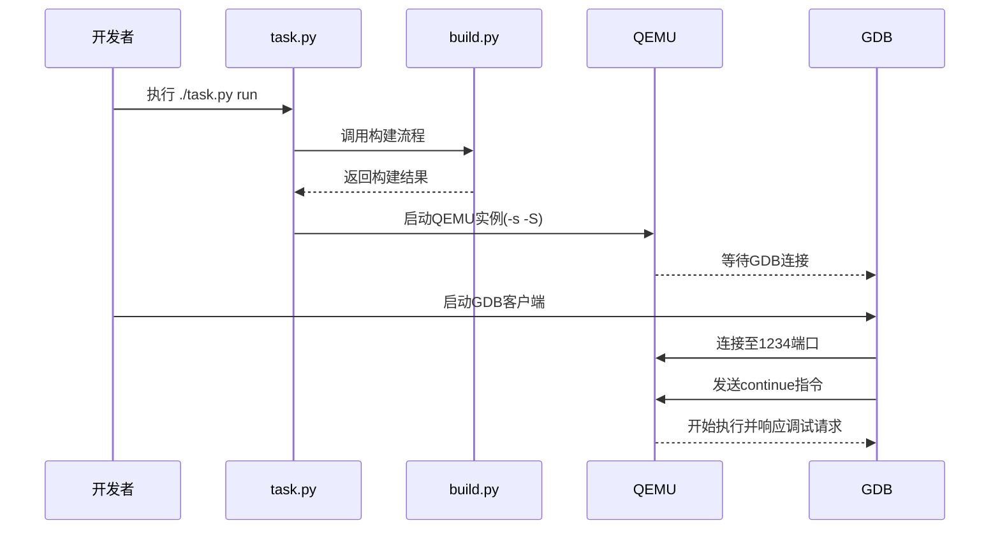

# 调试与测试指南

<cite>
**本文档中引用的文件**  
- [build.py](file://scripts/build.py)
- [run.py](file://scripts/run.py)
- [main.rs](file://src/main.rs)
- [vmm/mod.rs](file://src/vmm/mod.rs)
- [vmm/fdt.rs](file://src/vmm/fdt.rs)
- [vmm/ivc.rs](file://src/vmm/ivc.rs)
- [vmm/hvc.rs](file://src/vmm/hvc.rs)
- [vmm/vcpus.rs](file://src/vmm/vcpus.rs)
- [config.py](file://scripts/config.py)
- [task.py](file://scripts/task.py)
- [vmm/config.rs](file://src/vmm/config.rs)
- [vmm/images/linux.rs](file://src/vmm/images/linux.rs)
- [vmm/images/mod.rs](file://src/vmm/images/mod.rs)
- [vmm/timer.rs](file://src/vmm/timer.rs)
- [vmm/vm_list.rs](file://src/vmm/vm_list.rs)
</cite>

## 目录
1. [简介](#简介)
2. [增量编译与构建流程](#增量编译与构建流程)
3. [QEMU调试参数配置与GDB远程调试](#qemu调试参数配置与gdb远程调试)
4. [日志系统使用方法](#日志系统使用方法)
5. [典型故障诊断流程](#典型故障诊断流程)
6. [交叉验证策略](#交叉验证策略)

## 简介
本文档系统性地介绍在VMM功能扩展过程中所采用的调试与测试方法。通过合理利用构建脚本、运行脚本、日志系统以及硬件模拟器，开发者可以高效定位并解决虚拟机监控器（VMM）中的各类问题。文档涵盖从开发迭代优化到具体调试技术的完整流程，并提供针对常见故障的诊断思路。

## 增量编译与构建流程

为加快开发迭代速度，避免全量构建带来的耗时开销，项目提供了基于Python的`build.py`脚本实现增量编译。该脚本通过调用底层Makefile完成实际构建任务，同时封装了依赖管理与配置生成逻辑。

`build.py`脚本首先检查是否存在`.hvconfig.toml`配置文件，若不存在则根据命令行参数自动生成。其核心流程包括：
1. 设置ArceOS依赖环境
2. 创建配置对象`AxvisorConfig`
3. 构建并执行Make命令

此机制允许开发者在修改代码后仅重新编译受影响的部分，显著提升编译效率。此外，`task.py`作为统一入口工具，进一步简化了构建命令的调用方式。

**本节来源**
- [build.py](file://scripts/build.py#L0-L58)
- [task.py](file://scripts/task.py#L0-L173)
- [config.py](file://scripts/config.py#L0-L453)

## QEMU调试参数配置与GDB远程调试

为了支持对VMM及客户机操作系统的深度调试，可通过`run.py`启动脚本传递QEMU调试参数以启用GDB远程调试功能。

### 启动脚本配置
`run.py`脚本在执行前会自动调用`build.py`确保最新构建产物可用。随后，它将根据平台架构生成相应的QEMU启动参数。例如，在aarch64平台上添加`-machine virtualization=on`，在x86_64上使用`-accel kvm`启用KVM加速。

### GDB远程调试设置
通过在QEMU命令行中加入`-s -S`参数可启用GDB服务器模式：
- `-s`：在端口1234开启GDB远程调试服务
- `-S`：暂停CPU执行，等待GDB连接后再开始运行

连接步骤如下：
1. 启动VMM：`./task.py run --plat aarch64-qemu-virt-hv`
2. 另起终端连接GDB：`gdb target/aarch64-unknown-none/debug/axvisor`
3. 在GDB中执行：`(gdb) target remote :1234`
4. 设置断点并继续执行：`(gdb) continue`

借助此机制，可精确跟踪vCPU执行流、中断处理路径及超调用（hypercall）入口点，便于分析底层行为。



**图示来源**
- [run.py](file://scripts/run.py#L0-L43)
- [config.py](file://scripts/config.py#L0-L453)

**本节来源**
- [run.py](file://scripts/run.py#L0-L43)
- [config.py](file://scripts/config.py#L0-L453)

## 日志系统使用方法

日志系统是诊断VMM启动阶段异常行为的关键工具。项目采用Rust标准日志宏`log`，并通过`info!`、`warn!`、`error!`等宏控制输出级别。

### 日志级别控制
通过修改`log`宏的级别可调整输出详细程度：
- `trace!`：最详细信息，用于追踪函数调用
- `debug!`：调试信息，适用于变量状态输出
- `info!`：常规运行信息
- `warn!`：警告信息
- `error!`：错误信息

### 模块化日志启用
在`main.rs`中，可通过条件编译或运行时配置启用特定模块的日志输出。例如，在VMM初始化阶段打印关键信息：

```rust
info!("Initializing VMM...");
info!("Setting up vcpus...");
```

此外，`fdt.rs`模块提供了设备树解析过程的日志输出，可用于分析设备树挂载是否正确；`ivc.rs`和`hvc.rs`模块则记录了IVC通信与超调用的详细交互过程。

**本节来源**
- [main.rs](file://src/main.rs#L0-L37)
- [vmm/mod.rs](file://src/vmm/mod.rs#L0-L127)
- [vmm/fdt.rs](file://src/vmm/fdt.rs#L0-L97)
- [vmm/ivc.rs](file://src/vmm/ivc.rs#L0-L285)
- [vmm/hvc.rs](file://src/vmm/hvc.rs#L0-L148)

## 典型故障诊断流程

以下是几种常见故障的诊断流程建议：

### 客户机无法启动
1. 检查`main.rs`中`vmm::init()`与`vmm::start()`调用是否正常
2. 查看日志中是否有“VM boot success”提示
3. 若无成功日志，检查`config.rs`中`init_guest_vms()`是否成功加载配置
4. 使用GDB在`vcpu_run()`函数处设断点，观察vCPU是否进入运行循环

### IVC通信失败
1. 检查超调用号是否匹配（`HIVCPublishChannel`, `HIVCSubscribChannel`）
2. 验证共享内存区域映射是否成功（`map_region`调用）
3. 通过日志确认`IVCChannel`结构体创建与订阅过程无误
4. 利用GDB跟踪`hvc.rs`中`HyperCall::execute()`执行路径

### 设备树挂载错误
1. 检查`fdt.rs`中`updated_fdt`函数是否被正确调用
2. 确认DTB镜像地址与大小传递无误
3. 使用`print_fdt`辅助函数打印原始设备树内容进行比对
4. 分析`parse_vm_dtb`中节点过滤逻辑是否导致必要设备被跳过

以上流程结合日志输出与GDB调试，可有效定位大多数运行时问题。

**本节来源**
- [vmm/config.rs](file://src/vmm/config.rs#L0-L284)
- [vmm/fdt.rs](file://src/vmm/fdt.rs#L0-L97)
- [vmm/ivc.rs](file://src/vmm/ivc.rs#L0-L285)
- [vmm/hvc.rs](file://src/vmm/hvc.rs#L0-L148)
- [vmm/vcpus.rs](file://src/vmm/vcpus.rs#L0-L506)

## 交叉验证策略

为确保VMM扩展功能在不同平台上的兼容性与稳定性，建议结合QEMU模拟器与真实硬件平台进行交叉验证。

### QEMU模拟器验证
优点：
- 快速迭代，便于调试
- 支持多种架构（aarch64, riscv64, x86_64）
- 可复现边界条件与异常场景

使用`configs/platforms/`下的`.toml`文件配置不同虚拟平台，如`aarch64-qemu-virt-hv.toml`。

### 真实硬件平台验证
优点：
- 验证实际性能表现
- 检测硬件相关bug（如缓存一致性、中断延迟）
- 确保驱动与外设兼容性

使用对应平台配置文件，如`aarch64-rk3588j-hv.toml`，部署至目标设备进行测试。

通过双平台对比测试，可全面评估新功能的健壮性与移植性。

**本节来源**
- [configs/platforms](file://configs/platforms)
- [platform](file://platform)