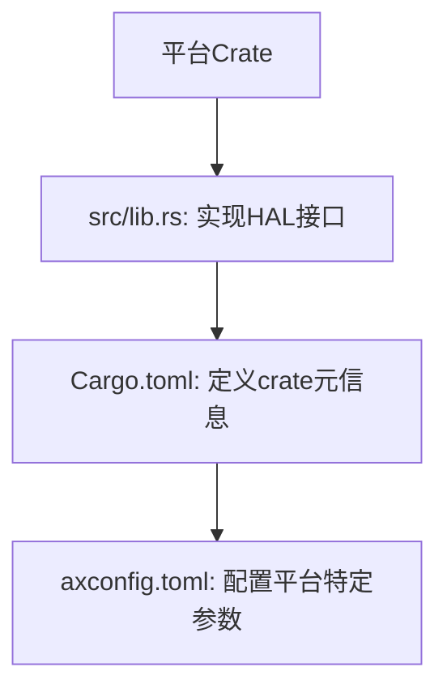
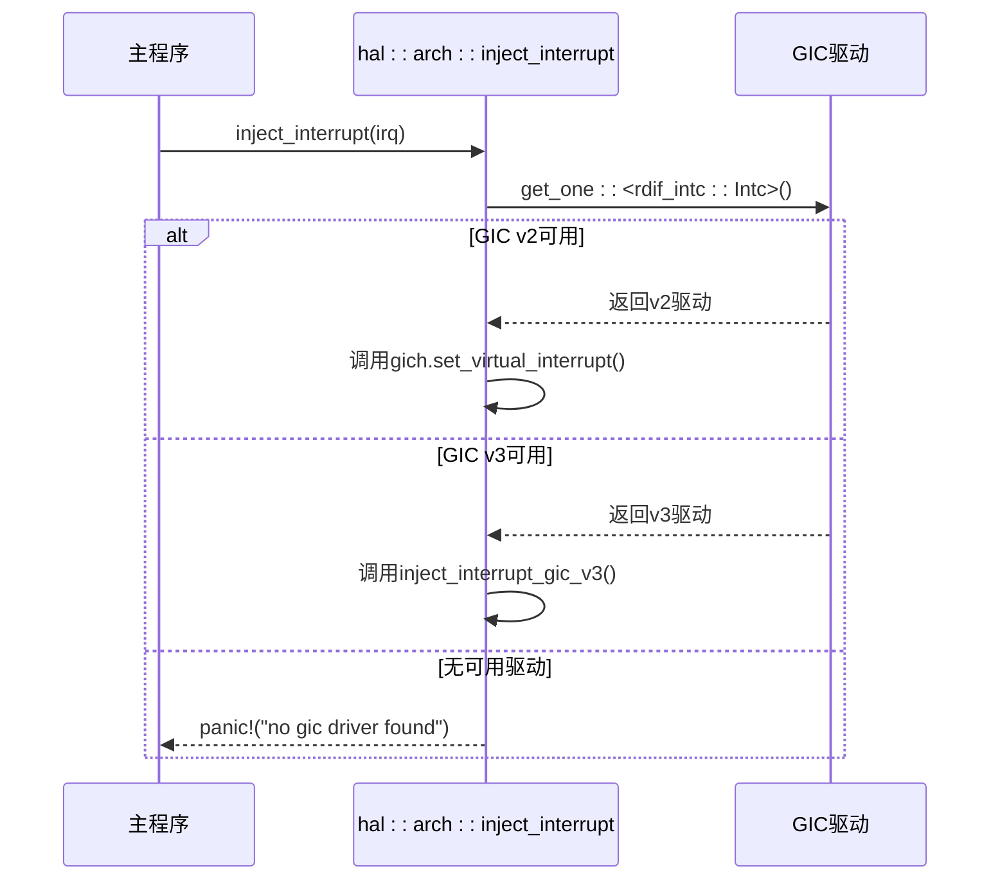
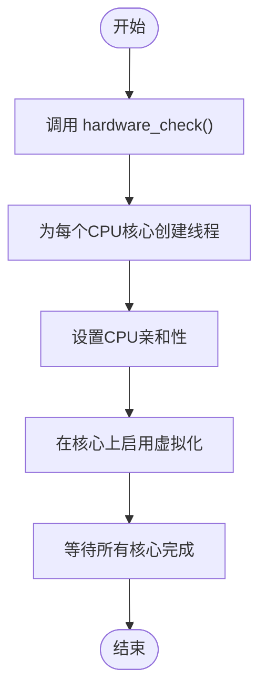

# 平台集成指南

<cite>
**本文档中引用的文件**
- [aarch64-roc-rk3568-pc/Cargo.toml](file://platform/aarch64-roc-rk3568-pc/Cargo.toml)
- [aarch64-roc-rk3568-pc/axconfig.toml](file://platform/aarch64-roc-rk3568-pc/axconfig.toml)
- [aarch64-roc-rk3568-pc/src/lib.rs](file://platform/aarch64-roc-rk3568-pc/src/lib.rs)
- [x86-qemu-q35/Cargo.toml](file://platform/x86-qemu-q35/Cargo.toml)
- [x86-qemu-q35/axconfig.toml](file://platform/x86-qemu-q35/axconfig.toml)
- [x86-qemu-q35/src/lib.rs](file://platform/x86-qemu-q35/src/lib.rs)
- [src/hal/arch/aarch64/mod.rs](file://src/hal/arch/aarch64/mod.rs)
- [src/hal/arch/x86_64/mod.rs](file://src/hal/arch/x86_64/mod.rs)
- [Cargo.toml](file://Cargo.toml)
- [src/main.rs](file://src/main.rs)
</cite>

## 目录
1. [简介](#简介)
2. [平台Crate标准目录结构](#平台crate标准目录结构)
3. [实现HAL架构接口](#实现hal架构接口)
4. [axconfig.toml配置详解](#axconfigtoml配置详解)
5. [主项目中的平台集成](#主项目中的平台集成)
6. [构建与验证步骤](#构建与验证步骤)

## 简介
本文档详细说明如何为axvisor添加新的硬件平台支持，以`aarch64-roc-rk3568-pc`和`x86-qemu-q35`为例。文档涵盖平台crate的创建、HAL接口的实现、axconfig.toml配置文件的语义解析、主项目中的条件编译配置以及新平台集成的验证方法。

## 平台Crate标准目录结构
每个新硬件平台需要在`platform/`目录下创建独立的crate，其标准目录结构必须包含三个核心文件：



**Diagram sources**
- [platform/aarch64-roc-rk3568-pc](file://platform/aarch64-roc-rk3568-pc)
- [platform/x86-qemu-q35](file://platform/x86-qemu-q35)

### src/lib.rs
该文件是平台crate的入口点，主要职责是声明crate特性并引入底层板级支持包（BSP）。文件必须包含以下内容：
- `#![no_std]` 属性，表明该crate不依赖标准库
- `#![cfg(target_arch = "...")]` 条件编译属性，指定目标架构
- `extern crate` 声明，引入对应的BSP crate

**Section sources**
- [aarch64-roc-rk3568-pc/src/lib.rs](file://platform/aarch64-roc-rk3568-pc/src/lib.rs#L0-L4)
- [x86-qemu-q35/src/lib.rs](file://platform/x86-qemu-q35/src/lib.rs#L0-L4)

### Cargo.toml
此文件定义了平台crate的元数据和依赖关系。关键配置包括：
- **package.name**: 以`axplat-`为前缀的唯一crate名称
- **dependencies**: 指定底层BSP依赖，可通过git仓库或本地路径引入
- **features**: 定义可选功能特征，用于条件编译

对于`x86-qemu-q35`平台，其`Cargo.toml`通过继承`axplat-x86-pc`实现了功能复用，并通过`fp-simd`和`rtc`等特征提供扩展能力。

**Section sources**
- [aarch64-roc-rk3568-pc/Cargo.toml](file://platform/aarch64-roc-rk3568-pc/Cargo.toml#L0-L11)
- [x86-qemu-q35/Cargo.toml](file://platform/x86-qemu-q35/Cargo.toml#L0-L12)

### axconfig.toml
这是一个平台特定的配置文件，使用TOML格式定义了硬件平台的关键参数。它被构建系统读取，用于生成编译时常量和运行时配置。

**Section sources**
- [aarch64-roc-rk3568-pc/axconfig.toml](file://platform/aarch64-roc-rk3568-pc/axconfig.toml#L0-L49)
- [x86-qemu-q35/axconfig.toml](file://platform/x86-qemu-q35/axconfig.toml#L0-L62)

## 实现HAL架构接口
平台crate的核心任务是实现`hal::arch`模块下的架构抽象接口。这些接口定义了与具体硬件架构相关的底层操作。

### 中断控制器初始化
在`aarch64`架构中，`inject_interrupt`函数负责向虚拟GIC（通用中断控制器）注入虚拟中断。该实现首先尝试获取GIC驱动实例，然后根据GIC版本（v2或v3）调用相应的API进行中断注入。



**Diagram sources**
- [src/hal/arch/aarch64/mod.rs](file://src/hal/arch/aarch64/mod.rs#L0-L49)

### 内存映射设置
内存映射由`axconfig.toml`中的`phys-virt-offset`等参数决定。`hal`模块利用这些配置值实现物理地址与虚拟地址之间的转换。例如，在`x86_64`架构中，线性映射偏移量直接用于地址转换计算。

### CPU启动流程
CPU启动流程由`hal::enable_virtualization()`函数协调。该函数执行以下步骤：
1. 调用`hardware_check()`验证硬件虚拟化支持
2. 为每个逻辑CPU核心创建线程
3. 设置CPU亲和性（affinity）
4. 在每个核心上启用硬件虚拟化扩展（如ARM的EL2或x86的VMX）



**Diagram sources**
- [src/hal/mod.rs](file://src/hal/mod.rs#L104-L148)

## axconfig.toml配置详解
`axconfig.toml`文件中的各个字段具有明确的语义和配置规则。

### 全局配置
| 字段 | 类型 | 语义 | 示例 |
|------|------|------|------|
| arch | str | 目标架构标识符 | "aarch64" 或 "x86_64" |
| package | str | Crate的包名 | "axplat-aarch64-roc-rk3568-pc" |
| platform | str | 平台标识符 | "aarch64-roc-rk3568-pc" |

### 平台配置 ([plat])
| 字段 | 类型 | 语义 | 规则 |
|------|------|------|------|
| cpu-num | uint | 支持的最大CPU核心数 | 必须大于0 |
| phys-memory-base | uint | 物理内存基地址 | 通常为0 |
| phys-memory-size | uint | 物理内存总大小 | 如0x800_0000 (128MB) |
| kernel-base-paddr | uint | 内核镜像物理基地址 | x86平台常用0x20_0000 |
| kernel-base-vaddr | uint | 内核镜像虚拟基地址 | 取决于架构寻址空间 |
| phys-virt-offset | uint | 物理到虚拟地址偏移 | x86_64常用0xffff_8000_0000_0000 |

### 设备规范 ([devices])
| 字段 | 类型 | 语义 | 示例 |
|------|------|------|------|
| mmio-regions/mmio-ranges | [(uint, uint)] | MMIO内存区域 | [[0xb000_0000, 0x1000_0000]] |
| pci-ecam-base | uint | PCIe ECAM空间基地址 | 0xb000_0000 |
| timer-irq | uint | 定时器中断号 | aarch64: 26, x86: 0xf0 |
| virtio-mmio-regions/ranges | [(uint, uint)] | VirtIO设备MMIO区域 | [] |

**Section sources**
- [aarch64-roc-rk3568-pc/axconfig.toml](file://platform/aarch64-roc-rk3568-pc/axconfig.toml#L0-L49)
- [x86-qemu-q35/axconfig.toml](file://platform/x86-qemu-q35/axconfig.toml#L0-L62)

## 主项目中的平台集成
新平台需要在主项目的`Cargo.toml`中进行注册和配置。

### features配置
在`Cargo.toml`的`[features]`部分，为每个平台定义一个以`plat-`为前缀的feature。例如：
```toml
[features]
plat-aarch64-roc-rk3568-pc = ["axplat-aarch64-roc-rk3568-pc", "axstd/driver-dyn"]
plat-x86-qemu-q35 = ["axplat-x86-qemu-q35"]
```
这允许通过`--features`参数选择目标平台。

### dependencies配置
在`[dependencies]`部分，将平台crate声明为可选依赖（optional = true），并指定其路径：
```toml
[dependencies]
axplat-aarch64-roc-rk3568-pc = {path = "platform/aarch64-roc-rk3568-pc", optional = true}
axplat-x86-qemu-q35 = {path = "platform/x86-qemu-q35", optional = true}
```

### 条件编译
在`src/main.rs`中，使用`#[cfg(feature = "...")]`宏来条件化地引入平台crate：
```rust
#[cfg(feature = "plat-aarch64-roc-rk3568-pc")]
extern crate axplat_aarch64_roc_rk3568_pc;
#[cfg(feature = "plat-x86-qemu-q35")]
extern crate axplat_x86_qemu_q35;
```

**Section sources**
- [Cargo.toml](file://Cargo.toml#L0-L91)
- [src/main.rs](file://src/main.rs#L0-L37)

## 构建与验证步骤
完成平台集成后，需执行以下步骤验证集成是否成功。

### 构建命令
使用`make`命令并指定相关参数进行构建：
```bash
make ARCH=aarch64 PLAT=aarch64-roc-rk3568-pc FEATURES=plat-aarch64-roc-rk3568-pc build
make ARCH=x86_64 PLAT=x86-qemu-q35 FEATURES=plat-x86-qemu-q35 build
```

### 运行测试
使用QEMU或其他模拟器运行构建产物，观察启动日志：
```bash
make run
```
成功的集成应能输出启动logo，并显示"Starting virtualization..."等日志信息。

### 验证要点
1. **编译通过**: 确保`cargo build`命令成功完成
2. **功能正确**: 关键HAL函数（如`inject_interrupt`）应能正确执行
3. **配置匹配**: `axconfig.toml`中的参数应与实际硬件规格一致
4. **多核支持**: 若配置了多核，应能看到所有核心成功启用虚拟化

**Section sources**
- [scripts/build.py](file://scripts/build.py)
- [scripts/run.py](file://scripts/run.py)