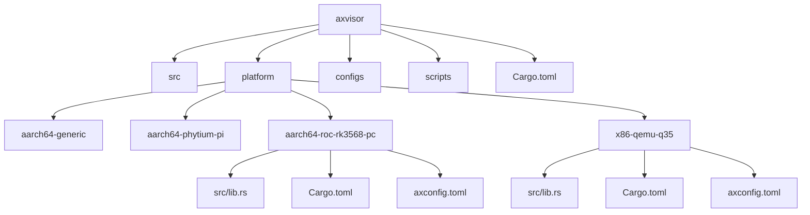
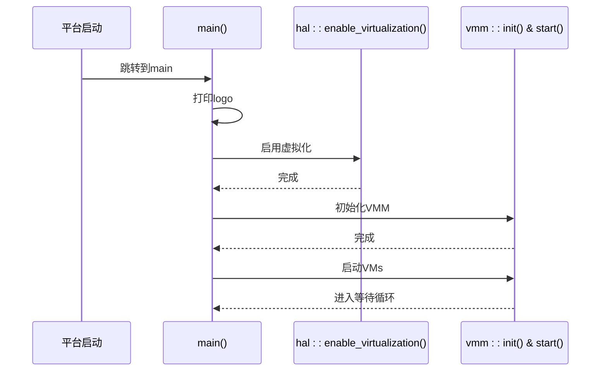
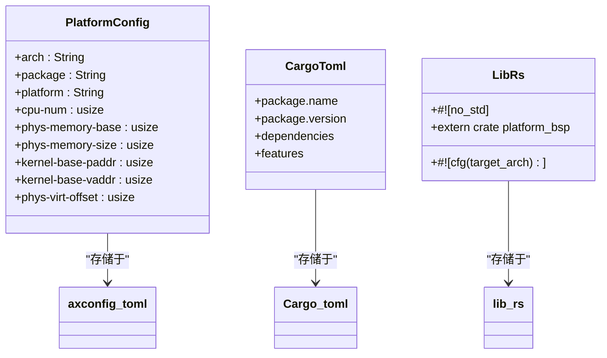
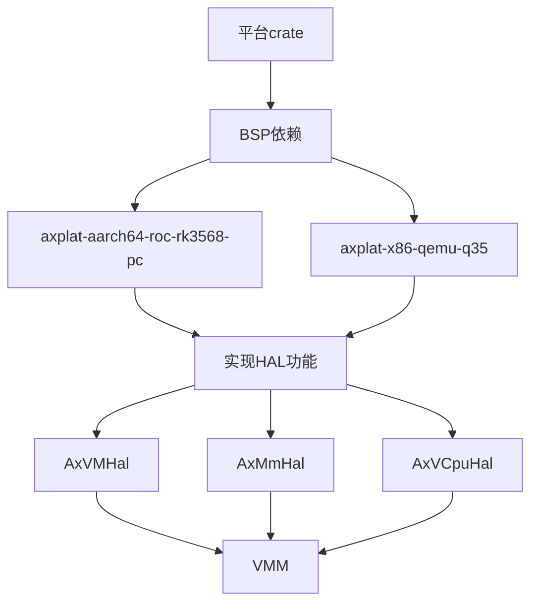
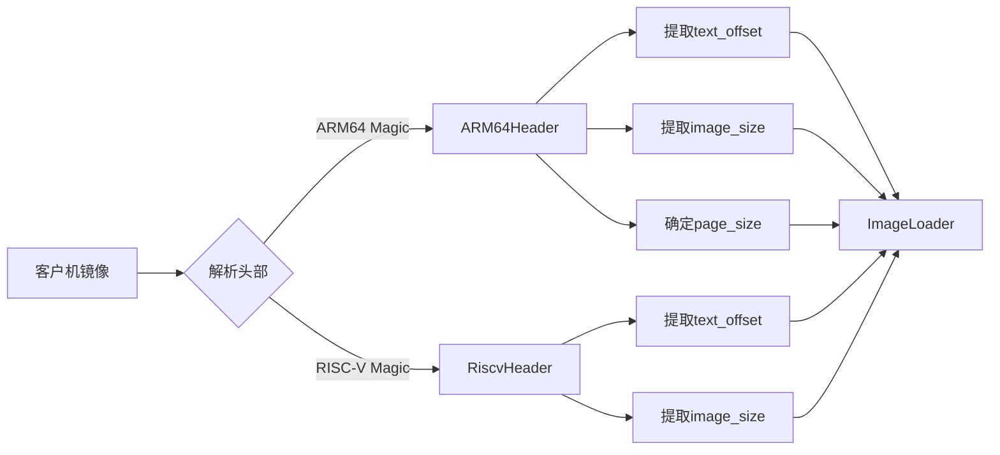
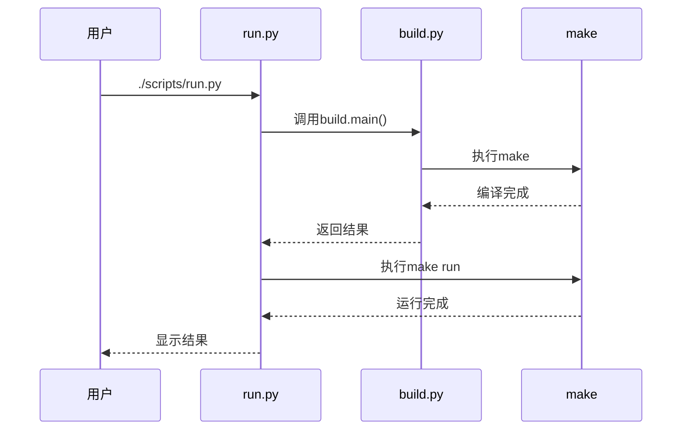
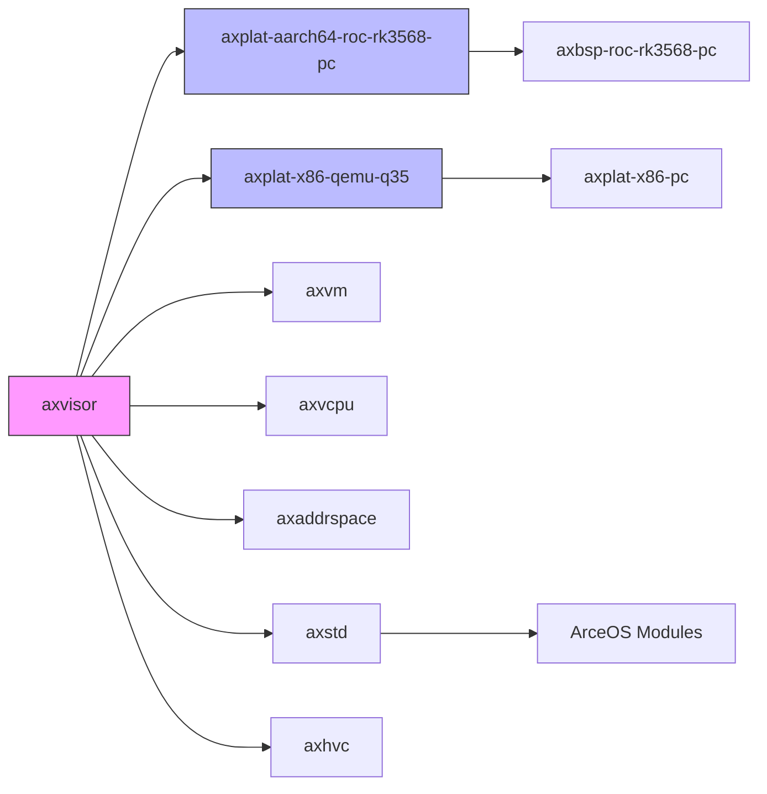

# 开发指南

<cite>
**本文档引用的文件**
- [aarch64-roc-rk3568-pc/Cargo.toml](file://platform/aarch64-roc-rk3568-pc/Cargo.toml)
- [aarch64-roc-rk3568-pc/src/lib.rs](file://platform/aarch64-roc-rk3568-pc/src/lib.rs)
- [aarch64-roc-rk3568-pc/axconfig.toml](file://platform/aarch64-roc-rk3568-pc/axconfig.toml)
- [x86-qemu-q35/Cargo.toml](file://platform/x86-qemu-q35/Cargo.toml)
- [x86-qemu-q35/src/lib.rs](file://platform/x86-qemu-q35/src/lib.rs)
- [x86-qemu-q35/axconfig.toml](file://platform/x86-qemu-q35/axconfig.toml)
- [src/hal/mod.rs](file://src/hal/mod.rs)
- [src/vmm/hvc.rs](file://src/vmm/hvc.rs)
- [src/vmm/images/linux.rs](file://src/vmm/images/linux.rs)
- [scripts/build.py](file://scripts/build.py)
- [scripts/run.py](file://scripts/run.py)
- [src/main.rs](file://src/main.rs)
- [Cargo.toml](file://Cargo.toml)
- [src/vmm/mod.rs](file://src/vmm/mod.rs)
- [src/vmm/config.rs](file://src/vmm/config.rs)
</cite>

## 目录
1. [简介](#简介)
2. [项目结构](#项目结构)
3. [核心组件](#核心组件)
4. [架构概述](#架构概述)
5. [详细组件分析](#详细组件分析)
6. [依赖分析](#依赖分析)
7. [性能考虑](#性能考虑)
8. [故障排除指南](#故障排除指南)
9. [结论](#结论)

## 简介
本开发指南旨在为希望扩展axvisor功能的开发者提供全面的技术指导。文档详细说明了如何添加新的硬件平台支持，以现有`aarch64-roc-rk3568-pc`或`x86-qemu-q35`为例，介绍平台crate的目录结构、`lib.rs`中必须实现的HAL接口、`axconfig.toml`配置项定义以及如何在主项目中集成。同时指导开发者通过feature flags启用或禁用特定功能模块，扩展VMM功能（如新增客户机操作系统支持或实现新的超调用命令），并提供使用`build.py`和`run.py`脚本进行增量构建与调试的最佳实践。此外，还包含日志级别控制、串口输出分析、利用QEMU进行远程GDB调试等调试技巧，并强调代码风格规范与Rust最佳实践。

## 项目结构
axvisor项目的目录结构清晰地划分了不同功能模块。根目录下包含主要源码目录`src`、平台相关代码目录`platform`、配置文件目录`configs`、脚本目录`scripts`等。平台相关的代码被组织在`platform`目录下，每个子目录代表一个具体的硬件平台，如`aarch64-roc-rk3568-pc`和`x86-qemu-q35`。每个平台目录都包含标准的Rust crate结构：`src/lib.rs`作为入口文件，`Cargo.toml`定义依赖关系，`axconfig.toml`提供平台特定的配置参数。这种模块化设计使得添加新平台变得简单直观。



**图示来源**
- [platform/aarch64-roc-rk3568-pc](file://platform/aarch64-roc-rk3568-pc)
- [platform/x86-qemu-q35](file://platform/x86-qemu-q35)

**章节来源**
- [platform/aarch64-roc-rk3568-pc](file://platform/aarch64-roc-rk3568-pc)
- [platform/x86-qemu-q35](file://platform/x86-qemu-q35)

## 核心组件
axvisor的核心组件主要包括硬件抽象层(HAL)、虚拟机监控器(VMM)、平台适配层和构建系统。硬件抽象层位于`src/hal`目录，负责封装底层硬件操作，为上层提供统一的接口。VMM组件位于`src/vmm`目录，实现了虚拟机生命周期管理、vCPU调度、内存管理和设备模拟等功能。平台适配层分布在`platform`目录下的各个子目录中，每个平台都有独立的crate来处理特定于该平台的初始化和配置。构建系统由Python脚本`build.py`和`run.py`组成，提供了便捷的编译和运行接口。

**章节来源**
- [src/hal/mod.rs](file://src/hal/mod.rs#L0-L282)
- [src/vmm/mod.rs](file://src/vmm/mod.rs#L0-L127)
- [scripts/build.py](file://scripts/build.py#L0-L58)
- [scripts/run.py](file://scripts/run.py#L0-L43)

## 架构概述
axvisor采用分层架构设计，从下到上依次为硬件层、平台适配层、硬件抽象层、虚拟机监控器层和应用层。系统启动时，首先执行平台特定的初始化代码，然后进入通用的`main.rs`入口点。在`main()`函数中，依次打印logo、启用虚拟化支持、初始化VMM并启动所有虚拟机。整个系统通过feature flags机制灵活地控制不同平台和功能模块的编译，确保代码的可移植性和可维护性。



**图示来源**
- [src/main.rs](file://src/main.rs#L0-L37)
- [src/hal/mod.rs](file://src/hal/mod.rs#L283-L300)
- [src/vmm/mod.rs](file://src/vmm/mod.rs#L128-L150)

## 详细组件分析

### 添加新硬件平台支持
要为axvisor添加一个新的硬件平台支持，需要创建一个新的平台crate，并遵循既定的结构和接口规范。以现有的`aarch64-roc-rk3568-pc`或`x86-qemu-q35`为例，新平台的目录结构应包含`src/lib.rs`、`Cargo.toml`和`axconfig.toml`三个核心文件。

#### 平台Crate结构
新平台的crate必须包含以下文件：
- `Cargo.toml`: 定义包元数据和依赖关系
- `src/lib.rs`: 实现平台特定的功能
- `axconfig.toml`: 提供平台配置参数

对于`aarch64`架构的平台，`Cargo.toml`中需要指定`axbsp`依赖；而对于`x86_64`架构，则可能依赖于共享的基础平台库。



**图示来源**
- [aarch64-roc-rk3568-pc/Cargo.toml](file://platform/aarch64-roc-rk3568-pc/Cargo.toml#L0-L11)
- [aarch64-roc-rk3568-pc/axconfig.toml](file://platform/aarch64-roc-rk3568-pc/axconfig.toml#L0-L49)
- [aarch64-roc-rk3568-pc/src/lib.rs](file://platform/aarch64-roc-rk3568-pc/src/lib.rs#L0-L4)

**章节来源**
- [platform/aarch64-roc-rk3568-pc](file://platform/aarch64-roc-rk3568-pc)
- [platform/x86-qemu-q35](file://platform/x86-qemu-q35)

#### HAL接口实现
硬件抽象层(HAL)是连接平台特定代码和通用VMM逻辑的关键桥梁。在`src/hal/mod.rs`中定义了多个trait，包括`AxVMHal`、`AxMmHal`和`AxVCpuHal`，这些trait规定了平台必须提供的功能接口。新平台不需要直接实现这些trait，而是通过依赖的BSP(板级支持包)来间接满足要求。



**图示来源**
- [src/hal/mod.rs](file://src/hal/mod.rs#L0-L282)
- [platform/aarch64-roc-rk3568-pc/Cargo.toml](file://platform/aarch64-roc-rk3568-pc/Cargo.toml#L7-L9)

**章节来源**
- [src/hal/mod.rs](file://src/hal/mod.rs#L0-L282)
- [platform/aarch64-roc-rk3568-pc/Cargo.toml](file://platform/aarch64-roc-rk3568-pc/Cargo.toml#L7-L9)

#### axconfig.toml配置项
`axconfig.toml`文件包含了平台特定的配置参数，这些参数在编译时被读取并用于生成相应的常量。配置项分为设备规格和平台配置两大部分。设备规格包括MMIO区域、PCIe配置空间基地址、VirtIO设备位置等；平台配置则包含CPU数量、物理内存大小、内核加载地址等关键信息。

```toml
# Architecture identifier.
arch = "aarch64" # str
# Platform package.
package = "axplat-aarch64-roc-rk3568-pc" # str
# Platform identifier.
platform = "aarch64-roc-rk3568-pc" # str

[plat]
cpu-num = 1
phys-memory-size = 0x0
kernel-base-vaddr = "0x8000_0000_0000"
kernel-aspace-base = "0x0000_0000_0000"
kernel-aspace-size = "0xffff_ffff_f000"
```

**章节来源**
- [platform/aarch64-roc-rk3568-pc/axconfig.toml](file://platform/aarch64-roc-rk3568-pc/axconfig.toml#L0-L49)
- [platform/x86-qemu-q35/axconfig.toml](file://platform/x86-qemu-q35/axconfig.toml#L0-L62)

#### 主项目集成
新平台需要在主项目的`Cargo.toml`中声明为可选依赖，并通过feature flag进行控制。当用户选择特定平台时，对应的feature会被激活，从而链接相应的平台crate。在`src/main.rs`中，使用条件编译指令`#[cfg(feature = "...")]`来引入正确的平台外部crate。

```rust
#[cfg(feature = "plat-aarch64-roc-rk3568-pc")]
extern crate axplat_aarch64_roc_rk3568_pc;
```

**章节来源**
- [Cargo.toml](file://Cargo.toml#L15-L22)
- [src/main.rs](file://src/main.rs#L10-L17)

### 功能模块的Feature Flags控制
axvisor使用Rust的feature flags机制来实现功能模块的条件编译。在`Cargo.toml`的`[features]`部分定义了各种feature，如`ept-level-4`、`fs`以及各个平台相关的feature。开发者可以通过在编译命令中添加`--features`参数来启用特定的功能组合。

```toml
[features]
ept-level-4 = ["axaddrspace/4-level-ept"]
fs = ["axstd/fs"]

plat-aarch64-generic = ["axplat-aarch64-generic", "axstd/driver-dyn"]
plat-aarch64-phytium-pi = ["axplat-aarch64-phytium-pi", "axstd/driver-dyn"]
plat-aarch64-roc-rk3568-pc = ["axplat-aarch64-roc-rk3568-pc", "axstd/driver-dyn"]
plat-x86-qemu-q35 = ["axplat-x86-qemu-q35"]
```

**章节来源**
- [Cargo.toml](file://Cargo.toml#L15-L22)

### 扩展VMM功能

#### 新增客户机操作系统支持
为了支持新的客户机操作系统，需要在`src/vmm/images/`目录下实现相应的镜像解析器。以Linux为例，`linux.rs`文件中的`Header::parse()`函数会检查镜像头部的magic number来识别操作系统类型和架构信息。开发者可以参照此模式为其他操作系统实现类似的解析逻辑。



**图示来源**
- [src/vmm/images/linux.rs](file://src/vmm/images/linux.rs#L0-L148)

**章节来源**
- [src/vmm/images/linux.rs](file://src/vmm/images/linux.rs#L0-L148)

#### 实现新的超调用命令
超调用(Hypercall)是客户机与VMM通信的主要方式。新的超调用命令需要在`axhvc` crate中定义对应的枚举值，并在`src/vmm/hvc.rs`的`HyperCall::execute()`方法中添加处理逻辑。现有的HIVC系列超调用展示了如何实现进程间通信通道的发布、订阅等功能。

```rust
match self.code {
    HyperCallCode::HIVCPublishChannel => { /* 处理发布 */ }
    HyperCallCode::HIVCUnPublishChannel => { /* 处理取消发布 */ }
    HyperCallCode::HIVCSubscribChannel => { /* 处理订阅 */ }
    HyperCallCode::HIVCUnSubscribChannel => { /* 处理取消订阅 */ }
    _ => ax_err!(Unsupported)
}
```

**章节来源**
- [src/vmm/hvc.rs](file://src/vmm/hvc.rs#L0-L148)

### 构建与调试最佳实践
axvisor提供了`build.py`和`run.py`两个Python脚本来简化构建和运行流程。`build.py`负责设置arceos依赖并执行make命令进行编译，而`run.py`则先调用`build.py`确保最新代码被编译，然后执行`make run`启动仿真环境。



**图示来源**
- [scripts/build.py](file://scripts/build.py#L0-L58)
- [scripts/run.py](file://scripts/run.py#L0-L43)

**章节来源**
- [scripts/build.py](file://scripts/build.py#L0-L58)
- [scripts/run.py](file://scripts/run.py#L0-L43)

### 调试技巧
有效的调试对于开发高质量的hypervisor至关重要。建议使用多级日志系统，通过调整日志级别来控制输出信息的详细程度。串口输出是嵌入式系统调试的重要手段，所有关键状态变化都应该记录到串口。对于复杂的运行时问题，可以利用QEMU的gdbstub功能进行远程GDB调试，设置断点、查看寄存器状态和内存内容。

**章节来源**
- [src/main.rs](file://src/main.rs#L0-L37)
- [src/hal/mod.rs](file://src/hal/mod.rs#L283-L300)

### 代码风格与Rust最佳实践
贡献代码应严格遵守Rust代码风格指南，使用`rustfmt`格式化代码，`clippy`检查潜在问题。避免使用`unsafe`代码除非绝对必要，并且要在注释中充分说明原因。优先使用Rust的所有权和借用系统来管理资源，减少显式内存管理的需求。对于并发编程，充分利用Rust的类型系统来防止数据竞争。

**章节来源**
- [src/hal/mod.rs](file://src/hal/mod.rs#L0-L282)
- [src/vmm/mod.rs](file://src/vmm/mod.rs#L0-L127)

## 依赖分析
axvisor项目的依赖关系呈现出清晰的层次结构。顶层是主项目`axvisor`，它依赖于多个内部模块和外部crates。平台相关的crate（如`axplat-aarch64-roc-rk3568-pc`）作为可选依赖被包含进来，通过feature flags控制。核心功能模块如`axvm`、`axvcpu`、`axaddrspace`等提供了虚拟化所需的基本能力。系统服务模块`axstd`集成了ArceOS的操作系统功能。这种依赖结构保证了代码的模块化和可测试性。



**图示来源**
- [Cargo.toml](file://Cargo.toml#L23-L70)
- [platform/aarch64-roc-rk3568-pc/Cargo.toml](file://platform/aarch64-roc-rk3568-pc/Cargo.toml#L7-L9)
- [platform/x86-qemu-q35/Cargo.toml](file://platform/x86-qemu-q35/Cargo.toml#L10-L12)

**章节来源**
- [Cargo.toml](file://Cargo.toml#L23-L70)
- [platform/aarch64-roc-rk3568-pc/Cargo.toml](file://platform/aarch64-roc-rk3568-pc/Cargo.toml#L7-L9)
- [platform/x86-qemu-q35/Cargo.toml](file://platform/x86-qemu-q35/Cargo.toml#L10-L12)

## 性能考虑
在开发axvisor扩展功能时，需要特别关注性能影响。硬件虚拟化初始化过程应在所有CPU核心上并行执行，以最小化启动延迟。内存分配操作应该尽可能高效，利用大页和预分配策略减少运行时开销。中断处理路径要保持简洁，避免在关键路径上执行复杂计算。对于频繁调用的超调用，考虑优化其执行路径，甚至实现快速通道(fast path)。

**章节来源**
- [src/hal/mod.rs](file://src/hal/mod.rs#L283-L300)
- [src/vmm/mod.rs](file://src/vmm/mod.rs#L128-L150)

## 故障排除指南
当遇到构建或运行问题时，首先检查是否正确设置了arceos依赖。确认`axconfig.toml`文件中的配置参数是否符合目标平台的要求。如果出现虚拟化初始化失败，验证CPU是否支持所需的虚拟化技术(SVM/VT-x)。对于客户机无法启动的问题，检查内核加载地址和内存映射配置是否正确。使用详细的日志输出可以帮助定位大多数运行时错误。

**章节来源**
- [scripts/setup.py](file://scripts/setup.py)
- [src/hal/mod.rs](file://src/hal/mod.rs#L283-L300)
- [src/vmm/config.rs](file://src/vmm/config.rs#L0-L284)

## 结论
本开发指南全面介绍了如何扩展axvisor的功能，涵盖了从添加新硬件平台支持到实现高级VMM特性的各个方面。通过遵循文档中描述的模式和最佳实践，开发者可以有效地为项目做出贡献。理解系统的整体架构和各组件之间的交互关系是成功开发的关键。建议在开始编码前仔细研究现有实现，并在提交代码前进行全面的测试。