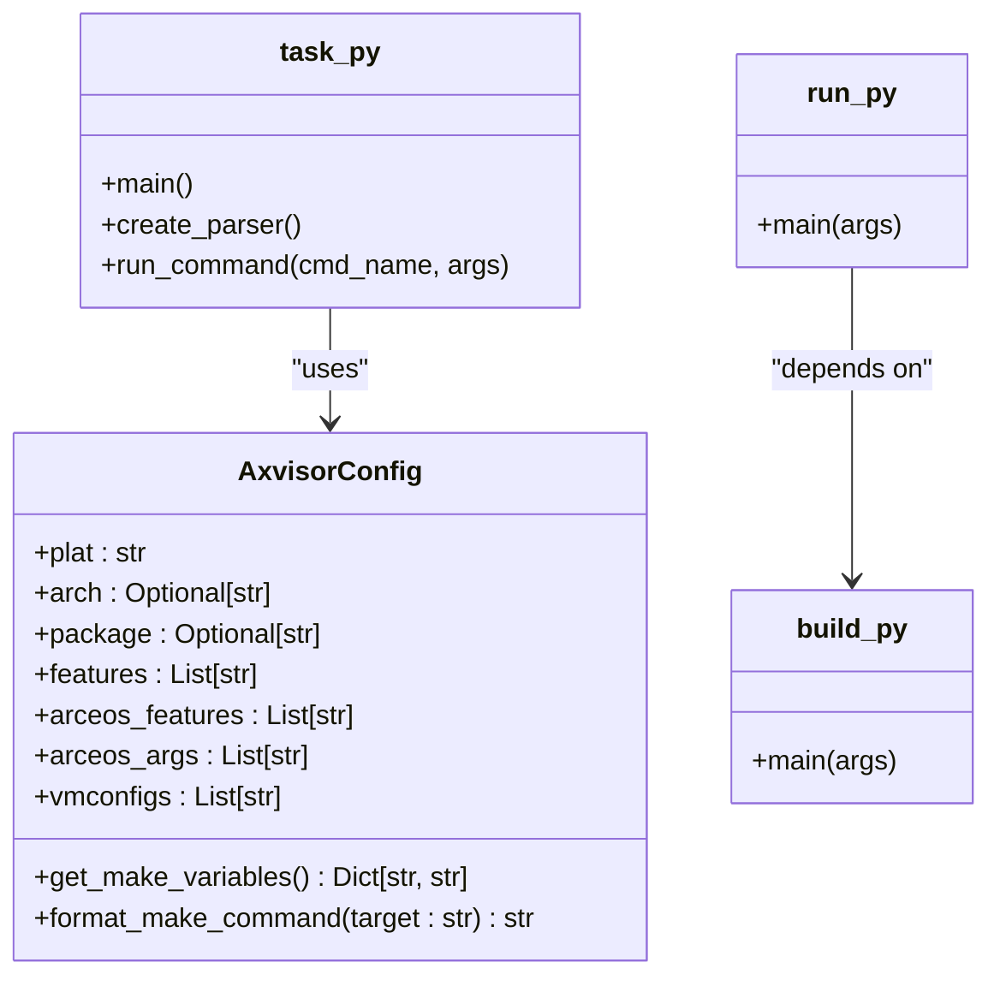

# 快速入门指南

<cite>
**本文档中引用的文件**
- [quick-start.sh](file://quick-start.sh)
- [axvisor.sh](file://axvisor.sh)
- [task.py](file://scripts/task.py)
- [build.py](file://scripts/build.py)
- [run.py](file://scripts/run.py)
- [config.py](file://scripts/config.py)
- [setup.py](file://scripts/setup.py)
- [def_hvconfig.toml](file://configs/def_hvconfig.toml)
- [arceos-aarch64.toml](file://configs/vms_bkp/arceos-aarch64.toml)
- [README.md](file://README.md)
</cite>

## 目录
1. [简介](#简介)
2. [开发环境准备](#开发环境准备)
3. [一键快速启动](#一键快速启动)
4. [手动构建流程](#手动构建流程)
5. [主执行脚本 axvisor.sh](#主执行脚本-axvisorsh)
6. [任务管理 task.py](#任务管理-taskpy)
7. [运行示例](#运行示例)
8. [常见问题排查](#常见问题排查)
9. [后续学习指引](#后续学习指引)

## 简介

AxVisor 是一个基于 ArceOS 单体内核框架实现的虚拟机监控器（Hypervisor），旨在利用 ArceOS 提供的基础操作系统功能，构建一个统一且模块化的 Hypervisor。其核心设计理念是“统一”与“模块化”。

“统一”意味着使用同一套代码库支持 x86_64、Arm (aarch64) 和 RISC-V 三种架构，最大化地复用与架构无关的代码，简化开发和维护工作。

“模块化”则指将 Hypervisor 的功能分解为多个可独立使用的组件，每个组件实现特定功能，并通过标准化接口进行通信，从而实现解耦和重用。

本指南将指导新用户从零开始构建和运行 AxVisor，涵盖环境准备、一键启动、手动构建、脚本使用、具体运行示例以及常见错误的解决方法。

## 开发环境准备

在开始构建 AxVisor 之前，您需要准备一个完整的开发环境。该环境主要依赖于 Rust 工具链、Python 脚本支持以及 QEMU 模拟器。

### 1. 安装 Rust 工具链

AxVisor 使用 Rust 编程语言编写，因此必须安装 Rust 开发环境。请根据官方指南安装 `rustup`：

```bash
curl --proto '=https' --tlsv1.2 -sSf https://sh.rustup.rs | sh
```

安装完成后，确保 `cargo` 和 `rustc` 命令可用。此外，还需要安装 `cargo-binutils` 工具集，用于 `rust-objcopy` 和 `rust-objdump` 等工具：

```bash
cargo install cargo-binutils
```

项目根目录下的 `rust-toolchain.toml` 文件指定了所需的工具链版本（nightly-2025-05-20），`rustup` 会自动下载并切换到该版本。

### 2. 安装 Python 依赖

AxVisor 的构建和管理脚本（如 `axvisor.sh` 和 `task.py`）依赖于 Python 3 及其第三方库。项目使用 `venv` 创建隔离的虚拟环境来管理这些依赖。

首次运行 `axvisor.sh` 脚本时，它会自动检测并设置 Python 虚拟环境。相关的依赖包列表定义在 `scripts/requirements.txt` 文件中。

### 3. 安装系统级依赖

确保您的系统已安装以下基础工具：
- `git`: 用于克隆 ArceOS 依赖仓库。
- `make`: 用于执行底层构建命令。
- `wget` 或 `curl`: 用于下载文件。
- `python3`: 运行 Python 脚本所必需。

`axvisor.sh` 脚本在执行前会检查 `python3` 和 `cargo` 是否已安装，如果缺失会给出明确的错误提示。

### 4. 安装 QEMU

为了在模拟环境中运行 AxVisor，需要安装对应架构的 QEMU 模拟器。对于 aarch64 架构，通常需要安装 `qemu-system-aarch64`。

在基于 Debian/Ubuntu 的系统上，可以使用以下命令安装：
```bash
sudo apt-get update
sudo apt-get install qemu-system-arm qemu-utils
```

**Section sources**
- [README.md](file://README.md#L45-L55)
- [axvisor.sh](file://axvisor.sh#L50-L65)
- [rust-toolchain.toml](file://rust-toolchain.toml#L1-L6)

## 一键快速启动

对于希望快速体验 AxVisor 功能的新用户，项目提供了一个名为 `quick-start.sh` 的一键式脚本。该脚本自动化了下载预编译内核镜像、复制配置文件并启动整个流程。

### 使用方法

只需在项目根目录下执行以下命令：

```bash
./quick-start.sh
```

此脚本无需任何参数，即可完成所有初始化和启动步骤。

### 脚本内部流程解析

`quick-start.sh` 脚本的核心逻辑如下：

1.  **创建临时目录**: 创建 `./tmp` 目录用于存放临时文件。
2.  **下载预编译内核**: 从指定的网络地址下载一个名为 `arceos_aarch64-dyn.bin` 的预编译 ArceOS 内核镜像。
3.  **复制虚拟机配置**: 将 `configs/vms_bkp/arceos-aarch64.toml` 配置文件复制到 `tmp` 目录下。
4.  **修改配置路径**: 使用 `sed` 命令动态修改 `.toml` 配置文件中的 `kernel_path` 字段，将其指向刚刚下载的内核镜像的绝对路径。
5.  **调用主脚本启动**: 最后，调用 `./axvisor.sh run` 命令，并传入一系列构建和运行参数，直接启动构建和模拟过程。
6.  **清理临时文件**: 启动完成后，删除 `tmp` 目录以保持项目整洁。

这个脚本极大地简化了初次用户的操作，避免了繁琐的手动配置步骤。

**Section sources**
- [quick-start.sh](file://quick-start.sh#L1-L13)
- [arceos-aarch64.toml](file://configs/vms_bkp/arceos-aarch64.toml#L1-L60)

## 手动构建流程

虽然一键脚本非常方便，但理解手动构建流程对于深入掌握项目至关重要。手动流程提供了更高的灵活性和对构建过程的完全控制。

### 1. 初始化配置文件

首先，需要生成一个默认的配置文件 `.hvconfig.toml`。这可以通过 `axvisor.sh` 脚本的 `defconfig` 命令完成：

```bash
./axvisor.sh defconfig
```

此命令会将 `configs/def_hvconfig.toml` 中的默认配置复制到项目根目录下的 `.hvconfig.toml`。您可以编辑此文件来自定义构建选项。

```toml
# 平台
plat = "aarch64-generic"
# Hypervisor 特性
features = ["ept-level-4"]
# ArceOS 构建参数
arceos_args = ["BUS=mmio", "BLK=y", "MEM=8g", "LOG=debug", "QEMU_ARGS=\"-machine gic-version=3  -cpu cortex-a72  \""]
# ArceOS 附加特性
arceos_features = []
# 虚拟机配置文件
vmconfigs = []
```

**Section sources**
- [axvisor.sh](file://axvisor.sh#L120-L145)
- [def_hvconfig.toml](file://configs/def_hvconfig.toml#L1-L11)

### 2. 执行构建

使用 `axvisor.sh` 脚本的 `build` 命令来构建项目：

```bash
./axvisor.sh build --plat aarch64-generic --features "fs" --arceos-args "LOG=info,BUS=mmio"
```

此命令会：
- 设置 Python 虚拟环境。
- 根据参数或 `.hvconfig.toml` 文件生成最终的配置。
- 调用底层的 `make` 命令进行实际编译。

### 3. 运行项目

构建成功后，使用 `run` 命令来启动模拟：

```bash
./axvisor.sh run --vmconfigs configs/vms/arceos-aarch64-e2000-smp1.toml
```

`run` 命令会先自动执行 `build` 步骤，确保代码是最新的，然后启动 QEMU 模拟器。

**Section sources**
- [axvisor.sh](file://axvisor.sh#L300-L320)
- [task.py](file://scripts/task.py#L100-L120)

## 主执行脚本 axvisor.sh

`axvisor.sh` 是项目的统一管理脚本，取代了传统的 Makefile，提供了完整的一站式项目管理功能。它是用户与项目交互的主要入口。

### 核心功能

该脚本封装了多种常用命令，使其更易于记忆和使用：

| 命令 | 描述 |
| :--- | :--- |
| `setup` | 设置完整的开发环境（检查依赖、设置虚拟环境）。 |
| `defconfig` | 复制默认配置文件 `.hvconfig.toml`。 |
| `build [args]` | 构建项目，支持透传所有参数。 |
| `run [args]` | 构建并运行项目，支持透传所有参数。 |
| `clean [args]` | 清理构建产物。 |
| `clippy [args]` | 运行代码静态检查。 |
| `status` | 显示项目当前状态（配置、环境等）。 |
| `help` | 显示帮助信息。 |

### 参数透传机制

`axvisor.sh` 的强大之处在于其“参数透传”机制。当您执行 `./axvisor.sh build --plat x86-qemu-q35` 时，脚本会智能地解析这些参数，并最终将它们传递给底层的 Python 脚本 `task.py`。这种设计保证了脚本的灵活性和向后兼容性。

**Section sources**
- [axvisor.sh](file://axvisor.sh#L1-L454)

## 任务管理 task.py

`task.py` 是 `axvisor.sh` 脚本背后的实际执行引擎，是一个用 Python 编写的命令行工具，负责处理具体的构建、运行等逻辑。

### 架构与工作流

`task.py` 采用模块化设计，不同的子命令（如 `build`, `run`）由 `scripts/` 目录下的不同 Python 模块（如 `build.py`, `run.py`）实现。

其核心工作流如下：
1.  **参数解析**: 使用 `argparse` 解析命令行参数。
2.  **配置合并**: 读取 `.hvconfig.toml` 配置文件，并将命令行参数与其合并，命令行参数优先级更高。
3.  **依赖设置**: 在构建前，自动检查并设置 ArceOS 依赖（克隆 `.arceos` 仓库）。
4.  **命令执行**: 根据合并后的配置，生成最终的 `make` 命令并执行。

### 关键配置类

`scripts/config.py` 文件中的 `AxvisorConfig` 类是整个配置系统的核心。它定义了所有可能的配置项（如 `plat`, `features`, `arceos_args` 等），并提供了将这些配置转换为 `make` 变量的方法。



**Diagram sources**
- [task.py](file://scripts/task.py#L1-L174)
- [config.py](file://scripts/config.py#L1-L454)
- [build.py](file://scripts/build.py#L1-L59)
- [run.py](file://scripts/run.py#L1-L44)

## 运行示例

### 示例 1：在 QEMU 上运行

这是最常用的开发和测试场景。假设您已经通过 `defconfig` 设置了配置文件，可以使用以下命令在 QEMU 中启动 AxVisor：

```bash
./axvisor.sh run --plat aarch64-qemu-virt-hv --vmconfigs configs/vms/linux-aarch64-qemu-smp1.toml
```

**预期输出日志**:
```
🚀 运行项目...
执行 run 功能...
运行前先构建项目...
执行 build 功能...
设置 arceos 依赖...
... (构建过程日志)
构建成功!
执行命令: make -C .arceos A=/path/to/axvisor ... run
INFO: Starting AxVisor...
INFO: Loading VM from config: configs/vms/linux-aarch64-qemu-smp1.toml
INFO: Booting Linux guest...
[    0.000000] Booting Linux on physical CPU 0x0000000000 [0x410fd034]
...
```

### 示例 2：在真实硬件平台（RK3568）上运行

要将 AxVisor 部署到 RK3568 开发板，您需要选择对应的平台配置：

```bash
./axvisor.sh build --plat aarch64-roc-rk3568-pc --vmconfigs configs/vms/arceos-aarch64-rk3568-smp1.toml
```

构建完成后，生成的二进制文件（如 `axvisor-dev_aarch64-roc-rk3568-pc.bin`）需要通过烧录工具写入开发板的存储介质（如 eMMC 或 SD 卡），然后上电启动。

**Section sources**
- [README.md](file://README.md#L100-L150)
- [axvisor.sh](file://axvisor.sh#L300-L320)

## 常见问题排查

在构建和运行过程中可能会遇到一些常见问题，以下是解决方案：

### 1. 依赖缺失

**现象**: 执行 `axvisor.sh` 时提示缺少 `python3` 或 `cargo`。

**解决方法**: 确保已正确安装 Python 3 和 Rust 工具链，并将它们添加到系统的 `PATH` 环境变量中。

### 2. 权限问题

**现象**: `task.py` 或 `axvisor.sh` 脚本没有执行权限。

**解决方法**: 使用 `chmod` 命令赋予执行权限：
```bash
chmod +x axvisor.sh scripts/task.py
```

### 3. 配置文件错误

**现象**: 报错找不到 `.hvconfig.toml` 或 `platform/xxx/axconfig.toml`。

**解决方法**: 
- 确保已运行 `./axvisor.sh defconfig` 生成了 `.hvconfig.toml`。
- 检查 `--plat` 参数指定的平台名称是否存在于 `platform/` 目录下。

### 4. ArceOS 依赖克隆失败

**现象**: `setup_arceos()` 函数报错，无法克隆 `https://github.com/arceos-hypervisor/arceos` 仓库。

**解决方法**: 
- 检查网络连接是否正常。
- 如果在国内，考虑使用 Git 代理或镜像源。

**Section sources**
- [axvisor.sh](file://axvisor.sh#L50-L65)
- [setup.py](file://scripts/setup.py#L1-L47)
- [config.py](file://scripts/config.py#L150-L200)

## 后续学习指引

本指南为您提供了从零开始构建和运行 AxVisor 的完整路径。为了进一步深入，建议您参考以下资源：

- **`doc/` 目录下的文档**: 包含关于虚拟机管理、SMP 支持和架构概览的详细说明。
- **`scripts/` 目录下的 Python 脚本**: 阅读 `task.py`、`build.py` 和 `config.py` 的源码，可以更深入地理解构建系统的内部机制。
- **`configs/vms/` 目录下的 TOML 文件**: 学习如何编写和自定义虚拟机配置文件。

通过这些资料，您将能够更好地配置和调试 AxVisor，满足更复杂的使用需求。