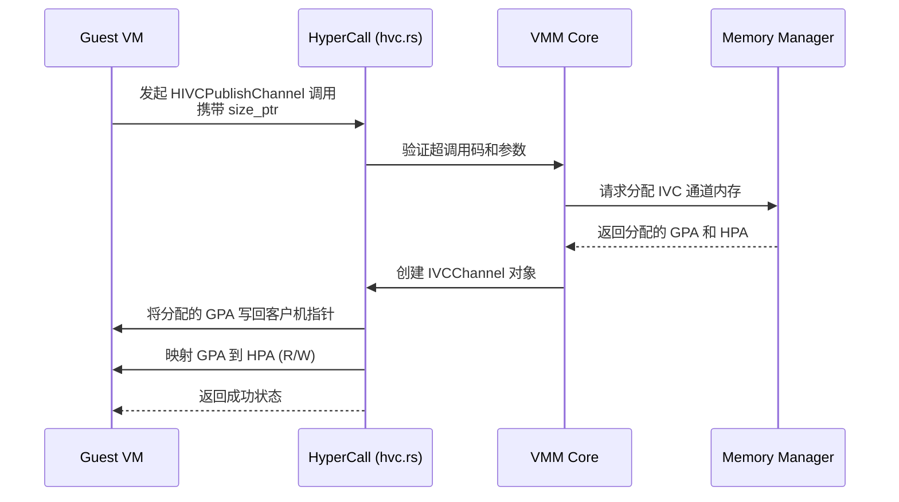
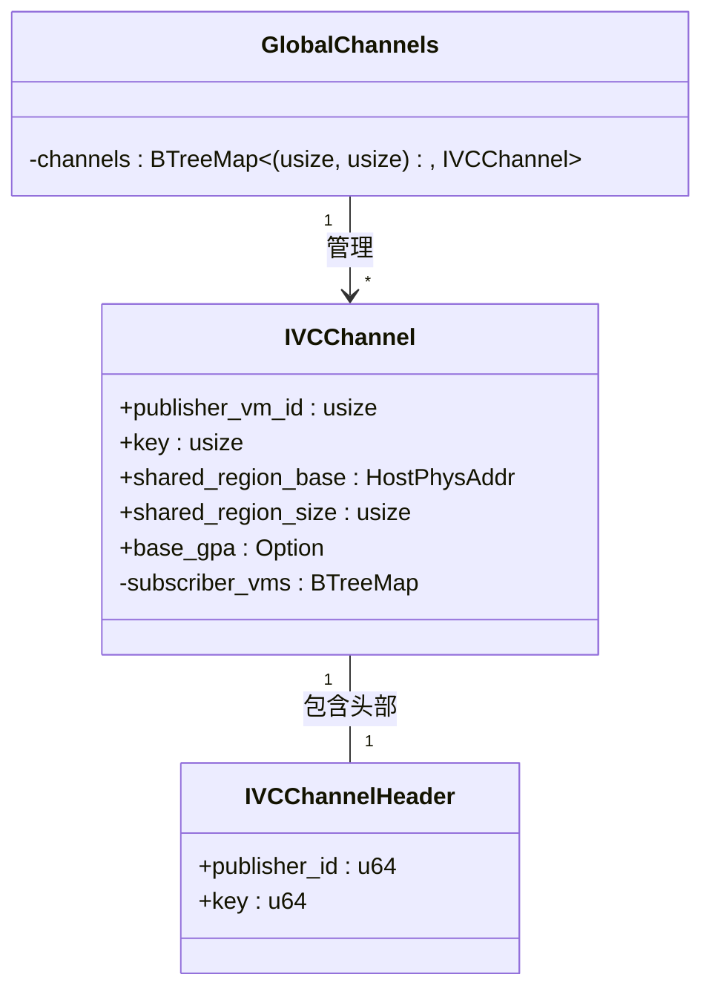
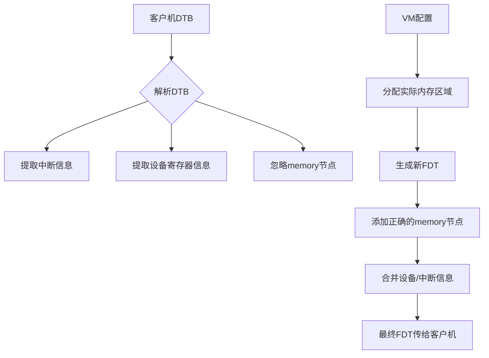

# 安全考量

<cite>
**本文档中引用的文件**
- [hvc.rs](file://src/vmm/hvc.rs)
- [ivc.rs](file://src/vmm/ivc.rs)
- [fdt.rs](file://src/vmm/fdt.rs)
- [config.rs](file://src/vmm/config.rs)
- [GuestVMs.md](file://doc/GuestVMs.md)
</cite>

## 目录
1. [引言](#引言)
2. [超调用接口权限控制机制](#超调用接口权限控制机制)
3. [IVC通道安全隔离设计](#ivc通道安全隔离设计)
4. [设备树与内存映射的安全配置](#设备树与内存映射的安全配置)
5. [客户机安全启动与可信执行环境](#客户机安全启动与可信执行环境)
6. [常见安全漏洞缓解措施](#常见安全漏洞缓解措施)
7. [结论](#结论)

## 引言
axvisor 是一个轻量级虚拟化监控器，旨在为嵌入式和资源受限环境提供安全、高效的虚拟化支持。本文件系统阐述 axvisor 在虚拟化环境中的安全边界构建原则与实践，重点分析其核心安全机制，包括超调用（Hypercall）接口的权限控制、跨虚拟机通信（IVC）通道的隔离设计、设备树（Device Tree）和内存映射配置的安全风险，并结合客户机管理规范，提出最小权限原则下的安全配置指南和漏洞缓解措施。

**Section sources**
- [main.rs](file://src/main.rs#L1-L38)
- [mod.rs](file://src/vmm/mod.rs#L1-L128)

## 超调用接口权限控制机制

超调用（Hypercall）是客户机操作系统（Guest OS）请求宿主虚拟机监控器（Hypervisor）执行特权操作的主要接口。在 axvisor 中，`hvc.rs` 模块实现了对超调用的处理，其核心在于严格的权限验证和操作范围限制，防止客户机越权访问宿主或其他客户机的资源。

`HyperCall::execute` 函数根据 `HyperCallCode` 枚举值分发不同的操作。当前实现主要围绕 IVC 通道的生命周期管理，如 `HIVCPublishChannel` 和 `HIVCSubscribChannel`。这些操作并非直接授予客户机任意内存或设备的访问权限，而是通过一个受控的发布-订阅模型来间接实现。

当客户机尝试发布一个 IVC 通道时，它仅能指定共享内存区域的大小，而不能指定其物理地址。宿主会使用 `vm.alloc_ivc_channel` 在宿主物理内存（HPA）中分配一块新的、隔离的内存区域，并将该区域的客户机物理地址（GPA）映射回客户机的地址空间。此过程确保了：
1.  **地址空间隔离**：客户机无法通过超调用直接指定或修改关键的 GPA 或 HPA。
2.  **资源所有权明确**：由宿主分配的内存，其所有权和生命周期由宿主严格管理。
3.  **输入验证**：所有来自客户机的参数（如 key, size）都会被宿主代码验证，无效的超调用码会被拒绝。

**Diagram sources**
- [hvc.rs](file://src/vmm/hvc.rs#L30-L70)
- [ivc.rs](file://src/vmm/ivc.rs#L149-L187)

**Section sources**
- [hvc.rs](file://src/vmm/hvc.rs#L1-L149)

## IVC通道安全隔离设计

IVC（Inter-VM Communication）模块是 axvisor 实现客户机间安全通信的核心。其设计遵循强隔离原则，确保消息传递过程中无信息泄露风险。

### 核心数据结构
`IVCChannel` 结构体是安全隔离的关键。它包含以下要素：
-   **`shared_region_base` (HostPhysAddr)**: 共享内存区域在宿主物理内存中的真实地址。这是唯一的真实存储位置，对所有参与的客户机都是隐藏的。
-   **`base_gpa` (Option<GuestPhysAddr>)**: 该区域在发布者客户机地址空间中的映射地址。一旦通道被取消发布，此字段会被置为 `None`，断开发布者的访问。
-   **`subscriber_vms` (BTreeMap<usize, GuestPhysAddr>)**: 记录所有订阅者客户机 ID 及其在各自地址空间中的映射 GPA。每个订阅者看到的是独立的 GPA 映射。
-   **`publisher_vm_id` 和 `key`**: 唯一标识一个通道，构成全局通道表 `IVC_CHANNELS` 的索引键。

### 安全特性分析
1.  **单点真相与地址转换**：所有客户机（发布者和订阅者）都通过各自的 GPA 访问同一块宿主 HPA 内存。宿主的页表管理负责 GPA 到 HPA 的透明转换。这使得客户机无法感知其他客户机的 GPA，也无法直接探测到共享内存的真实物理位置，有效防止了侧信道攻击中的地址猜测。
2.  **显式订阅与访问控制**：客户机必须通过 `HIVCSubscribChannel` 超调用显式申请订阅。宿主会检查 `(publisher_vm_id, key)` 组合是否存在且有效，只有通过验证的客户机才能获得映射。这实现了基于身份（VM ID）和密钥（Key）的访问控制。
3.  **生命周期管理与资源回收**：
    *   当发布者调用 `HIVCUnPublishChannel` 时，宿主会将 `base_gpa` 置为 `None` 并解除发布者地址空间的映射，立即切断发布者的写入能力。
    *   如果此时仍有订阅者，通道不会被立即销毁，而是进入“待清理”状态，允许订阅者继续读取数据。
    *   当最后一个订阅者调用 `HIVCUnSubscribChannel` 后，宿主会检查通道是否已取消发布且无订阅者，然后才从全局表中移除并释放底层的 HPA 内存帧（通过 `Drop` trait 调用 `dealloc_frame`）。这种延迟释放机制保证了通信的原子性和完整性，同时确保了资源的最终回收。

**Diagram sources**
- [ivc.rs](file://src/vmm/ivc.rs#L149-L223)
- [ivc.rs](file://src/vmm/ivc.rs#L1-L286)

**Section sources**
- [ivc.rs](file://src/vmm/ivc.rs#L1-L286)

## 设备树与内存映射的安全配置

设备树（Device Tree Blob, DTB）和内存映射配置是客户机启动时的重要环节，但也可能引入潜在的攻击面。

### 设备树修改风险
在 `config.rs` 中，`parse_vm_dtb` 函数解析客户机提供的 DTB 文件。虽然此函数主要用于提取中断和设备信息以配置直通设备，但若不加限制地应用整个 DTB，恶意客户机可能：
1.  **伪装设备**：声明不存在的设备，试图诱骗宿主分配资源。
2.  **覆盖关键节点**：修改或禁用关键的系统节点，干扰宿主的正常初始化。

**安全实践**：
-   **选择性解析**：axvisor 仅解析 DTB 中的 `interrupts` 和 `reg` 属性，用于配置 SPI 中断和直通设备，而非全盘接受。例如，`interrupt-controller` 节点会被跳过，强制使用虚拟 GIC（vGIC），避免客户机干扰中断系统。
-   **地址过滤**：对于 `reg` 属性，低于 `0x1000` 的地址会被忽略，防止客户机尝试映射低地址保留区域。
-   **最小化依赖**：最佳实践是宿主应使用自己生成的、经过审计的设备树，而不是完全依赖客户机提供的 DTB。

### 内存映射配置风险
`vm_alloc_memorys` 函数根据配置文件为虚拟机分配内存。存在两种映射类型：
-   `MapAlloc`: 宿主在指定 GPA 分配内存。
-   `MapIdentical`: 宿主在任意 GPA 分配内存。

**安全实践（最小权限原则）**：
1.  **避免不必要的 `MapAlloc`**：除非有特定需求（如固件要求的固定加载地址），否则应优先使用 `MapIdentical`。这可以防止客户机通过配置文件指定敏感的 GPA 区域。
2.  **明确内存区域**：在配置文件中明确定义内存区域的大小和属性，避免过大或模糊的分配。
3.  **动态设备树更新**：`fdt.rs` 中的 `updated_fdt` 函数会在启动前动态修改设备树，特别是 `memory` 节点。它会丢弃客户机 DTB 中的原始 `memory` 节点，转而根据宿主为该 VM 分配的实际 `memory_regions` 重新生成。这确保了客户机只能看到宿主授权给它的内存，从根本上杜绝了客户机通过 DTB 声称拥有未分配内存的可能性。

**Diagram sources**
- [config.rs](file://src/vmm/config.rs#L139-L162)
- [fdt.rs](file://src/vmm/fdt.rs#L40-L96)

**Section sources**
- [config.rs](file://src/vmm/config.rs#L41-L284)
- [fdt.rs](file://src/vmm/fdt.rs#L0-L97)

## 客户机安全启动与可信执行环境

结合 `GuestVMs.md` 文档中关于客户机管理的描述，可以制定一套安全启动流程。

### 安全启动流程
1.  **配置文件审查**：管理员应仔细审查 `configs/vms/*.toml` 配置文件，确认其中定义的内核路径、内存大小、CPU 核心数等符合预期，且不包含可疑的直通设备。
2.  **镜像来源验证**：确保 `kernel_path` 和 `dtb_path` 指向经过签名和验证的、可信的内核和设备树二进制文件。文档中提到的 ArceOS 和 NimbOS 应从官方仓库获取。
3.  **最小化配置**：为每个客户机创建专用的、最小化的 TOML 配置文件，只包含运行必需的组件，遵循最小权限原则。
4.  **启动与监控**：通过 `make kernel` 等命令构建并启动。启动后，宿主日志（如 `info!`, `warn!` 输出）应被持续监控，以检测任何异常行为。

### 可信执行环境配置指南
-   **隔离关键客户机**：将运行不同信任级别的工作负载（如 NimbOS 实时任务 vs ArceOS 通用任务）部署在不同的客户机中，利用硬件虚拟化进行强隔离。
-   **禁用不必要的功能**：如果客户机不需要 IVC 通信，则不在其配置中启用相关超调用，减少攻击面。
-   **使用简单 BIOS**：对于需要引导程序的客户机，使用文档中提到的 `axvm-bios` 这类极简 BIOS，降低引导阶段的复杂性和潜在漏洞。

**Section sources**
- [GuestVMs.md](file://doc/GuestVMs.md#L0-L43)
- [config.rs](file://src/vmm/config.rs#L1-L284)

## 常见安全漏洞缓解措施

### 侧信道攻击
-   **缓解措施**：IVC 通道的设计本身提供了良好的防护。由于共享内存的真实 HPA 对客户机不可见，且每个客户机的 GPA 映射是独立的，基于地址的推测攻击难度极大。此外，应确保共享内存区域的访问模式（如缓存行填充）不会泄露敏感信息。
-   **代码建议**：在 `IVCChannel` 的 `data_region` 访问前后，可考虑加入缓存刷新操作（尽管当前 `dcache_range` 为空实现），以防御基于缓存的侧信道攻击。

### DMA越权
-   **缓解措施**：DMA 攻击通常针对直通设备。在 `config.rs` 中，`PassThroughDeviceConfig` 明确指定了设备的 `base_gpa` 和 `length`。宿主的 IOMMU（如果平台支持）应被正确配置，将设备的 DMA 访问限制在该客户机被分配的内存区域内。
-   **代码建议**：在 `add_pass_through_device` 调用前后，应有明确的日志记录和边界检查。未来可增强对设备 MSI/MSI-X 中断的处理，确保中断路由的安全。

**Section sources**
- [ivc.rs](file://src/vmm/ivc.rs#L189-L223)
- [config.rs](file://src/vmm/config.rs#L139-L162)
- [hal/arch/x86_64/cache.rs](file://src/hal/arch/x86_64/cache.rs#L0-L4)

## 结论
axvisor 通过精心设计的超调用权限控制、基于发布-订阅模型的 IVC 通道以及对设备树和内存映射的主动管理，构建了一个坚固的安全边界。其核心思想是“宿主掌控一切”，即所有关键资源（内存、设备、通信通道）的分配和管理权始终掌握在宿主手中，客户机只能通过预定义的、受严格验证的接口进行有限的、非越权的操作。遵循最小权限原则，审慎配置客户机，并持续关注潜在的侧信道和 DMA 攻击，可以进一步提升整个虚拟化环境的安全性。