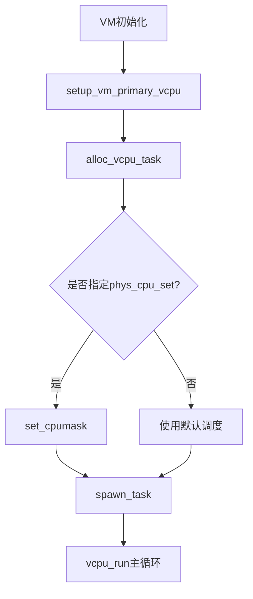
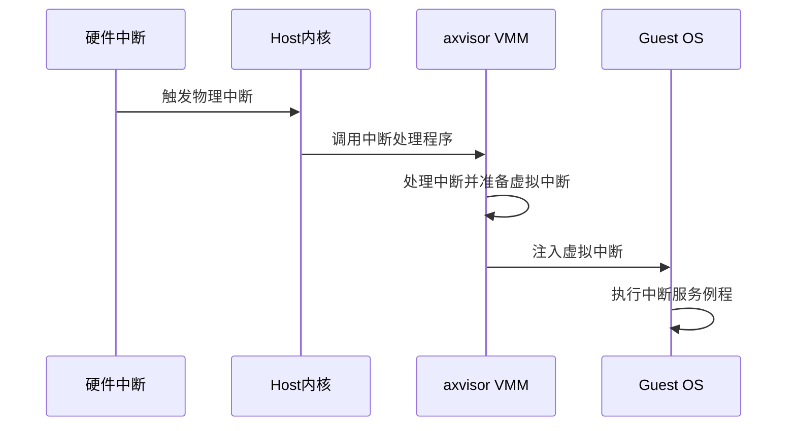

# 性能优化

<cite>
**本文档中引用的文件**  
- [SMP.md](file://doc/SMP.md)
- [timer.rs](file://src/vmm/timer.rs)
- [vcpus.rs](file://src/vmm/vcpus.rs)
- [mod.rs](file://src/vmm/mod.rs)
- [config.rs](file://src/vmm/config.rs)
- [fdt.rs](file://src/vmm/fdt.rs)
- [arceos-aarch64-e2000-smp1.toml](file://configs/vms/arceos-aarch64-e2000-smp1.toml)
- [arceos-aarch64-e2000-smp2.toml](file://configs/vms/arceos-aarch64-e2000-smp2.toml)
- [linux-aarch64-e2000-smp1.toml](file://configs/vms/linux-aarch64-e2000-smp1.toml)
- [linux-aarch64-e2000-smp2.toml](file://configs/vms/linux-aarch64-e2000-smp2.toml)
</cite>

## 目录
1. [引言](#引言)
2. [vCPU调度机制与SMP配置](#vcpu调度机制与smp配置)
3. [性能瓶颈分析](#性能瓶颈分析)
4. [调优策略与代码实现](#调优策略与代码实现)
5. [多核配置对比与推荐模板](#多核配置对比与推荐模板)
6. [性能测试方法论](#性能测试方法论)
7. [结论](#结论)

## 引言
本文深入分析axvisor在多虚拟机并发运行场景下的性能优化策略。结合`SMP.md`文档内容，详细说明vCPU调度机制与SMP多核配置对性能的影响，探讨如何根据工作负载合理分配vCPU数量和亲和性设置以最大化利用率。同时分析内存映射延迟、中断注入开销等瓶颈点，并提供基于实际代码的调优建议。

## vCPU调度机制与SMP配置

### SMP架构支持现状
axvisor当前支持为虚拟机配置多个vCPU（虚拟CPU），但受限于缺乏中断虚拟化支持，每个vCPU被固定绑定到特定物理核心上运行。未来一旦支持中断虚拟化，将实现vCPU与物理核心之间的灵活调度。

**关键配置参数：**
- `cpu_num`: 指定虚拟机所需的vCPU数量
- `phys_cpu_ids`: 从虚拟机视角看到的物理CPU ID列表
- `phys_cpu_sets`: 定义每个vCPU的亲和性位图，用于绑定到具体物理CPU

例如，在一个四核配置中：
```toml
cpu_num = 4
phys_cpu_ids = [0x00, 0x100, 0x200, 0x300]
phys_cpu_sets = [0x1, 0x2, 0xC, 0xC]
```
表示前两个vCPU分别固定在物理核心0和1上，后两个vCPU可在物理核心2或3上运行。

### vCPU任务调度流程
vCPU的调度通过ArceOS的任务系统实现。每个vCPU对应一个内核任务（AxTaskRef），由`alloc_vcpu_task`函数创建并注册到全局调度器中。



**代码路径：**
- [vcpus.rs#L300-L335](file://src/vmm/vcpus.rs#L300-L335): `alloc_vcpu_task` 函数负责创建vCPU任务
- [vcpus.rs#L329-L366](file://src/vmm/vcpus.rs#L329-L366): 设置CPU亲和性并启动任务

**Diagram sources**
- [vcpus.rs](file://src/vmm/vcpus.rs#L300-L335)

**Section sources**
- [vcpus.rs](file://src/vmm/vcpus.rs#L300-L335)
- [SMP.md](file://doc/SMP.md)

## 性能瓶颈分析

### 内存映射延迟
由于当前采用`MAP_IDENTICAL`方式进行内存映射，虽然减少了页表转换开销，但在跨NUMA节点访问时可能引入较高的内存延迟。特别是当vCPU与其使用的内存不在同一NUMA域时，性能下降明显。

### 中断注入开销
当前中断处理路径较长：
1. 物理中断触发
2. Host内核处理并转发至VMM
3. VMM调用`inject_interrupt`进行虚拟中断注入
4. Guest OS响应中断

此过程涉及多次上下文切换和权限变更，增加了延迟。

### 上下文切换成本
尽管vCPU被绑定到特定物理核心以减少迁移，但在高负载情况下仍可能发生不必要的上下文切换。特别是在`vcpu_run`主循环中频繁检查定时器事件（`check_events`）会增加额外开销。



**Diagram sources**
- [vcpus.rs](file://src/vmm/vcpus.rs#L395-L422)
- [timer.rs](file://src/vmm/timer.rs#L81-L112)

**Section sources**
- [vcpus.rs](file://src/vmm/vcpus.rs#L395-L422)
- [timer.rs](file://src/vmm/timer.rs#L81-L112)

## 调优策略与代码实现

### 时间片轮转策略调整
参考`timer.rs`中的定时器管理机制，可通过调整定时器精度来平衡响应性与开销：

```rust
pub fn check_events() {
    let timer_list = unsafe { TIMER_LIST.current_ref_mut_raw() };
    loop {
        let now = axhal::time::wall_time();
        let event = timer_list.lock().expire_one(now);
        if let Some((_deadline, event)) = event {
            trace!("pick one {:#?} to handle!!!", _deadline);
            event.callback(now);
        } else {
            break;
        }
    }
}
```

建议优化方向：
- 减少`check_events`调用频率
- 合并短间隔定时器
- 使用更高效的定时器数据结构（如时间轮）

**代码路径：**
- [timer.rs#L81-L112](file://src/vmm/timer.rs#L81-L112): `check_events` 函数实现

### 减少跨vCPU上下文切换
通过合理设置`phys_cpu_sets`确保：
1. 高频通信的vCPU尽量位于同一物理CPU簇内
2. I/O密集型vCPU与网络/存储中断所在物理核心靠近
3. 计算密集型vCPU独占物理核心避免争抢

示例配置（RK3568平台）：
```toml
cpu_num = 2
phys_cpu_ids = [0x00, 0x100]
phys_cpu_sets = [1, 2]  # 分别绑定到核心0和1
```

### 启动延迟优化
当前存在固定的启动延迟机制：
```rust
let boot_delay_sec = (vm_id - 1) * 5;
busy_wait(Duration::from_secs(boot_delay_sec as _));
```
对于实时性要求高的场景，可考虑动态调整或移除该延迟。

**Section sources**
- [timer.rs](file://src/vmm/timer.rs#L81-L112)
- [vcpus.rs](file://src/vmm/vcpus.rs#L329-L366)

## 多核配置对比与推荐模板

### 单核 vs 双核配置对比

| 配置类型 | 示例文件 | cpu_num | phys_cpu_sets | 适用场景 |
|---------|--------|--------|-------------|---------|
| 单核SMP | arceos-aarch64-e2000-smp1.toml | 1 | [4] | 轻量级服务、控制平面 |
| 双核SMP | arceos-aarch64-e2000-smp2.toml | 2 | [2, 8] | 计算密集型应用 |
| 单核Linux | linux-aarch64-e2000-smp1.toml | 1 | [8] | 兼容性测试 |
| 双核Linux | linux-aarch64-e2000-smp2.toml | 2 | [1, 4] | 高性能计算 |

### 推荐配置模板
```toml
[base]
id = 2
name = "optimized-vm"
vm_type = 1
cpu_num = 2
phys_cpu_ids = [0x00, 0x100]
phys_cpu_sets = [1, 2]

[kernel]
entry_point = 0x20_2008_0000
image_location = "memory"
kernel_load_addr = 0x20_2008_0000
dtb_load_addr = 0x20_2000_0000
memory_regions = [[0x20_2000_0000, 0x2000_0000, 0x7, 1]]
```

**Section sources**
- [arceos-aarch64-e2000-smp1.toml](file://configs/vms/arceos-aarch64-e2000-smp1.toml)
- [arceos-aarch64-e2000-smp2.toml](file://configs/vms/arceos-aarch64-e2000-smp2.toml)
- [linux-aarch64-e2000-smp1.toml](file://configs/vms/linux-aarch64-e2000-smp1.toml)
- [linux-aarch64-e2000-smp2.toml](file://configs/vms/linux-aarch64-e2000-smp2.toml)

## 性能测试方法论

### 基准测试工具建议
1. **CPU性能测试**：使用`hackbench`或`sysbench cpu`评估多线程性能
2. **内存带宽测试**：`mbw`工具测量跨NUMA内存访问性能
3. **中断延迟测试**：自定义压力测试程序测量中断响应时间
4. **上下文切换测试**：`lmbench lat_ctx`评估任务切换开销

### 监控指标解读
关键监控指标包括：
- **vCPU利用率**：通过`/proc/stat`获取各vCPU使用率
- **上下文切换次数**：`vmstat`中的`cs`字段
- **中断频率**：`/proc/interrupts`统计每秒中断数
- **内存延迟**：`numastat`查看远程内存访问比例

建议建立自动化测试框架，定期采集上述指标并生成趋势报告。

**Section sources**
- [SMP.md](file://doc/SMP.md)
- [vcpus.rs](file://src/vmm/vcpus.rs)

## 结论
axvisor在多虚拟机并发场景下具备良好的SMP支持基础，但仍有较大优化空间。通过合理配置vCPU数量与亲和性、优化定时器处理逻辑、减少上下文切换等手段，可显著提升系统整体性能。建议根据具体工作负载特征选择合适的配置模板，并建立完善的性能监控体系持续优化。