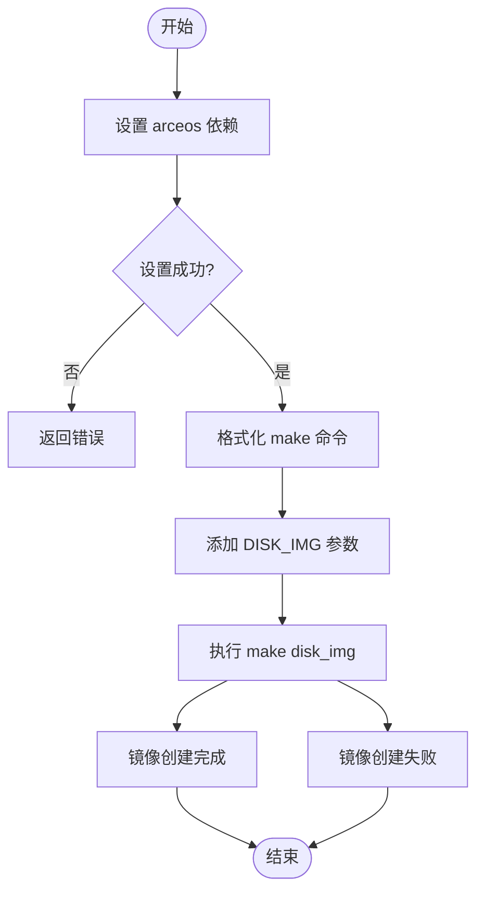
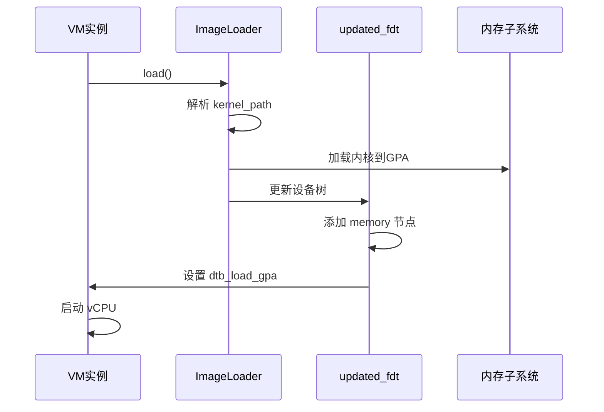
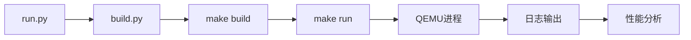
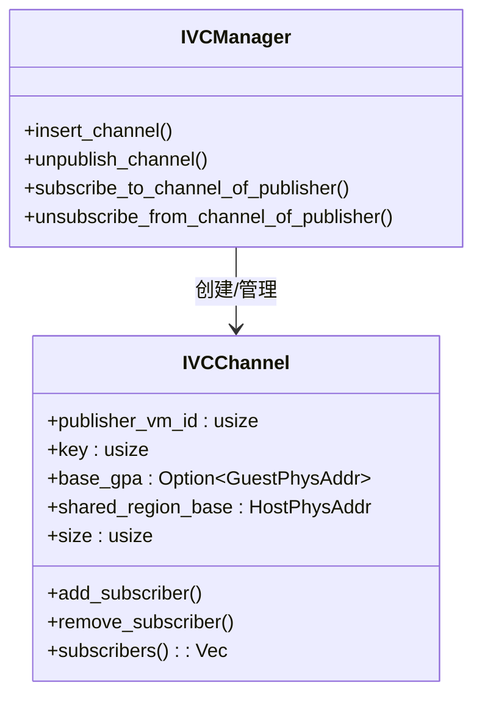
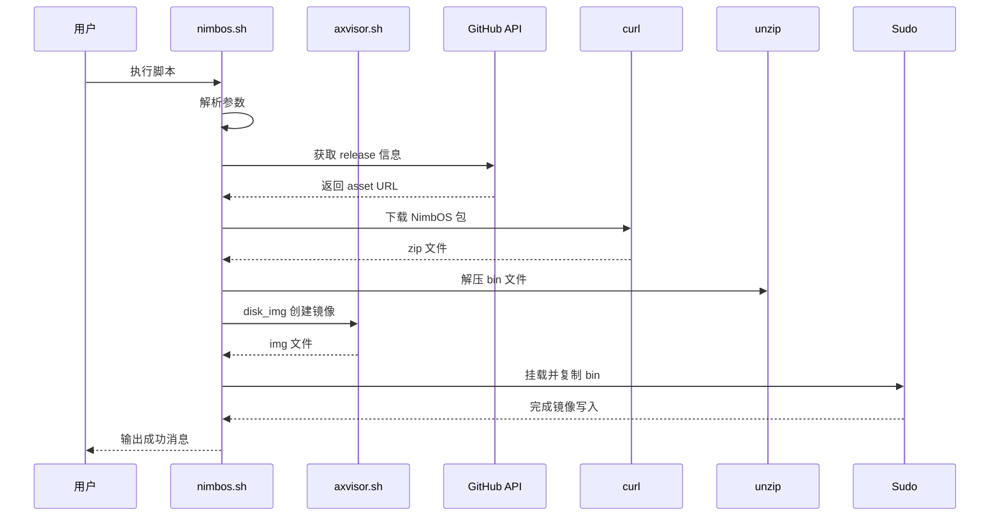

# 故障排查指南

<cite>
**本文档中引用的文件**
- [disk_img.py](file://scripts/disk_img.py)
- [run.py](file://scripts/run.py)
- [task.py](file://scripts/task.py)
- [nimbos.sh](file://scripts/nimbos.sh)
- [config.py](file://scripts/config.py)
- [task.py-usage.md](file://doc/task.py-usage.md)
- [fdt.rs](file://src/vmm/fdt.rs)
- [ivc.rs](file://src/vmm/ivc.rs)
- [config.rs](file://src/vmm/config.rs)
- [linux.rs](file://src/vmm/images/linux.rs)
- [mod.rs](file://src/vmm/images/mod.rs)
- [mod.rs](file://src/vmm/mod.rs)
- [main.rs](file://src/main.rs)
</cite>

## 目录
1. [引言](#引言)
2. [虚拟机启动失败排查](#虚拟机启动失败排查)
3. [性能异常与卡顿分析](#性能异常与卡顿分析)
4. [跨虚拟机通信中断处理](#跨虚拟机通信中断处理)
5. [自动化部署脚本问题诊断](#自动化部署脚本问题诊断)
6. [高频问题模式总结](#高频问题模式总结)

## 引言

本指南旨在为开发者提供一套结构化的故障排查流程，帮助快速定位并解决 axvisor 在部署与运行过程中遇到的典型问题。通过分析日志输出、验证磁盘镜像完整性、检查内核配置及设备树兼容性，并结合调试工具收集运行时数据，系统化地应对各类异常场景。

## 虚拟机启动失败排查

当虚拟机无法正常启动时，应首先检查日志输出模式，确认错误类型属于镜像加载、内存分配还是设备初始化阶段。重点验证磁盘镜像完整性、内核路径配置以及设备树（DTB）的兼容性。

### 磁盘镜像完整性验证

使用 `disk_img.py` 脚本创建和验证磁盘镜像是确保 VM 启动成功的关键步骤。该脚本会调用底层构建系统生成指定格式的磁盘映像。



**图示来源**
- [disk_img.py](file://scripts/disk_img.py#L0-L51)

**本节来源**
- [disk_img.py](file://scripts/disk_img.py#L0-L51)

### 内核镜像路径与设备树兼容性检查

内核镜像路径必须在 VM 配置文件（`.toml`）中正确指定，且其二进制头部信息需符合目标架构规范。对于 AArch64 架构，`linux.rs` 模块会解析内核头部中的 `text_offset` 和 `image_size` 字段以验证有效性。

设备树（DTB）由 `fdt.rs` 处理，在加载过程中会被更新以反映实际内存布局。若 DTB 中定义了不支持的中断控制器或保留内存区域冲突，可能导致 VM 初始化失败。



**图示来源**
- [images/mod.rs](file://src/vmm/images/mod.rs#L0-L337)
- [fdt.rs](file://src/vmm/fdt.rs#L0-L97)

**本节来源**
- [linux.rs](file://src/vmm/images/linux.rs#L0-L148)
- [mod.rs](file://src/vmm/images/mod.rs#L0-L337)
- [fdt.rs](file://src/vmm/fdt.rs#L0-L97)

## 性能异常与卡顿分析

针对性能下降或运行卡顿现象，应利用 `run.py` 和 `task.py-usage.md` 提供的调试命令收集 vCPU 占用率、内存分配状态等关键指标。

### 使用 run.py 收集运行时数据

`run.py` 在执行前自动调用 `build.py` 完成构建，并通过 `make run` 启动虚拟机。可通过启用详细日志输出观察各阶段耗时。



**图示来源**
- [run.py](file://scripts/run.py#L0-L43)

**本节来源**
- [run.py](file://scripts/run.py#L0-L43)
- [task.py-usage.md](file://doc/task.py-usage.md#L0-L271)

### 运行时资源监控建议

建议在 `task.py` 中添加自定义参数以注入性能监控逻辑，例如：

```bash
./task.py run --arceos-args "LOG=debug,QEMU_ARGS=\"-smp 4 -m 4G\""
```

此命令将启用调试日志并配置 4 核 CPU 与 4GB 内存，便于观察资源瓶颈。

## 跨虚拟机通信中断处理

IVC（Inter-VM Communication）通道是实现虚拟机间共享内存通信的核心机制。通信中断通常源于 IVC 通道初始化顺序错误或共享内存映射不一致。

### IVC 通道初始化流程

IVC 通道由发布者（publisher）创建，订阅者（subscriber）通过 `subscribe_to_channel_of_publisher` 接口接入。通道元数据存储于全局 `IVC_CHANNELS` 映射中。



**图示来源**
- [ivc.rs](file://src/vmm/ivc.rs#L0-L285)

**本节来源**
- [ivc.rs](file://src/vmm/ivc.rs#L0-L285)

### 共享内存映射一致性检查

每个 IVC 通道包含一个共享内存帧（frame），其物理地址在宿主机上固定（HVA），但在不同 VM 的 GPA 空间中可映射至不同位置。需确保所有参与者对同一通道使用相同的 `key` 和 `publisher_vm_id`。

常见错误包括：
- 订阅时未正确传递 `subscriber_gpa`
- 发布者提前调用 `unpublish_channel` 导致通道失效
- 多个 VM 并发访问同一通道而未加锁

## 自动化部署脚本问题诊断

`nimbos.sh` 是用于自动化构建 NimbOS 镜像的核心脚本，涉及下载、解压、BIOS 注入和磁盘镜像制作等多个环节。

### nimbos.sh 调用链分析



**图示来源**
- [nimbos.sh](file://scripts/nimbos.sh#L0-L356)

**本节来源**
- [nimbos.sh](file://scripts/nimbos.sh#L0-L356)

### 常见易错环节与修复方案

| 问题环节 | 错误表现 | 修复方案 |
|--------|--------|--------|
| 依赖缺失 | `curl`, `jq`, `unzip` 未安装 | 提示用户安装必要工具 |
| 版本不匹配 | SHA256 校验失败 | 清理缓存重新下载 |
| BIOS 缺失 | x86_64 架构缺少 BIOS | 检查 `axvm-bios.bin` 是否存在 |
| 权限不足 | 挂载镜像失败 | 使用 `sudo` 执行挂载操作 |
| 路径错误 | `axvisor.sh` 不在预期位置 | 验证工作目录结构 |

## 高频问题模式总结

以下为常见问题的根本原因与应对策略汇总：

| 问题类型 | 根本原因 | 应对策略 |
|--------|--------|--------|
| VM 启动失败 | 磁盘镜像损坏或路径错误 | 使用 `disk_img.py` 重建镜像 |
| 内核无法加载 | 内核头部格式不符或 DTB 缺失 | 验证 `linux.rs` 解析逻辑与 DTB 存在性 |
| 性能卡顿 | vCPU 数量不足或内存竞争 | 调整 `QEMU_ARGS` 增加资源 |
| IVC 通信中断 | 初始化顺序错误或 key 冲突 | 检查 `ivc.rs` 中订阅/发布顺序 |
| 自动化失败 | 脚本权限或网络问题 | 确保 `nimbos.sh` 可执行且网络通畅 |

通过遵循上述结构化流程，开发者可高效定位并解决 axvisor 在部署与运行中的绝大多数典型问题。