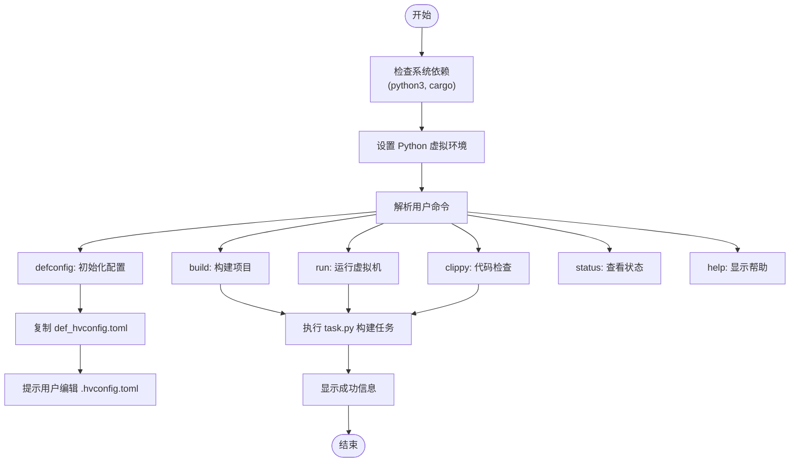
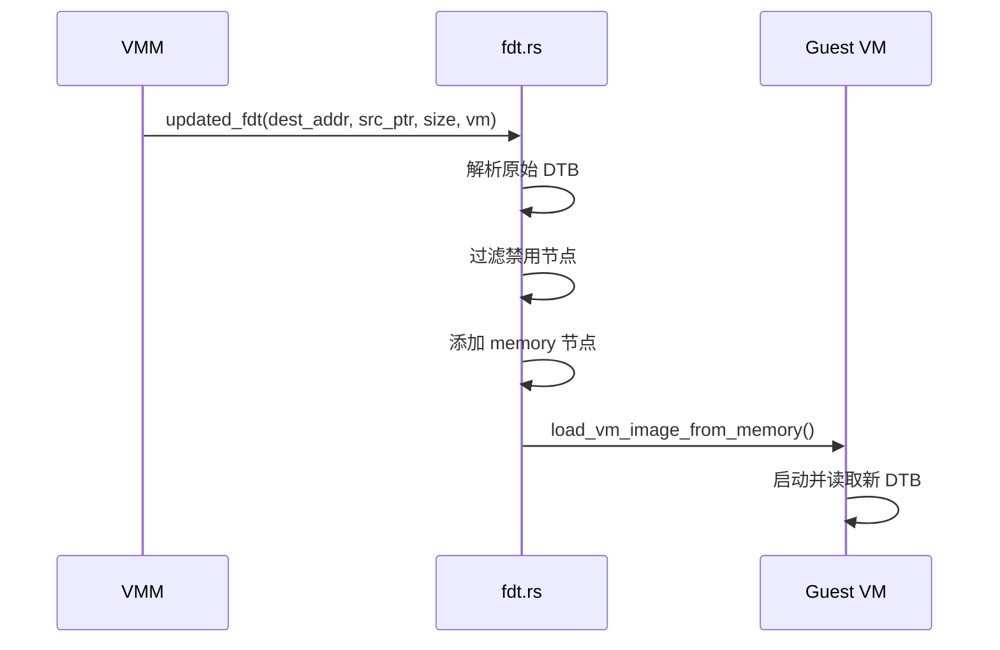

# 部署实践

<cite>
**本文档引用的文件**
- [axvisor.sh](file://axvisor.sh)
- [quick-start.sh](file://quick-start.sh)
- [aarch64-qemu-virt-hv.toml](file://configs/platforms/aarch64-qemu-virt-hv.toml)
- [aarch64-rk3588j-hv.toml](file://configs/platforms/aarch64-rk3588j-hv.toml)
- [linux-aarch64-rk3568-smp1.toml](file://configs/vms/linux-aarch64-rk3568-smp1.toml)
- [arceos-aarch64-rk3568-smp1.toml](file://configs/vms/arceos-aarch64-rk3568-smp1.toml)
- [def_hvconfig.toml](file://configs/def_hvconfig.toml)
- [main.rs](file://src/main.rs)
- [config.rs](file://src/vmm/config.rs)
- [mod.rs](file://src/vmm/mod.rs)
</cite>

## 目录
1. [引言](#引言)
2. [平台配置与虚拟机模板适配](#平台配置与虚拟机模板适配)
3. [一键式部署脚本分析](#一键式部署脚本分析)
4. [生产环境优化策略](#生产环境优化策略)
5. [系统资源预估模型](#系统资源预估模型)
6. [监控与容灾机制](#监控与容灾机制)
7. [结论](#结论)

## 引言
AxVisor 是一个基于 ArceOS 单体内核框架实现的统一模块化虚拟机监视器（Hypervisor），支持 x86_64、Arm (aarch64) 和 RISC-V 三种架构。该系统通过将功能分解为多个独立组件，实现了高可复用性和低耦合性。本文档旨在分享在真实硬件与仿真环境中部署 AxVisor 的最佳实践，涵盖从平台选择到生产级优化的完整流程。

## 平台配置与虚拟机模板适配

### 平台定义文件解析
AxVisor 使用 TOML 格式的配置文件来管理不同平台和虚拟机的设置。平台定义文件位于 `configs/platforms/` 目录下，用于描述目标硬件的物理内存布局、设备地址空间及中断控制器等关键信息。

以 QEMU 仿真环境为例，`aarch64-qemu-virt-hv.toml` 文件中定义了：
- 物理内存基地址：`0x4000_0000`
- 内存大小：2GB (`0x1_0000_0000`)
- UART 控制器地址：`0x0900_0000`
- GIC 中断控制器分布：GICD 在 `0x0800_0000`，GICR 在 `0x080a_0000`

而对于 RK3588 真实硬件平台，`aarch64-rk3588j-hv.toml` 则配置了：
- 物理内存起始地址：`0x20_0000`
- 总内存容量：128MB (`0x800_0000`)
- UART 地址：`0xfeb5_0000`
- GICV3 分布式中断控制器地址：`0xfe600000`

这些差异化的配置确保了 AxVisor 能够准确映射底层硬件资源，实现跨平台兼容。

### 虚拟机模板匹配原则
虚拟机模板文件存储于 `configs/vms/` 目录，命名遵循 `<os>-<arch>-board_or_cpu-smpx` 规则。例如：
- `linux-aarch64-rk3568-smp1.toml` 表示运行 Linux 系统、ARM64 架构、RK3568 平台、单核 SMP 的虚拟机配置。
- `arceos-aarch64-rk3568-smp1.toml` 对应 ArceOS 操作系统在同一平台上的部署方案。

选择合适的模板需考虑以下因素：
1. **操作系统类型**：根据 Guest OS 类型选择对应前缀的模板。
2. **CPU 架构一致性**：确保虚拟机架构与宿主平台一致。
3. **SMP 核心数匹配**：依据应用负载需求选择单核或对称多处理（SMP）配置。
4. **外设透传需求**：如需直接访问 UART 或 PCIe 设备，应选用包含 `passthrough_devices` 配置的模板。

**Section sources**
- [aarch64-qemu-virt-hv.toml](file://configs/platforms/aarch64-qemu-virt-hv.toml#L1-L120)
- [aarch64-rk3588j-hv.toml](file://configs/platforms/aarch64-rk3588j-hv.toml#L1-L75)
- [linux-aarch64-rk3568-smp1.toml](file://configs/vms/linux-aarch64-rk3568-smp1.toml#L1-L87)
- [arceos-aarch64-rk3568-smp1.toml](file://configs/vms/arceos-aarch64-rk3568-smp1.toml#L1-L74)

## 一键式部署脚本分析

### axvisor.sh 脚本功能详解
`axvisor.sh` 是 AxVisor 的核心管理脚本，替代传统 Makefile 提供完整的项目生命周期控制。其主要功能包括：



**Diagram sources**
- [axvisor.sh](file://axvisor.sh#L1-L455)

该脚本通过调用 `scripts/task.py` 实现具体操作，并支持参数透传，允许用户自定义平台、特性集和虚拟机配置文件路径。

### quick-start.sh 使用场景与限制
`quick-start.sh` 提供了一键快速启动 ArceOS 虚拟机的能力，适用于开发测试阶段的快速验证。

其工作流程如下：
1. 下载预编译的 ArceOS 内核镜像到 `./tmp/` 目录
2. 复制默认虚拟机配置文件并更新内核路径
3. 调用 `axvisor.sh run` 启动虚拟机，指定 aarch64-generic 平台
4. 清理临时文件

适用场景：
- 新开发者快速上手
- CI/CD 流水线中的自动化测试
- 功能回归验证

限制条件：
- 仅支持 ArceOS 作为 Guest OS
- 固定使用 aarch64-generic 平台
- 不支持自定义资源配置
- 自动清理机制可能导致调试信息丢失

因此，在生产部署或复杂测试中，建议直接使用 `axvisor.sh` 进行精细化控制。

**Section sources**
- [axvisor.sh](file://axvisor.sh#L1-L455)
- [quick-start.sh](file://quick-start.sh#L1-L13)

## 生产环境优化策略

### 关闭调试日志
在生产环境中，应将日志级别从 `debug` 调整为 `info` 或更高，避免频繁的日志输出影响性能。可在 `.hvconfig.toml` 中修改：

```toml
arceos_args = ["BUS=mmio", "BLK=y", "MEM=8g", "LOG=info"]
```

源码中通过 `log` 宏实现条件编译，确保无用日志不会进入最终二进制。

### 启用静态编译与链接优化
通过启用 `ept-level-4` 等构建特性，可激活硬件辅助虚拟化功能，提升内存管理效率。同时，利用 Rust 编译器的 LTO（Link Time Optimization）进行全程序优化，减少函数调用开销。

相关配置位于 `def_hvconfig.toml`：
```toml
features = ["ept-level-4"]
```

此外，可通过 `Cargo.toml` 配置 release 模式下的优化等级：
```toml
[profile.release]
lto = "fat"
codegen-units = 1
```

这些优化显著提升了系统的稳定性和响应速度。

**Section sources**
- [def_hvconfig.toml](file://configs/def_hvconfig.toml#L1-L11)
- [main.rs](file://src/main.rs#L1-L38)

## 系统资源预估模型

### 内存规划
虚拟机内存分配需综合考虑 Guest OS 最小需求、应用负载峰值及预留空间。建议公式：

```
总物理内存 ≥ Σ(各 VM 基础内存 + 应用预期占用 + 20% 缓冲)
```

例如，若运行两个 Linux VM（各需 1GB）和一个 ArceOS VM（需 512MB），则至少需要：
```
1GB × 2 + 512MB + 512MB = 3GB 物理内存
```

### CPU 核心预留
为保证实时性和隔离性，推荐采用“专用核心”策略：
- 每个 VM 分配独立的物理 CPU 核心
- 使用 `phys_cpu_ids` 和 `phys_cpu_sets` 绑定 vCPU 到特定 pCPU
- 预留至少一个核心给 Host OS 处理中断和调度

在 `arceos-aarch64-rk3568-smp1.toml` 中可见：
```toml
cpu_num = 1
phys_cpu_ids = [0x200]
phys_cpu_sets = [1]
```

表明该 VM 被绑定到特定物理核心，避免上下文切换开销。

**Section sources**
- [linux-aarch64-rk3568-smp1.toml](file://configs/vms/linux-aarch64-rk3568-smp1.toml#L1-L87)
- [arceos-aarch64-rk3568-smp1.toml](file://configs/vms/arceos-aarch64-rk3568-smp1.toml#L1-L74)

## 监控与容灾机制

### 外部监控集成
AxVisor 支持通过设备树（DTB）注入监控代理，采集 VM 健康状态。`fdt.rs` 模块负责动态更新设备树，添加内存节点信息：



**Diagram sources**
- [fdt.rs](file://src/vmm/fdt.rs#L1-L98)

外部监控系统可通过串口或 virtio 接口定期获取 VM 的 CPU 使用率、内存占用等指标。

### 自动重启与快照备份
虽然当前代码未直接实现自动重启逻辑，但可通过 `RUNNING_VM_COUNT` 原子计数器检测 VM 异常退出：

```rust
task::ax_wait_queue_wait_until(
    &VMM,
    || RUNNING_VM_COUNT.load(Ordering::Acquire) == 0,
    None,
);
```

结合外部守护进程，可在检测到 VM 崩溃后触发重启流程。快照功能可通过扩展 `images` 模块实现内存镜像持久化，未来可基于 `vm_list::get_vm_by_id()` 获取 VM 状态并保存上下文。

**Section sources**
- [mod.rs](file://src/vmm/mod.rs#L1-L128)
- [fdt.rs](file://src/vmm/fdt.rs#L1-L98)

## 结论
本文系统阐述了 AxVisor 在真实硬件与仿真环境中的部署最佳实践。通过合理选择平台定义与虚拟机模板，结合 `axvisor.sh` 和 `quick-start.sh` 脚本实现灵活部署，能够在开发与生产场景间取得平衡。生产环境应关闭调试日志、启用静态编译优化以提升稳定性。基于数学模型的资源预估有助于科学规划物理资源配置。未来可通过增强监控接口与实现快照机制进一步提升系统的可靠性与容灾能力。