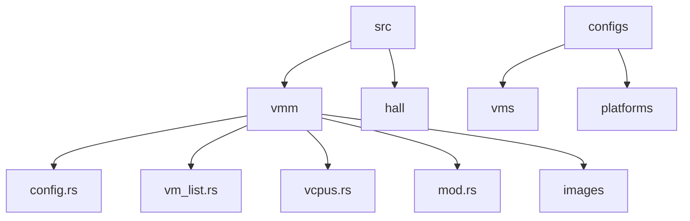
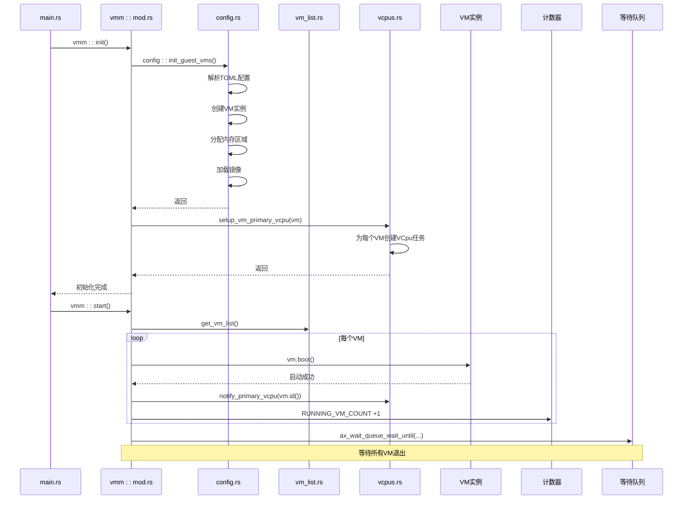
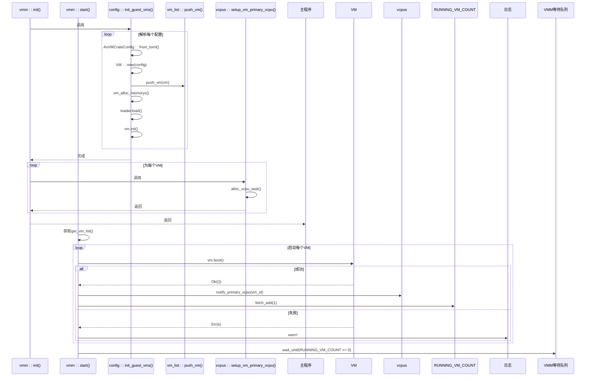
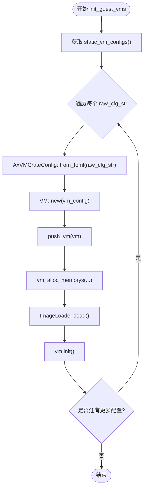
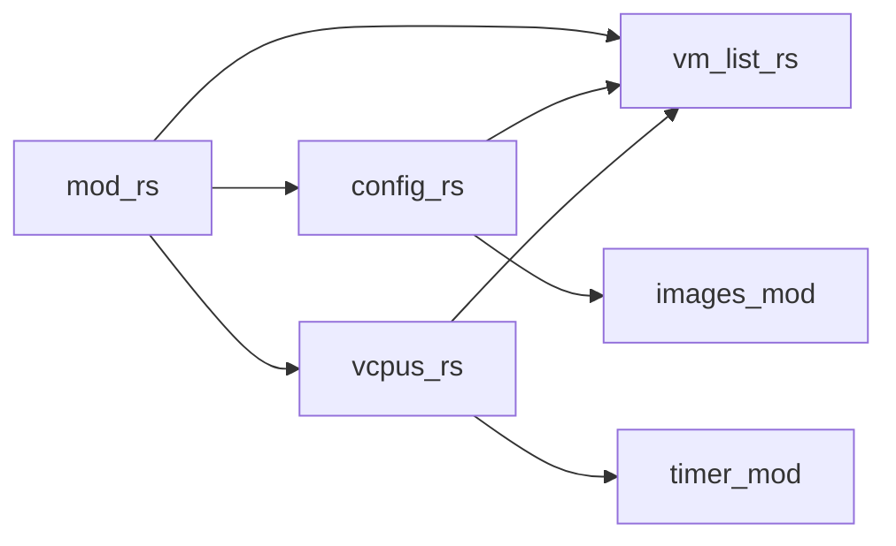

# VMM核心层

<cite>
**本文档中引用的文件**
- [main.rs](file://src/main.rs)
- [mod.rs](file://src/vmm/mod.rs)
- [config.rs](file://src/vmm/config.rs)
- [vm_list.rs](file://src/vmm/vm_list.rs)
- [vcpus.rs](file://src/vmm/vcpus.rs)
- [arceos-aarch64-e2000-smp1.toml](file://configs/vms/arceos-aarch64-e2000-smp1.toml)
</cite>

## 目录
1. [引言](#引言)
2. [项目结构](#项目结构)
3. [核心组件](#核心组件)
4. [架构概述](#架构概述)
5. [详细组件分析](#详细组件分析)
6. [依赖分析](#依赖分析)
7. [性能考虑](#性能考虑)
8. [故障排除指南](#故障排除指南)
9. [结论](#结论)

## 引言
本文档旨在深入解析axvisor虚拟机监控器（VMM）的核心层架构，涵盖其初始化流程、配置管理、虚拟机生命周期控制以及多虚拟机并发调度机制。文档将重点分析`vmm::init()`和`vmm::start()`函数如何协同工作以启动系统，并探讨基于TOML的配置文件如何驱动整个虚拟化环境的构建。

## 项目结构
axvisor项目的源码组织清晰，遵循模块化设计原则。VMM相关的核心逻辑位于`src/vmm/`目录下，该目录包含了处理虚拟机配置、内存管理、CPU调度及设备模型等关键功能的独立模块。

**Diagram sources**
- [src/vmm](file://src/vmm)
- [configs](file://configs)

**Section sources**
- [src](file://src)
- [configs](file://configs)

## 核心组件
VMM的核心职责由几个关键组件共同承担：`config.rs`负责解析静态配置并创建虚拟机实例；`vm_list.rs`维护全局虚拟机列表，实现对所有VM的集中管理；`vcpus.rs`则处理vCPU的任务分配与事件循环；而`mod.rs`作为顶层模块，协调这些子模块的初始化与启动。

**Section sources**
- [mod.rs](file://src/vmm/mod.rs#L0-L127)
- [config.rs](file://src/vmm/config.rs#L0-L284)
- [vm_list.rs](file://src/vmm/vm_list.rs#L0-L116)
- [vcpus.rs](file://src/vmm/vcpus.rs#L0-L506)

## 架构概述
VMM的启动过程是一个有序的初始化序列。首先，`vmm::init()`函数被调用，它会触发`config::init_guest_vms()`来根据预定义的TOML配置创建并配置所有的虚拟机。随后，为每个虚拟机设置主vCPU。最后，`vmm::start()`函数启动主事件循环，依次引导各个虚拟机进入运行状态，并通过一个等待队列监听所有虚拟机的退出信号。

**Diagram sources**
- [main.rs](file://src/main.rs#L0-L37)
- [mod.rs](file://src/vmm/mod.rs#L0-L127)
- [config.rs](file://src/vmm/config.rs#L164-L201)
- [vcpus.rs](file://src/vmm/vcpus.rs#L388-L400)

## 详细组件分析

### `vmm::init()` 与 `vmm::start()` 函数分析
`vmm::init()`是VMM的入口点，其主要任务是完成虚拟机的静态配置和初步设置。它首先调用`config::init_guest_vms()`来遍历所有预编译进二进制的TOML配置字符串，为每一个配置创建一个`VM`实例，并将其加入全局列表。之后，它会为每个虚拟机调用`vcpus::setup_vm_primary_vcpu()`，为该虚拟机的主vCPU准备一个操作系统任务（axtask），但此时任务并未开始执行。

`vmm::start()`则标志着VMM从初始化阶段进入运行阶段。它遍历全局虚拟机列表，调用每个`VM`实例的`boot()`方法。一旦某个虚拟机成功启动，VMM会立即通过`notify_primary_vcpu()`唤醒为其准备好的主vCPU任务，使其开始执行虚拟机代码。同时，一个原子计数器`RUNNING_VM_COUNT`会被递增，用于跟踪正在运行的虚拟机数量。VMM的主线程随后进入阻塞等待状态，直到所有虚拟机都退出，计数器归零。

#### 对于API/Service Components:

**Diagram sources**
- [mod.rs](file://src/vmm/mod.rs#L47-L92)
- [config.rs](file://src/vmm/config.rs#L164-L283)

**Section sources**
- [mod.rs](file://src/vmm/mod.rs#L47-L92)
- [config.rs](file://src/vmm/config.rs#L164-L283)

### `config.rs` 中的 TOML 配置解析流程
`config.rs`模块是VMM的“大脑”，它定义了`AxVMCrateConfig`结构体来反序列化TOML格式的配置文件。当`init_guest_vms()`被调用时，它会从`static_vm_configs()`获取一系列内嵌的TOML字符串。对于每一个字符串，它使用`AxVMCrateConfig::from_toml()`进行反序列化，从而得到一个包含完整虚拟机配置的Rust对象。

这个配置对象随后被转换为`AxVMConfig`，用于实际创建`VM`实例。在创建过程中，`vm_alloc_memorys()`函数会根据配置中的`memory_regions`字段为虚拟机分配物理内存。此外，如果配置指定了DTB（设备树二进制文件），`parse_vm_dtb()`函数还会解析该文件，自动将其中描述的中断控制器（GIC_SPI）和外设内存区域添加到虚拟机的直通设备列表中，极大地简化了手动配置。

#### 对于复杂逻辑组件:

**Diagram sources**
- [config.rs](file://src/vmm/config.rs#L164-L283)
- [arceos-aarch64-e2000-smp1.toml](file://configs/vms/arceos-aarch64-e2000-smp1.toml)

**Section sources**
- [config.rs](file://src/vmm/config.rs#L164-L283)

### `vm_list.rs` 中的 VM 生命周期管理
`vm_list.rs`模块通过一个全局的、线程安全的`BTreeMap`（由`Mutex`保护）来管理所有已创建的虚拟机实例，即`GLOBAL_VM_LIST`。该模块提供了`push_vm()`、`get_vm_by_id()`和`remove_vm()`等接口，实现了虚拟机的创建、查询和销毁。

虚拟机的生命周期状态转换主要体现在`vcpus.rs`模块中。当`vcpu_run()`任务被唤醒后，它会进入一个无限循环，不断调用`vm.run_vcpu(vcpu_id)`来执行虚拟机代码。当vCPU因超调用、外部中断或需要启动其他vCPU（`CpuUp`）等原因退出时，VMM会处理这些事件并可能再次进入运行循环。当收到`SystemDown`或`FailEntry`等致命错误时，`vcpu_run()`会调用`vm.shutdown()`，这标志着该虚拟机生命周期的终结。`mark_vcpu_exiting()`函数会在最后一个vCPU退出时，将`RUNNING_VM_COUNT`减一，并唤醒VMM主线程，促使其最终退出。

**Section sources**
- [vm_list.rs](file://src/vmm/vm_list.rs#L0-L116)
- [vcpus.rs](file://src/vmm/vcpus.rs#L400-L506)

## 依赖分析
VMM内部各模块之间存在明确的依赖关系。`mod.rs`作为顶层协调者，直接依赖`config.rs`、`vm_list.rs`和`vcpus.rs`。`config.rs`在创建虚拟机时，需要调用`vm_list.rs`的`push_vm()`来注册新实例，并在加载镜像时依赖`images`模块。`vcpus.rs`模块则深度依赖`vm_list.rs`来获取VM引用，并通过`VM_VCPU_TASK_WAIT_QUEUE`这一全局数据结构与`mod.rs`中的`notify_primary_vcpu()`函数进行通信。

**Diagram sources**
- [mod.rs](file://src/vmm/mod.rs#L0-L45)
- [config.rs](file://src/vmm/config.rs#L164-L201)
- [vcpus.rs](file://src/vmm/vcpus.rs#L0-L506)

**Section sources**
- [mod.rs](file://src/vmm/mod.rs#L0-L45)

## 性能考虑
VMM的设计充分考虑了性能。通过为每个vCPU分配独立的操作系统任务（axtask），并利用硬件虚拟化技术（如ARM的Hyp模式），vCPU的执行效率非常高。内存分配采用`MapIdentical`策略，避免了复杂的页表映射开销。事件处理（如中断和超调用）被设计为轻量级操作，直接在vCPU任务上下文中处理，减少了上下文切换的延迟。然而，`VM_VCPU_TASK_WAIT_QUEUE`使用`UnsafeCell`和`BTreeMap`，虽然避免了锁的开销，但在高并发场景下可能存在可扩展性瓶颈，未来可考虑更高效的无锁数据结构。

## 故障排除指南
以下是一些常见的初始化失败场景及其排查方法：

*   **错误信息**: `Failed to resolve VM config`
    *   **原因**: 内嵌的TOML配置字符串格式错误。
    *   **排查**: 检查`configs/vms/`目录下的对应`.toml`文件语法是否正确，特别是数组和字符串的引号。

*   **错误信息**: `Failed to allocate memory region for VM`
    *   **原因**: 请求的内存区域过大，或物理内存不足。
    *   **排查**: 检查`memory_regions`中的`size`字段是否合理，并确认宿主机有足够的可用内存。

*   **错误信息**: `VM[{}] setup failed: ...`
    *   **原因**: 在`vm.init()`阶段发生错误，可能涉及设备初始化或内部状态设置。
    *   **排查**: 查看具体的错误类型，检查`devices`配置项中的直通设备地址是否与其他资源冲突。

*   **现象**: VMM卡在`Initializing VMM...`，没有后续日志。
    *   **原因**: `enable_virtualization()`失败，硬件不支持或固件未开启虚拟化。
    *   **排查**: 确认CPU型号支持虚拟化（如Intel VT-x, AMD-V, ARM HYP），并在BIOS/UEFI中启用相关选项。

*   **现象**: 虚拟机无法启动，但无明显错误。
    *   **原因**: `boot_delay_sec`导致启动延迟。
    *   **排查**: 注意日志中`VM[{}] boot delay: {}s`的信息，这是正常行为，等待延迟结束后观察。

**Section sources**
- [config.rs](file://src/vmm/config.rs#L164-L283)
- [vcpus.rs](file://src/vmm/vcpus.rs#L400-L506)

## 结论
axvisor的VMM核心层通过高度模块化的设计，实现了虚拟机的高效管理和调度。`vmm::init()`和`vmm::start()`函数构成了清晰的启动流水线，`config.rs`模块利用TOML配置实现了灵活的虚拟机定义，而`vm_list.rs`和`vcpus.rs`则共同保障了多虚拟机环境下的稳定运行。整体架构简洁明了，为构建可靠的虚拟化平台奠定了坚实的基础。