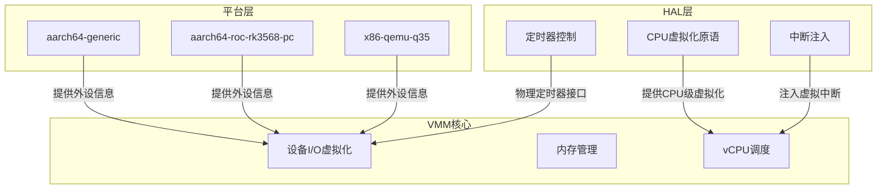
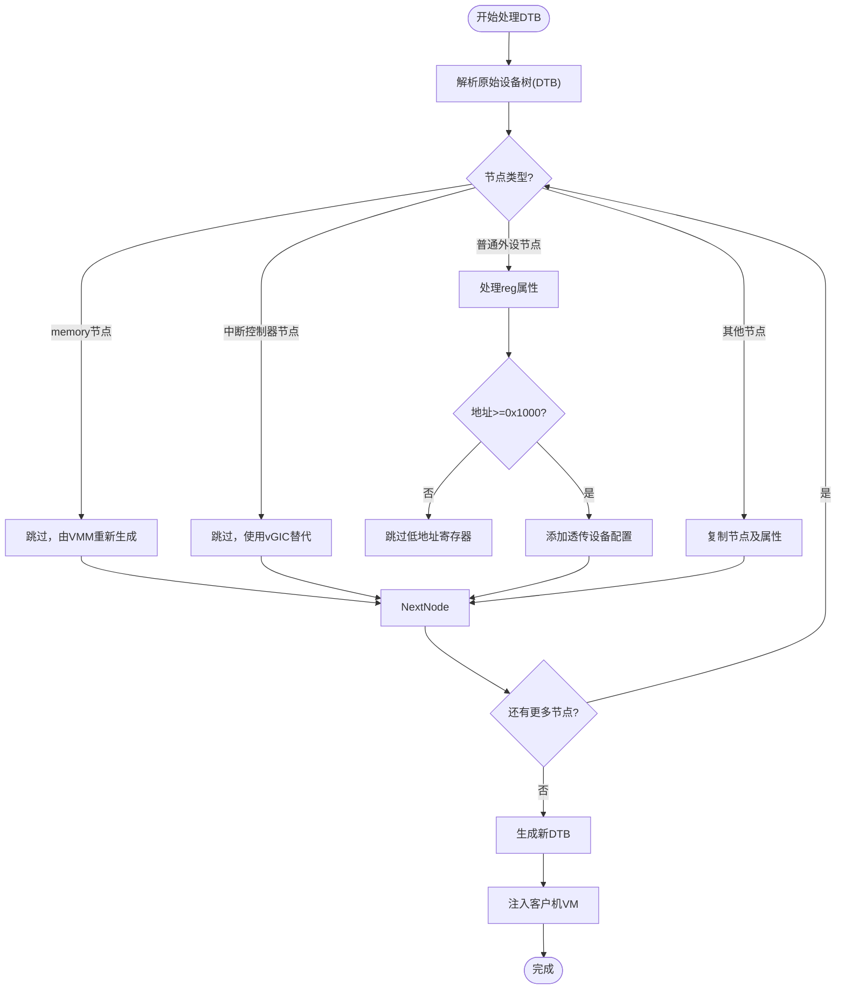
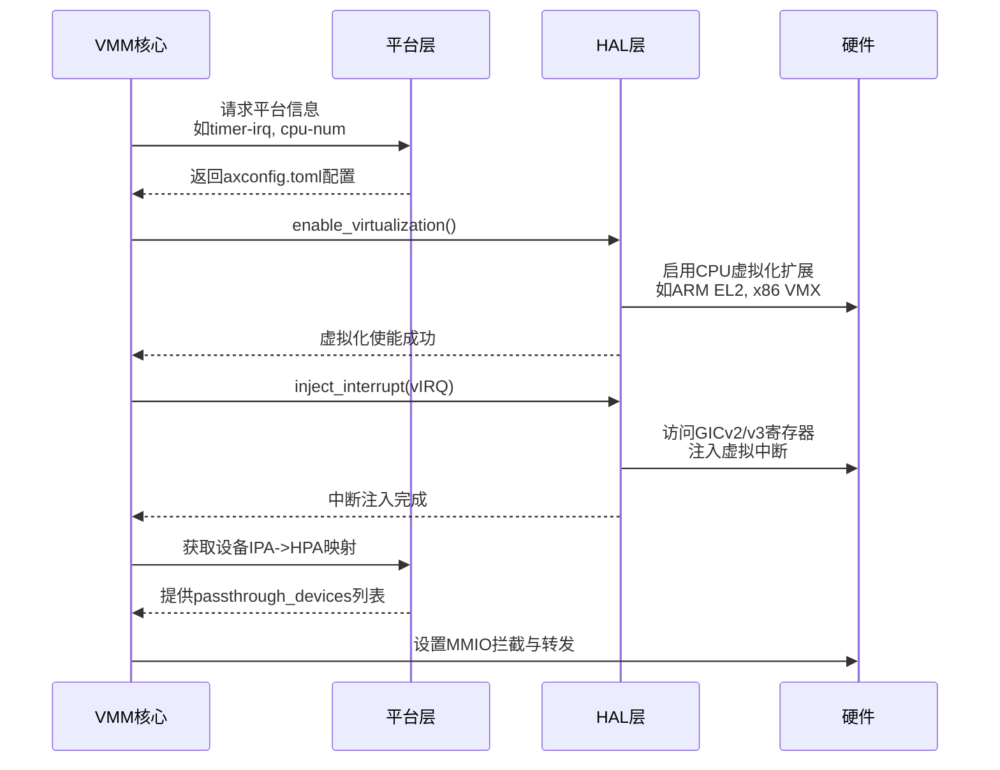

# 平台适配层

<cite>
**本文档引用文件**  
- [main.rs](file://src/main.rs)
- [lib.rs](file://platform/aarch64-generic/src/lib.rs)
- [axconfig.toml](file://platform/aarch64-generic/axconfig.toml)
- [config.py](file://scripts/config.py)
- [config.rs](file://src/vmm/config.rs)
- [fdt.rs](file://src/vmm/fdt.rs)
- [hal/mod.rs](file://src/hal/mod.rs)
- [api.rs](file://src/hal/arch/aarch64/api.rs)
- [aarch64/mod.rs](file://src/hal/arch/aarch64/mod.rs)
- [vcpus.rs](file://src/vmm/vcpus.rs)
- [timer.rs](file://src/vmm/timer.rs)
- [x86-qemu-q35/axconfig.toml](file://platform/x86-qemu-q35/axconfig.toml)
- [aarch64-roc-rk3568-pc/axconfig.toml](file://platform/aarch64-roc-rk3568-pc/axconfig.toml)
</cite>

## 目录
1. [引言](#引言)
2. [平台抽象架构](#平台抽象架构)
3. [核心组件分析](#核心组件分析)
4. [设备树处理机制](#设备树处理机制)
5. [平台与HAL协作边界](#平台与hal协作边界)
6. [新增平台移植指南](#新增平台移植指南)
7. [典型启动日志分析](#典型启动日志分析)

## 引言
`axvisor` 是一个支持多样化硬件平台的虚拟化监控器，通过平台适配层实现对不同架构和具体硬件平台的支持。本文档系统性介绍其平台适配机制，以 `aarch64-generic` 为基础模板，详细说明平台特定驱动的注册与初始化流程、配置文件的作用以及平台抽象层与硬件抽象层（HAL）之间的职责划分。

## 平台抽象架构



**图示来源**
- [main.rs](file://src/main.rs#L0-L37)
- [hal/mod.rs](file://src/hal/mod.rs#L104-L193)
- [config.rs](file://src/vmm/config.rs#L201-L239)

## 核心组件分析

### 平台配置文件解析
`axconfig.toml` 文件定义了平台相关的静态配置参数，包括架构标识、设备MMIO区域、中断控制器信息等。这些配置在编译时被读取并生成相应的Rust代码，用于初始化平台特定的资源。

```toml
# Architecture identifier.
arch = "aarch64" # str
# Platform package.
package = "axplat-aarch64-generic" # str
# Platform identifier.
platform = "aarch64-generic" # str

[devices]
# Timer interrupt num (PPI, physical timer).
timer-irq = 26 # uint
```

脚本 `scripts/config.py` 负责从 `axconfig.toml` 中提取配置，并将其传递给构建系统，确保正确的平台特性被启用。

**章节来源**
- [axconfig.toml](file://platform/aarch64-generic/axconfig.toml#L0-L49)
- [config.py](file://scripts/config.py#L67-L151)

### 外设驱动注册与初始化
平台特定的外设（如中断控制器、定时器、串口）通过 `passthrough_devices` 在VM配置中声明。VMM在启动时解析设备树或配置文件，将这些设备的物理地址映射到客户机的IPA（Intermediate Physical Address），并设置中断路由。

例如，在QEMU平台上：
```toml
passthrough_devices = [
  ["intc@8000000", 0x800_0000, 0x800_0000, 0x50_000, 0x1],
  ["pl011@9000000", 0x900_0000, 0x900_0000, 0x1000, 0x1]
]
```

VMM会跳过设备树中的原始中断控制器节点，使用虚拟GIC（vGIC）替代：
```rust
if name.starts_with("interrupt-controller") || name.starts_with("intc") {
    info!("skipping node {} to use vGIC", name);
    continue;
}
```

对于SPI中断，VMM收集所有GIC_SPI类型的中断并添加到vGIC中进行管理。

**章节来源**
- [config.rs](file://src/vmm/config.rs#L41-L137)
- [fdt.rs](file://src/vmm/fdt.rs#L40-L96)

### 定时器与中断处理
物理定时器的中断号由 `axconfig.toml` 中的 `timer-irq` 指定（如 `aarch64-generic` 使用PPI 26）。HAL层负责处理物理定时器中断，并通过 `inject_interrupt` 接口向vCPU注入虚拟定时器中断。

```rust
pub fn inject_interrupt(irq: usize) {
    let mut gic = rdrive::get_one::<rdif_intc::Intc>().expect("Failed to get GIC driver").lock().unwrap();
    if let Some(gic) = gic.typed_mut::<arm_gic_driver::v2::Gic>() {
        gic.hypervisor_interface().expect("Failed to get GICH").enable();
        gic.set_virtual_interrupt(...);
    }
}
```

**章节来源**
- [api.rs](file://src/hal/arch/aarch64/api.rs#L42-L74)
- [aarch64/mod.rs](file://src/hal/arch/aarch64/mod.rs#L0-L49)
- [timer.rs](file://src/vmm/timer.rs#L81-L112)

## 设备树处理机制



**图示来源**
- [config.rs](file://src/vmm/config.rs#L41-L162)
- [fdt.rs](file://src/vmm/fdt.rs#L40-L96)

### RK3568与QEMU Q35平台差异
- **RK3568平台**：使用 `aarch64-roc-rk3568-pc` 平台包，其 `axconfig.toml` 配置与 `aarch64-generic` 类似，但实际的 `passthrough_devices` 列表需根据RK3568 SoC的具体外设布局定义。
- **QEMU Q35平台**：为x86_64架构，使用 `x86-qemu-q35` 平台包。其设备配置包含PCIe ECAM空间、IO APIC、HPET定时器等x86特有组件，且 `timer-irq` 使用0xf0作为虚拟化定时器中断向量。

```toml
# x86-qemu-q35 axconfig.toml 片段
arch = "x86_64"
timer-irq = 0xf0
[devices]
mmio-ranges = [
    [0xb000_0000, 0x1000_0000], # PCI config space
    [0xfec0_0000, 0x1000],      # IO APIC
    [0xfed0_0000, 0x1000],      # HPET
]
```

**章节来源**
- [aarch64-roc-rk3568-pc/axconfig.toml](file://platform/aarch64-roc-rk3568-pc/axconfig.toml#L0-L49)
- [x86-qemu-q35/axconfig.toml](file://platform/x86-qemu-q35/axconfig.toml#L0-L62)

## 平台与HAL协作边界



**图示来源**
- [main.rs](file://src/main.rs#L0-L37)
- [hal/mod.rs](file://src/hal/mod.rs#L104-L193)
- [vcpus.rs](file://src/vmm/vcpus.rs#L368-L457)

- **HAL层职责**：负责CPU级别的虚拟化原语，包括启用虚拟化扩展、vCPU上下文切换、虚拟中断注入、物理定时器管理等。它直接与CPU和中断控制器（GIC/APIC）的硬件寄存器交互。
- **平台层职责**：负责外设I/O的虚拟化，提供平台特定的静态信息（通过`axconfig.toml`），定义哪些外设需要透传给客户机，以及它们的物理地址和中断号。它不直接操作硬件，而是为VMM提供配置数据。

## 新增平台移植指南

### 必需实现步骤
1.  **创建平台目录**：在 `platform/` 下创建新的平台目录，如 `aarch64-myboard`。
2.  **编写Cargo.toml**：定义平台crate，依赖 `axplat-aarch64-dyn` 或对应架构的动态平台库。
3.  **创建axconfig.toml**：必须包含以下关键字段：
    - `arch`: 架构标识 (`aarch64`, `x86_64`)
    - `package`: crate名称 (`axplat-aarch64-myboard`)
    - `platform`: 平台标识符
    - `[devices]` -> `timer-irq`: 物理定时器中断号
    - `[plat]` -> `cpu-num`: CPU核心数量
4.  **实现lib.rs**：创建空的 `lib.rs` 文件，仅包含必要的crate属性和外部crate引用。
5.  **更新主程序**：在 `src/main.rs` 中添加对该平台crate的条件编译引用。
6.  **定义VM配置**：在 `configs/vms/` 下为该平台创建 `.toml` 配置文件，明确列出 `passthrough_devices`。

### 关键配置项说明
| 配置项 | 作用 | 示例值 |
| :--- | :--- | :--- |
| `timer-irq` | 物理定时器使用的PPI中断号 | `26` |
| `cpu-num` | 支持的CPU核心数 | `4` |
| `passthrough_devices` | 需要透传给客户机的外设列表 | `[["uart@9000000", ...]]` |
| `phys-bus-offset` | 物理地址与总线地址的偏移 | `0` |

**章节来源**
- [lib.rs](file://platform/aarch64-generic/src/lib.rs#L0-L3)
- [Cargo.toml](file://platform/aarch64-generic/Cargo.toml#L0-L10)
- [axconfig.toml](file://platform/aarch64-generic/axconfig.toml#L0-L49)
- [main.rs](file://src/main.rs#L0-L37)

## 典型启动日志分析
以下是 `axvisor` 启动过程中的典型日志序列及其含义：

```
[INFO] Starting virtualization...
[INFO] Hardware support: true
[INFO] Enabling hardware virtualization support on all cores...
[INFO] Core 0 is initializing hardware virtualization support...
[INFO] Enabling hardware virtualization support on core 0
[INFO] Initing HV Timer...
[INFO] Creating VM[1] "arceos"
[INFO] Adding memory node with regions: [VMMemoryRegion { gpa: 0x40000000, size: 268435456, flags: 0x7, map_type: MapAlloc }]
[INFO] Loading VM[1] images from memory
[INFO] DTB buffer addr: 40000000, size: 0x10000
[INFO] VM[1] created success, loading images...
[INFO] Adjusting kernel load address from 0x40080000 to 0x40000000
[INFO] skpping node intc@8000000 to use vGIC
[INFO] node: pl011@9000000 interrupts:
[INFO] node: pl011@9000000, GIC_SPI
[INFO] node: pl011@9000000, interrupt id: 0x2b
[INFO] VM[1] run VCpu[0] get irq 26
```

- **日志解读**：
  - 前几行表明虚拟化环境正在初始化，硬件支持已确认。
  - `Initing HV Timer...` 表明每个vCPU的本地定时器已准备就绪。
  - `Creating VM[1]` 和 `Adding memory node` 显示VM和内存区域的创建。
  - `Adjusting kernel load address` 是因为使用了 `MAP_IDENTICAL` 内存映射。
  - `skpping node intc@8000000` 确认了vGIC已接管中断控制。
  - `node: pl011@9000000, interrupt id: 0x2b` 表明串口设备的SPI中断（ID 43）已被捕获并准备路由。
  - 最后一行 `get irq 26` 表明客户机操作系统收到了来自虚拟定时器的周期性中断。

**章节来源**
- [main.rs](file://src/main.rs#L0-L37)
- [config.rs](file://src/vmm/config.rs#L201-L239)
- [timer.rs](file://src/vmm/timer.rs#L81-L112)
- [vcpus.rs](file://src/vmm/vcpus.rs#L368-L393)