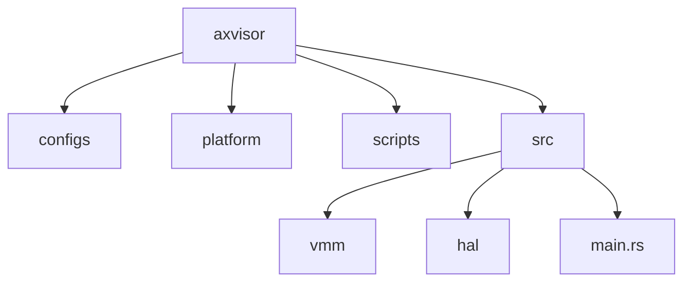
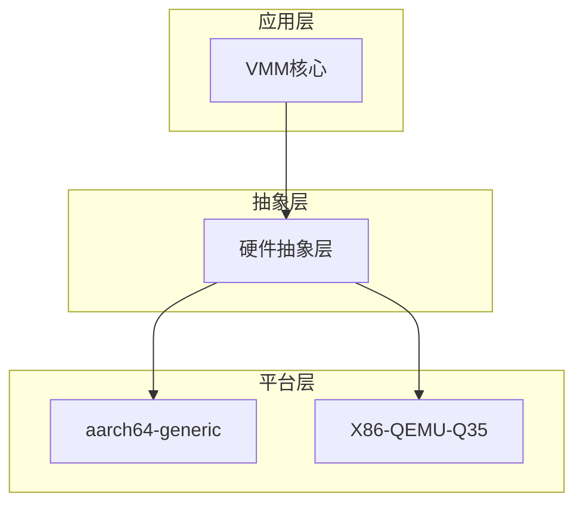
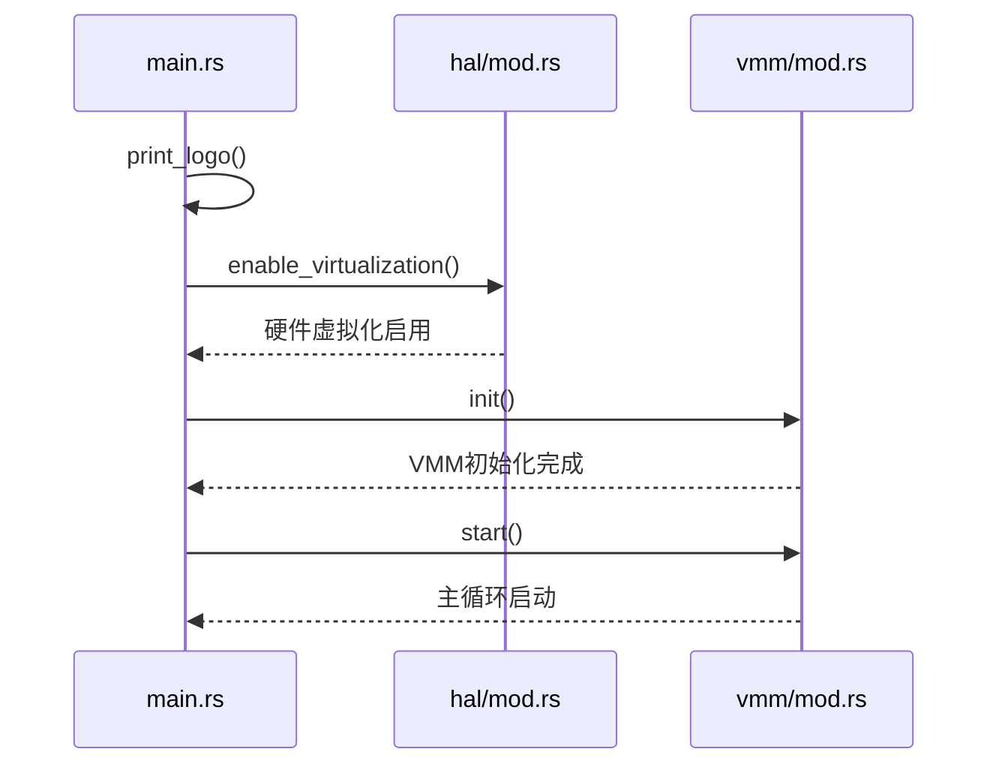
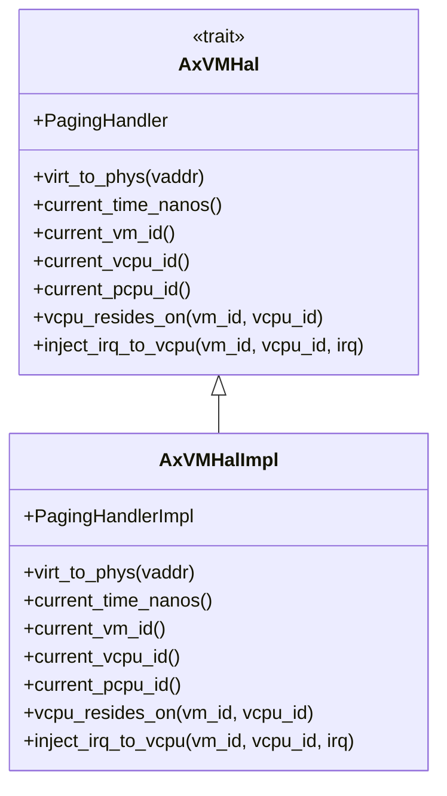
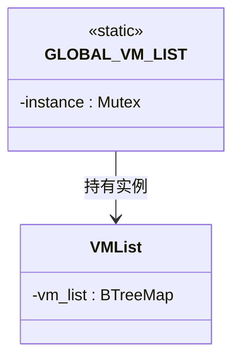
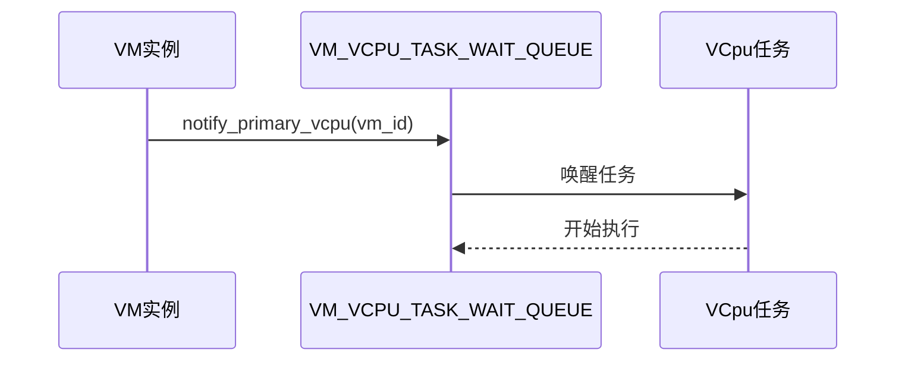
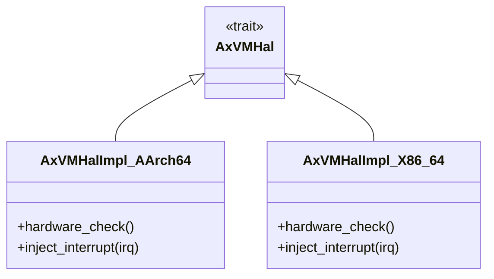
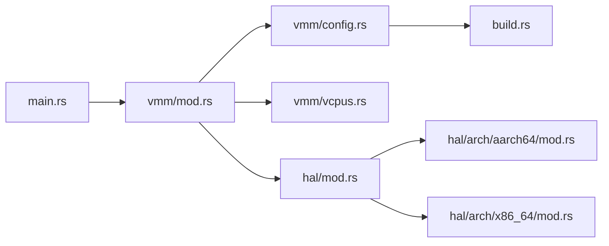

# 架构设计

<cite>
**本文档引用的文件**
- [main.rs](file://src/main.rs)
- [vmm/mod.rs](file://src/vmm/mod.rs)
- [vmm/config.rs](file://src/vmm/config.rs)
- [hal/mod.rs](file://src/hal/mod.rs)
- [vmm/vm_list.rs](file://src/vmm/vm_list.rs)
- [vmm/vcpus.rs](file://src/vmm/vcpus.rs)
- [build.rs](file://build.rs)
- [vmm/images/mod.rs](file://src/vmm/images/mod.rs)
- [vmm/fdt.rs](file://src/vmm/fdt.rs)
- [vmm/hvc.rs](file://src/vmm/hvc.rs)
- [vmm/ivc.rs](file://src/vmm/ivc.rs)
- [hal/arch/aarch64/mod.rs](file://src/hal/arch/aarch64/mod.rs)
- [hal/arch/aarch64/api.rs](file://src/hal/arch/aarch64/api.rs)
</cite>

## 目录
1. [引言](#引言)
2. [项目结构](#项目结构)
3. [核心组件](#核心组件)
4. [架构概述](#架构概述)
5. [详细组件分析](#详细组件分析)
6. [依赖分析](#依赖分析)
7. [性能考虑](#性能考虑)
8. [故障排除指南](#故障排除指南)
9. [结论](#结论)

## 引言
axvisor 是一个基于 Rust 语言开发的虚拟机监控器（VMM），旨在为多种 CPU 架构提供跨平台的虚拟化支持。本架构设计文档深入解析其分层软件架构与核心设计模式，涵盖程序启动流程、硬件抽象层（HAL）的设计、关键设计模式的应用以及系统各组件间的交互关系。

## 项目结构
axvisor 的项目结构清晰地体现了其模块化设计理念。主要目录包括 `configs` 存放平台和虚拟机配置文件，`platform` 包含特定平台的实现，`scripts` 提供构建和运行脚本，而 `src` 目录则包含了核心源代码，其中 `vmm` 和 `hal` 是两个最重要的子模块。

**图示来源**
- [src/main.rs](file://src/main.rs#L0-L37)
- [src/vmm/mod.rs](file://src/vmm/mod.rs#L0-L127)
- [src/hal/mod.rs](file://src/hal/mod.rs#L0-L282)

**章节来源**
- [src/main.rs](file://src/main.rs#L0-L37)
- [src/vmm/mod.rs](file://src/vmm/mod.rs#L0-L127)

## 核心组件
axvisor 的核心组件主要包括虚拟机监控器（VMM）、硬件抽象层（HAL）和主入口点 `main.rs`。这些组件协同工作，实现了从初始化到虚拟机启动的完整流程。

**章节来源**
- [src/main.rs](file://src/main.rs#L0-L37)
- [src/vmm/mod.rs](file://src/vmm/mod.rs#L0-L127)
- [src/hal/mod.rs](file://src/hal/mod.rs#L0-L282)

## 架构概述
axvisor 采用分层架构设计，将系统划分为多个独立但相互协作的层次。最上层是 VMM 核心层，负责管理虚拟机的生命周期；中间层是 HAL，用于屏蔽底层硬件差异；最下层是具体的平台实现，如 aarch64 和 x86_64。

**图示来源**
- [src/vmm/mod.rs](file://src/vmm/mod.rs#L0-L127)
- [src/hal/mod.rs](file://src/hal/mod.rs#L0-L282)
- [platform/aarch64-generic/lib.rs](file://platform/aarch64-generic/src/lib.rs)
- [platform/x86-qemu-q35/lib.rs](file://platform/x86-qemu-q35/src/lib.rs)

## 详细组件分析
### 程序启动流程分析
axvisor 的程序启动流程始于 `main.rs` 文件中的 `main` 函数。该函数首先打印启动日志，然后调用 `hal::enable_virtualization()` 初始化硬件虚拟化支持，接着通过 `vmm::init()` 完成虚拟机监控器的初始化，最后调用 `vmm::start()` 启动主循环。

**图示来源**
- [src/main.rs](file://src/main.rs#L0-L37)
- [src/hal/mod.rs](file://src/hal/mod.rs#L0-L282)
- [src/vmm/mod.rs](file://src/vmm/mod.rs#L0-L127)

**章节来源**
- [src/main.rs](file://src/main.rs#L0-L37)

### VMM核心层与HAL解耦机制
VMM 核心层通过 HAL 与底层架构解耦，实现跨平台兼容性。HAL 提供了一组统一的接口，如 `AxVMHal` 和 `AxVCpuHal`，这些接口的具体实现由不同架构的模块提供。例如，在 aarch64 架构中，`AxVMHalImpl` 实现了 `current_time_nanos`、`virt_to_phys` 等方法。

**图示来源**
- [src/hal/mod.rs](file://src/hal/mod.rs#L0-L282)
- [src/vmm/mod.rs](file://src/vmm/mod.rs#L0-L127)

**章节来源**
- [src/hal/mod.rs](file://src/hal/mod.rs#L0-L282)

### 设计模式应用分析
#### 单例模式在全局状态管理中的应用
axvisor 使用单例模式管理全局状态，如 `GLOBAL_VM_LIST` 静态变量。这个变量是一个带互斥锁的 `VMList` 结构，确保在整个系统中只有一个 VM 列表实例存在。

**图示来源**
- [src/vmm/vm_list.rs](file://src/vmm/vm_list.rs#L0-L116)

**章节来源**
- [src/vmm/vm_list.rs](file://src/vmm/vm_list.rs#L0-L116)

#### 观察者模式在VM状态监听中的体现
观察者模式体现在 `VM_VCPU_TASK_WAIT_QUEUE` 的使用上。当 VM 状态发生变化时，相关的 VCpu 任务会被通知并作出响应。例如，`notify_primary_vcpu` 函数会唤醒指定 VM 的主 VCpu 任务。

**图示来源**
- [src/vmm/vcpus.rs](file://src/vmm/vcpus.rs#L0-L506)

**章节来源**
- [src/vmm/vcpus.rs](file://src/vmm/vcpus.rs#L0-L506)

#### 策略模式支持不同CPU架构的动态行为选择
策略模式通过条件编译属性 `#[cfg_attr]` 实现，允许根据目标架构选择不同的实现。例如，`hal/mod.rs` 中的 `arch` 模块路径根据 `target_arch` 的值动态确定。

**图示来源**
- [src/hal/arch/aarch64/mod.rs](file://src/hal/arch/aarch64/mod.rs#L0-L154)
- [src/hal/arch/x86_64/mod.rs](file://src/hal/arch/x86_64/mod.rs)

**章节来源**
- [src/hal/arch/aarch64/mod.rs](file://src/hal/arch/aarch64/mod.rs#L0-L154)

### 数据流路径分析
axvisor 的数据流路径从配置文件开始，经过 `build.rs` 脚本处理生成 `vm_configs.rs`，再由 `vmm::config` 模块读取并创建 VM 实例，最终通过 HAL 层与硬件交互。

**图示来源**
- [build.rs](file://build.rs#L0-L309)
- [src/vmm/config.rs](file://src/vmm/config.rs#L0-L284)
- [src/vmm/mod.rs](file://src/vmm/mod.rs#L0-L127)

**章节来源**
- [build.rs](file://build.rs#L0-L309)
- [src/vmm/config.rs](file://src/vmm/config.rs#L0-L284)

### 关键抽象设计意图与生命周期管理
#### AxVMCrateConfig设计意图
`AxVMCrateConfig` 是一个关键抽象，用于表示虚拟机的创建配置。它从 TOML 配置文件解析而来，并包含虚拟机的所有必要信息，如内存区域、设备配置等。

**章节来源**
- [src/vmm/config.rs](file://src/vmm/config.rs#L0-L284)

#### VM与VCpuRef生命周期管理
VM 和 VCpuRef 的生命周期由 Arc（原子引用计数）智能指针管理。这种设计允许多个所有者共享同一资源，同时保证线程安全。当最后一个引用被释放时，资源自动回收。

**章节来源**
- [src/vmm/mod.rs](file://src/vmm/mod.rs#L0-L127)
- [src/vmm/vcpus.rs](file://src/vmm/vcpus.rs#L0-L506)

## 依赖分析
axvisor 的组件间依赖关系复杂但有序。VMM 核心依赖于 HAL 提供的硬件抽象接口，而 HAL 又依赖于具体平台的实现。此外，`build.rs` 脚本生成的代码被 `vmm::config` 模块直接引用。

**图示来源**
- [src/main.rs](file://src/main.rs#L0-L37)
- [src/vmm/mod.rs](file://src/vmm/mod.rs#L0-L127)
- [src/vmm/config.rs](file://src/vmm/config.rs#L0-L284)
- [src/vmm/vcpus.rs](file://src/vmm/vcpus.rs#L0-L506)
- [build.rs](file://build.rs#L0-L309)
- [src/hal/mod.rs](file://src/hal/mod.rs#L0-L282)

**章节来源**
- [src/main.rs](file://src/main.rs#L0-L37)
- [src/vmm/mod.rs](file://src/vmm/mod.rs#L0-L127)
- [build.rs](file://build.rs#L0-L309)

## 性能考虑
axvisor 在性能方面做了多项优化。例如，使用 `spin::Mutex` 而非标准库的 `std::sync::Mutex`，以减少上下文切换开销。此外，通过预分配内存区域和批量操作来提高内存管理效率。

## 故障排除指南
常见问题包括硬件虚拟化支持未启用、配置文件格式错误或缺失、以及跨平台编译问题。建议检查 BIOS 设置中的虚拟化选项，验证 TOML 配置文件的语法正确性，并确保使用正确的工具链版本。

**章节来源**
- [src/main.rs](file://src/main.rs#L0-L37)
- [src/hal/mod.rs](file://src/hal/mod.rs#L0-L282)
- [build.rs](file://build.rs#L0-L309)

## 结论
axvisor 通过精心设计的分层架构和多种设计模式的应用，成功实现了高效、可扩展且跨平台的虚拟机监控功能。其模块化设计不仅提高了代码的可维护性，也为未来的功能扩展奠定了坚实基础。