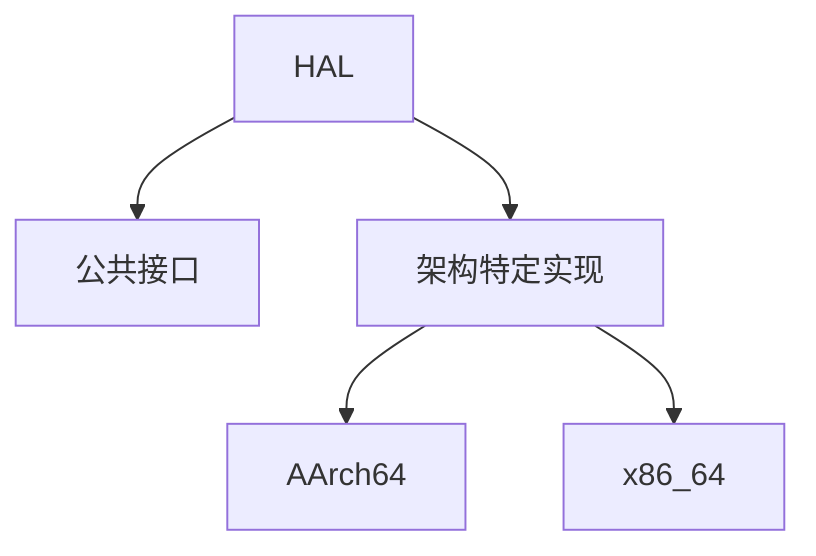
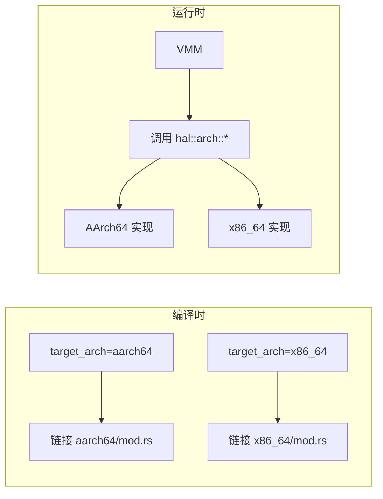
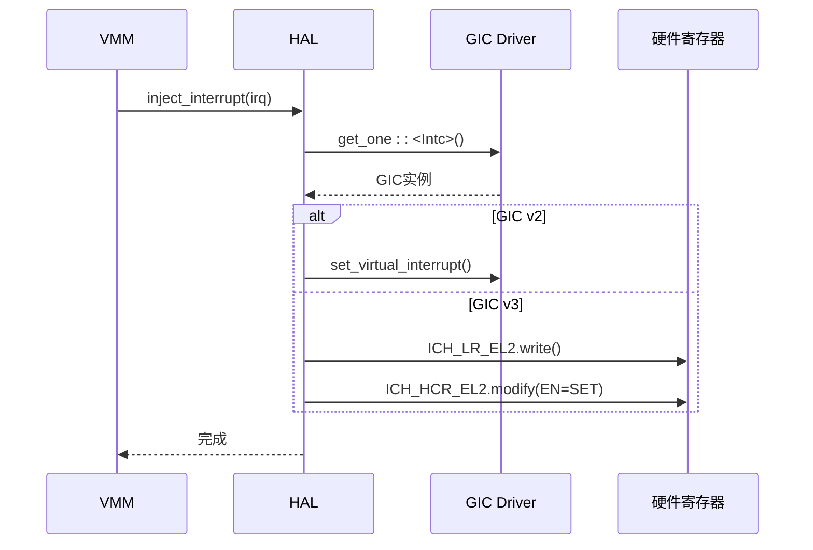
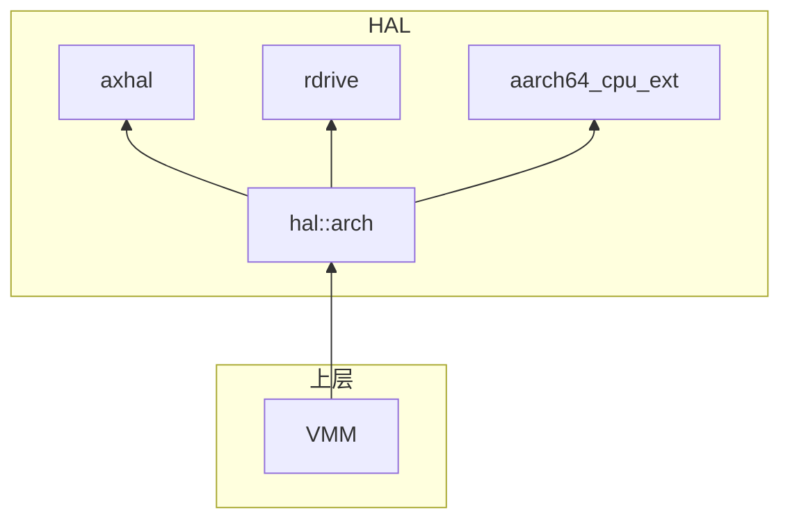

# 硬件抽象层（HAL）

<cite>
**本文档中引用的文件**
- [mod.rs](file://src/hal/mod.rs)
- [arch/aarch64/mod.rs](file://src/hal/arch/aarch64/mod.rs)
- [arch/x86_64/mod.rs](file://src/hal/arch/x86_64/mod.rs)
- [arch/aarch64/api.rs](file://src/hal/arch/aarch64/api.rs)
- [arch/aarch64/cache.rs](file://src/hal/arch/aarch64/cache.rs)
- [arch/x86_64/cache.rs](file://src/hal/arch/x86_64/cache.rs)
</cite>

## 目录
1. [简介](#简介)
2. [项目结构](#项目结构)
3. [核心组件](#核心组件)
4. [架构概述](#架构概述)
5. [详细组件分析](#详细组件分析)
6. [依赖分析](#依赖分析)
7. [性能考虑](#性能考虑)
8. [故障排除指南](#故障排除指南)
9. [结论](#结论)

## 简介
硬件抽象层（HAL）是axvisor实现跨平台兼容性的核心模块。它为不同硬件架构提供统一的接口，屏蔽底层差异，使上层虚拟机监控器（VMM）能够以一致的方式访问硬件资源。本技术文档将深入解析`hal::arch`模块如何为AArch64和x86_64架构提供统一接口，重点阐述其在虚拟化扩展、内存管理、中断注入等方面的设计与实现。

## 项目结构
硬件抽象层位于`src/hal`目录下，采用条件编译机制根据目标架构动态选择后端实现。其核心结构如下：
- `src/hal/mod.rs`：定义了HAL的公共接口和高层功能。
- `src/hal/arch/`：包含特定架构的实现。
  - `aarch64/`：AArch64架构的具体实现。
  - `x86_64/`：x86_64架构的具体实现。

这种分层设计使得平台无关代码与平台相关代码清晰分离，便于维护和扩展。



**图示来源**
- [mod.rs](file://src/hal/mod.rs)
- [arch/aarch64/mod.rs](file://src/hal/arch/aarch64/mod.rs)
- [arch/x86_64/mod.rs](file://src/hal/arch/x86_64/mod.rs)

**章节来源**
- [mod.rs](file://src/hal/mod.rs)

## 核心组件
HAL的核心在于通过Rust的条件编译特性（`#[cfg_attr]`）和特征（trait）系统，为上层VMM提供一个统一的硬件操作视图。主要组件包括：
- **AxVMHalImpl**：实现了`AxVMHal` trait，为虚拟机提供时间、内存地址转换等基础服务。
- **AxMmHalImpl**：实现了`AxMmHal` trait，负责物理页帧的分配与释放。
- **AxVCpuHalImpl**：实现了`AxVCpuHal` trait，处理vCPU相关的中断。
- **`enable_virtualization()`函数**：在每个核心上初始化硬件虚拟化支持。

这些组件共同构成了VMM与底层硬件之间的桥梁。

**章节来源**
- [mod.rs](file://src/hal/mod.rs)

## 架构概述
HAL的架构设计遵循“一次编写，多处运行”的原则。其关键在于`src/hal/mod.rs`中的条件编译指令：

```rust
#[cfg_attr(target_arch = "aarch64", path = "arch/aarch64/mod.rs")]
#[cfg_attr(target_arch = "x86_64", path = "arch/x86_64/mod.rs")]
pub mod arch;
```

该指令确保在编译时，根据`target_arch`配置项自动链接到对应架构的`mod.rs`文件。例如，在AArch64平台上，`hal::arch`模块实际指向`src/hal/arch/aarch64/mod.rs`中的内容。



**图示来源**
- [mod.rs](file://src/hal/mod.rs)

**章节来源**
- [mod.rs](file://src/hal/mod.rs)

## 详细组件分析

### 虚拟化扩展封装 (api.rs)
`hal::arch`模块通过`api.rs`文件为AArch64架构的虚拟化扩展提供了安全的封装。该文件使用`axvisor_api::api_mod_impl`宏，将底层的HVC（HyperVisor Call）或SMC（Secure Monitor Call）指令暴露为高级API。

关键函数`hardware_inject_virtual_interrupt`用于向虚拟机注入中断。其调用链路如下：
1.  VMM请求注入中断。
2.  调用`hal::arch::inject_interrupt`。
3.  该函数通过`rdrive`获取GIC（Generic Interrupt Controller）驱动实例。
4.  根据GIC版本（v2或v3），调用相应的驱动方法设置虚拟中断列表寄存器（List Register, LR）。

此设计将复杂的寄存器操作细节隐藏在驱动内部，向上层提供了简洁的函数接口。

#### API调用序列图


**图示来源**
- [arch/aarch64/api.rs](file://src/hal/arch/aarch64/api.rs)
- [arch/aarch64/mod.rs](file://src/hal/arch/aarch64/mod.rs)

**章节来源**
- [arch/aarch64/api.rs](file://src/hal/arch/aarch64/api.rs)

### 内存屏障与缓存一致性 (cache.rs)
`cache.rs`文件展示了不同架构在内存管理上的显著差异。

**AArch64实现**：
- 提供了完整的`dcache_range`函数，利用`aarch64_cpu_ext`库执行数据缓存操作。
- 支持`Clean`（回写）、`Invalidate`（无效化）和`CleanAndInvalidate`（回写并无效化）三种操作。
- 这些操作对于维护内存一致性至关重要，尤其是在DMA传输前后。

**x86_64实现**：
- `dcache_range`函数为空实现（no-op）。
- 原因是x86_64架构通常采用强内存模型和写通（Write-Through）缓存策略，对显式的数据缓存管理需求较低。

这种差异体现了HAL设计的灵活性：它允许在不需要的平台上提供空实现，从而避免不必要的开销。

#### 缓存操作对比表
| 操作 | AArch64 实现 | x86_64 实现 |
| :--- | :--- | :--- |
| `CacheOp::Clean` | 调用`dcache_range`回写缓存行 | 无操作 |
| `CacheOp::Invalidate` | 调用`dcache_range`无效化缓存行 | 无操作 |
| `CacheOp::CleanAndInvalidate` | 调用`dcache_range`回写并无效化 | 无操作 |

**章节来源**
- [arch/aarch64/cache.rs](file://src/hal/arch/aarch64/cache.rs)
- [arch/x86_64/cache.rs](file://src/hal/arch/x86_64/cache.rs)

### 条件编译与特性开关
HAL通过两种机制实现平台绑定：
1.  **条件编译 (`cfg_attr`)**：如前所述，这是选择不同架构后端的主要方式。
2.  **特性开关 (`features`)**：在`Cargo.toml`中定义了如`ept-level-4`等特性。`hal::arch::hardware_check()`函数会检查这些特性是否与硬件能力匹配。例如，如果启用了`ept-level-4`但硬件不支持4级页表，则会触发panic，防止潜在的错误。

这确保了软件功能与硬件能力的一致性。

**章节来源**
- [mod.rs](file://src/hal/mod.rs)
- [arch/aarch64/mod.rs](file://src/hal/arch/aarch64/mod.rs)
- [Cargo.toml](file://Cargo.toml)

## 依赖分析
HAL模块高度依赖于ArceOS提供的底层服务：
- **`arceos::modules::axhal`**：提供内存地址转换、时间、中断处理等基础OS功能。
- **`rdrive`**：用于设备驱动发现，是获取GIC驱动的关键。
- **`aarch64_cpu_ext`**：提供AArch64架构特有的寄存器访问和缓存操作。

同时，HAL也向上层VMM提供服务，形成了清晰的依赖关系。



**图示来源**
- [mod.rs](file://src/hal/mod.rs)
- [arch/aarch64/mod.rs](file://src/hal/arch/aarch64/mod.rs)

**章节来源**
- [mod.rs](file://src/hal/mod.rs)

## 性能考虑
对于性能敏感的操作，建议遵循以下最佳实践：
- **批量操作**：尽可能使用`alloc_contiguous_frames`而非多次调用`alloc_frame`，以减少碎片并提高效率。
- **避免频繁缓存操作**：仅在必要时（如DMA传输前后）调用`dcache_range`，因为缓存操作本身有开销。
- **利用硬件特性**：确保启用正确的`features`（如`ept-level-4`）以充分利用硬件的全部能力。

## 故障排除指南
常见的架构适配错误及调试方法：
- **错误：硬件虚拟化支持未启用**
  - **原因**：`hardware_check()`失败。
  - **调试**：检查`def_hvconfig.toml`中的`features`配置是否与目标硬件匹配。
- **错误：无法注入虚拟中断**
  - **原因**：GIC驱动未正确初始化或未找到。
  - **调试**：确认`rdrive`已成功注册GIC驱动，并检查日志中是否有"Failed to get GIC driver"等错误信息。
- **错误：内存映射异常**
  - **原因**：`virt_to_phys`转换失败。
  - **调试**：验证虚拟地址是否在有效的映射范围内，并检查`axhal::mem`模块的状态。

**章节来源**
- [mod.rs](file://src/hal/mod.rs)
- [arch/aarch64/mod.rs](file://src/hal/arch/aarch64/mod.rs)

## 结论
硬件抽象层（HAL）是axvisor实现跨平台兼容性的基石。它通过精巧的条件编译和模块化设计，成功地为AArch64和x86_64架构提供了统一的硬件访问接口。通过对虚拟化扩展、内存管理和中断系统的有效封装，HAL极大地简化了上层VMM的开发复杂度，同时保证了系统的高性能和可移植性。其设计模式为构建复杂的跨平台系统软件提供了优秀的范例。