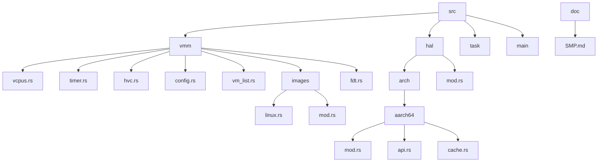
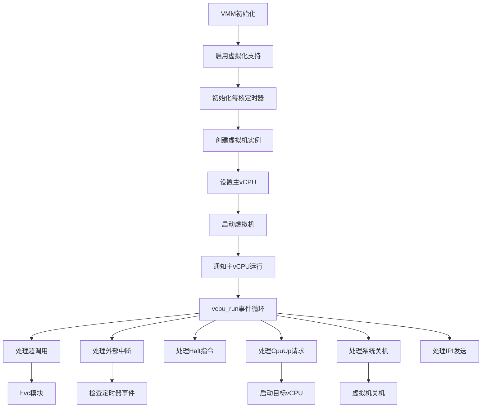
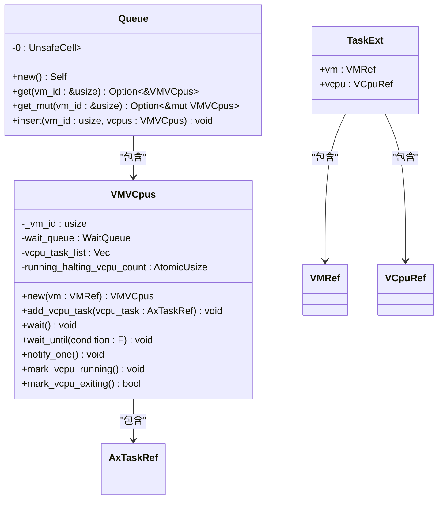
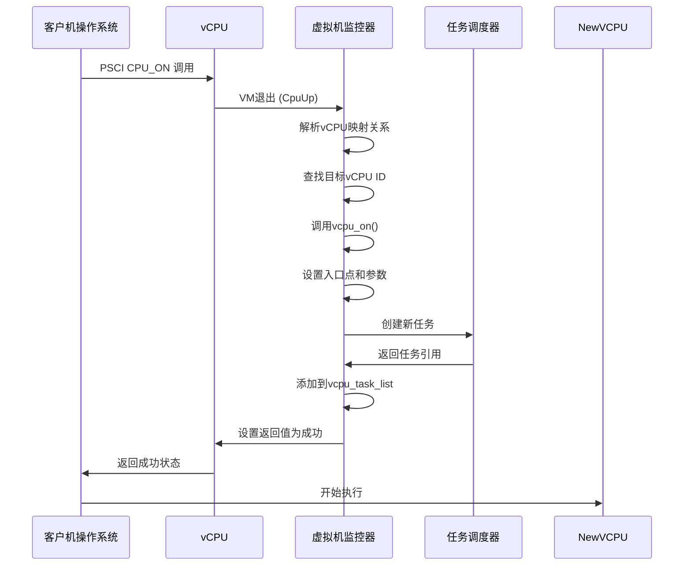

# vCPU管理

<cite>
**本文档中引用的文件**
- [vcpus.rs](file://src/vmm/vcpus.rs)
- [SMP.md](file://doc/SMP.md)
- [timer.rs](file://src/vmm/timer.rs)
- [hvc.rs](file://src/vmm/hvc.rs)
- [main.rs](file://src/main.rs)
- [mod.rs](file://src/vmm/mod.rs)
- [config.rs](file://src/vmm/config.rs)
- [vm_list.rs](file://src/vmm/vm_list.rs)
- [task.rs](file://src/task.rs)
- [hal/mod.rs](file://src/hal/mod.rs)
- [arch/aarch64/mod.rs](file://src/hal/arch/aarch64/mod.rs)
- [arch/aarch64/api.rs](file://src/hal/arch/aarch64/api.rs)
- [images/linux.rs](file://src/vmm/images/linux.rs)
- [images/mod.rs](file://src/vmm/images/mod.rs)
- [fdt.rs](file://src/vmm/fdt.rs)
</cite>

## 目录
1. [引言](#引言)
2. [项目结构](#项目结构)
3. [核心组件](#核心组件)
4. [架构概述](#架构概述)
5. [详细组件分析](#详细组件分析)
6. [依赖分析](#依赖分析)
7. [性能考虑](#性能考虑)
8. [故障排除指南](#故障排除指南)
9. [结论](#结论)

## 引言
本文档深入解析axvisor中vCPU管理子系统的架构设计与实现细节。重点阐述vcpus.rs中vCPU抽象的创建过程，包括VCpuRef智能指针的封装、寄存器上下文保存与恢复机制，以及基于Rust任务调度器的任务绑定逻辑。详细描述单核与多核（SMP）模式下的启动流程差异，结合SMP.md文档说明多vCPU如何通过PSCI接口协同启动，以及主从核初始化顺序控制。分析时间片调度与定时器中断（timer.rs）的集成方式，解释hvc层如何响应客户机的时间请求。通过代码示例展示vCPU进入/退出虚拟化模式的切换流程，特别是在aarch64平台下EL2异常向量表的使用。讨论SMP扩展性限制与缓存一致性挑战，并提供调试多核死锁或启动失败的排查指南，例如检查GIC配置与启动IPI发送逻辑。

## 项目结构



**Diagram sources**
- [vcpus.rs](file://src/vmm/vcpus.rs)
- [SMP.md](file://doc/SMP.md)
- [timer.rs](file://src/vmm/timer.rs)
- [hvc.rs](file://src/vmm/hvc.rs)
- [main.rs](file://src/main.rs)
- [mod.rs](file://src/vmm/mod.rs)
- [config.rs](file://src/vmm/config.rs)
- [vm_list.rs](file://src/vmm/vm_list.rs)
- [task.rs](file://src/task.rs)
- [hal/mod.rs](file://src/hal/mod.rs)
- [arch/aarch64/mod.rs](file://src/hal/arch/aarch64/mod.rs)
- [arch/aarch64/api.rs](file://src/hal/arch/aarch64/api.rs)
- [images/linux.rs](file://src/vmm/images/linux.rs)
- [images/mod.rs](file://src/vmm/images/mod.rs)
- [fdt.rs](file://src/vmm/fdt.rs)

**Section sources**
- [vcpus.rs](file://src/vmm/vcpus.rs)
- [SMP.md](file://doc/SMP.md)
- [timer.rs](file://src/vmm/timer.rs)
- [hvc.rs](file://src/vmm/hvc.rs)
- [main.rs](file://src/main.rs)
- [mod.rs](file://src/vmm/mod.rs)
- [config.rs](file://src/vmm/config.rs)
- [vm_list.rs](file://src/vmm/vm_list.rs)
- [task.rs](file://src/task.rs)
- [hal/mod.rs](file://src/hal/mod.rs)
- [arch/aarch64/mod.rs](file://src/hal/arch/aarch64/mod.rs)
- [arch/aarch64/api.rs](file://src/hal/arch/aarch64/api.rs)
- [images/linux.rs](file://src/vmm/images/linux.rs)
- [images/mod.rs](file://src/vmm/images/mod.rs)
- [fdt.rs](file://src/vmm/fdt.rs)

## 核心组件

vCPU管理子系统是axvisor虚拟机监控器的核心组成部分，负责虚拟CPU的生命周期管理、上下文切换、中断处理和多核协调。该系统通过`VCpuRef`智能指针封装vCPU实例，利用Rust的任务调度机制将每个vCPU绑定到独立的任务中执行。系统在初始化阶段通过`setup_vm_primary_vcpu`函数为每个虚拟机设置主vCPU，并通过`alloc_vcpu_task`函数分配内核栈和任务扩展数据。vCPU的运行由`vcpu_run`函数驱动，该函数实现了事件循环，处理超调用、外部中断、Halt指令等各种VM退出原因。

**Section sources**
- [vcpus.rs](file://src/vmm/vcpus.rs#L1-L506)
- [mod.rs](file://src/vmm/mod.rs#L1-L127)
- [task.rs](file://src/task.rs#L1-L19)

## 架构概述



**Diagram sources**
- [main.rs](file://src/main.rs#L1-L37)
- [mod.rs](file://src/vmm/mod.rs#L1-L127)
- [vcpus.rs](file://src/vmm/vcpus.rs#L1-L506)
- [timer.rs](file://src/vmm/timer.rs#L1-L113)
- [hvc.rs](file://src/vmm/hvc.rs#L1-L148)

## 详细组件分析

### vCPU抽象与VCpuRef封装

vCPU抽象通过`VCpuRef`类型实现，这是一个引用计数的智能指针，封装了底层的vCPU状态和操作。每个vCPU实例都关联一个独立的Rust任务，通过`alloc_vcpu_task`函数创建。任务扩展数据`TaskExt`包含了对所属虚拟机和vCPU的引用，使得在任务执行上下文中可以方便地访问这些资源。物理CPU亲和性通过`phys_cpu_set`配置项设置，确保vCPU被调度到指定的物理核心上运行。



**Diagram sources**
- [vcpus.rs](file://src/vmm/vcpus.rs#L1-L506)
- [task.rs](file://src/task.rs#L1-L19)

**Section sources**
- [vcpus.rs](file://src/vmm/vcpus.rs#L1-L506)
- [task.rs](file://src/task.rs#L1-L19)

### 寄存器上下文保存与恢复机制

vCPU的寄存器上下文管理由底层虚拟化库`axvm`负责，在vCPU进入和退出虚拟化模式时自动完成。当发生VM退出时，硬件会自动保存客户机的寄存器状态，然后跳转到监控器的异常处理程序。在aarch64平台上，这涉及到EL2异常向量表的使用，异常向量指向特定的处理程序来处理不同类型的VM退出事件。寄存器状态的恢复发生在vCPU重新进入客户机模式时，由硬件自动完成。

**Section sources**
- [arch/aarch64/mod.rs](file://src/hal/arch/aarch64/mod.rs#L1-L154)
- [arch/aarch64/api.rs](file://src/hal/arch/aarch64/api.rs#L1-L75)

### 基于Rust任务调度器的任务绑定逻辑

vCPU任务绑定逻辑充分利用了ArceOS的Rust任务调度器特性。每个vCPU都被封装为一个独立的任务，通过`axtask::spawn_task`创建。任务的CPU亲和性通过`set_cpumask`方法设置，确保vCPU被绑定到指定的物理核心上。这种设计避免了vCPU在不同物理核心间的迁移，简化了中断虚拟化的实现。任务的入口函数是`vcpu_run`，它实现了vCPU的主要执行循环。

**Section sources**
- [vcpus.rs](file://src/vmm/vcpus.rs#L1-L506)
- [hal/mod.rs](file://src/hal/mod.rs#L1-L282)

### 单核与多核（SMP）模式启动流程

单核模式下，只有主vCPU（ID为0）被初始化并启动。多核模式下，主vCPU首先启动，然后通过PSCI（Power State Coordination Interface）服务处理来自客户机的`CpuUp`请求来启动从vCPU。`vcpu_run`函数中的`AxVCpuExitReason::CpuUp`分支处理这一过程，调用`vcpu_on`函数为目标vCPU设置入口点和参数，然后将其添加到任务列表中等待调度。



**Diagram sources**
- [vcpus.rs](file://src/vmm/vcpus.rs#L1-L506)
- [SMP.md](file://doc/SMP.md#L1-L77)

**Section sources**
- [vcpus.rs](file://src/vmm/vcpus.rs#L1-L506)
- [SMP.md](file://doc/SMP.md#L1-L77)

### 时间片调度与定时器中断集成

时间片调度通过`timer.rs`模块实现，该模块提供了基于每核定时器的事件调度机制。`check_events`函数在每次外部中断后被调用，检查是否有到期的定时器事件。虚拟机监控器使用`register_timer`函数注册周期性或一次性定时器，当定时器到期时触发相应的回调函数。客户机的时间请求通过超调用机制处理，由`hvc`模块中的相应处理器响应。

**Section sources**
- [timer.rs](file://src/vmm/timer.rs#L1-L113)
- [hvc.rs](file://src/vmm/hvc.rs#L1-L148)

### hvc层对客户机时间请求的响应

hvc（HyperVisor Call）层作为客户机与监控器之间的通信接口，处理各种超调用请求。对于时间相关的请求，虽然当前代码中没有直接实现，但框架已经准备好处理这类请求。超调用通过`AxVCpuExitReason::Hypercall`退出原因触发，`vcpu_run`函数将其分发给`HyperCall::execute`方法处理。不同的超调用代码对应不同的功能，如共享内存通道的发布与订阅等。

**Section sources**
- [hvc.rs](file://src/vmm/hvc.rs#L1-L148)
- [vcpus.rs](file://src/vmm/vcpus.rs#L1-L506)

### vCPU虚拟化模式切换流程

vCPU在客户机模式和监控器模式之间切换是通过硬件虚拟化扩展实现的。在aarch64平台上，这涉及到EL1（客户机内核）和EL2（监控器）之间的转换。当发生需要监控器介入的事件时（如超调用、外部中断），硬件自动从EL1切换到EL2，保存客户机状态并跳转到相应的异常向量。处理完成后，通过特定的返回指令恢复客户机状态并返回EL1继续执行。

**Section sources**
- [arch/aarch64/mod.rs](file://src/hal/arch/aarch64/mod.rs#L1-L154)
- [arch/aarch64/api.rs](file://src/hal/arch/aarch64/api.rs#L1-L75)

### SMP扩展性限制与缓存一致性挑战

当前实现中，由于缺乏中断虚拟化支持，每个vCPU都被固定绑定到特定的物理核心上，限制了调度灵活性。这种一对一绑定简化了实现，但牺牲了负载均衡能力。缓存一致性方面，系统依赖硬件的缓存一致性协议（如MESI），但在跨核通信时仍需注意内存屏障的使用。通过IPI（处理器间中断）机制实现核间通信，但目前`SendIPI`功能尚未完全实现。

**Section sources**
- [SMP.md](file://doc/SMP.md#L1-L77)
- [vcpus.rs](file://src/vmm/vcpus.rs#L1-L506)

## 依赖分析

```mermaid
graph LR
main[main.rs] --> vmm[mod.rs]
vmm --> vcpus[vcpus.rs]
vmm --> timer[timer.rs]
vmm --> hvc[hvc.rs]
vmm --> config[config.rs]
vmm --> vm_list[vm_list.rs]
vcpus --> axtask[axtask]
vcpus --> axvm[axvm]
vcpus --> axhal[axhal]
timer --> axhal[axhal]
timer --> timer_list[timer_list)
hvc --> axvm[axvm]
hvc --> ivc[ivc]
config --> vm_list[vm_list]
config --> images[images]
config --> fdt[fdt]
images --> linux[linux]
images --> fs[fs]
hal[hal/mod.rs] --> arch[arch/aarch64]
arch --> gic[GIC驱动]
```

**Diagram sources**
- [main.rs](file://src/main.rs#L1-L37)
- [mod.rs](file://src/vmm/mod.rs#L1-L127)
- [vcpus.rs](file://src/vmm/vcpus.rs#L1-L506)
- [timer.rs](file://src/vmm/timer.rs#L1-L113)
- [hvc.rs](file://src/vmm/hvc.rs#L1-L148)
- [config.rs](file://src/vmm/config.rs#L1-L284)
- [vm_list.rs](file://src/vmm/vm_list.rs#L1-L116)
- [images/mod.rs](file://src/vmm/images/mod.rs#L1-L337)
- [hal/mod.rs](file://src/hal/mod.rs#L1-L282)
- [arch/aarch64/mod.rs](file://src/hal/arch/aarch64/mod.rs#L1-L154)

**Section sources**
- [main.rs](file://src/main.rs#L1-L37)
- [mod.rs](file://src/vmm/mod.rs#L1-L127)
- [vcpus.rs](file://src/vmm/vcpus.rs#L1-L506)
- [timer.rs](file://src/vmm/timer.rs#L1-L113)
- [hvc.rs](file://src/vmm/hvc.rs#L1-L148)
- [config.rs](file://src/vmm/config.rs#L1-L284)
- [vm_list.rs](file://src/vmm/vm_list.rs#L1-L116)
- [images/mod.rs](file://src/vmm/images/mod.rs#L1-L337)
- [hal/mod.rs](file://src/hal/mod.rs#L1-L282)
- [arch/aarch64/mod.rs](file://src/hal/arch/aarch64/mod.rs#L1-L154)

## 性能考虑
vCPU管理子系统的性能关键在于最小化VM退出的开销。频繁的VM退出会严重影响客户机性能，因此应尽量减少不必要的退出事件。定时器中断的处理应尽可能高效，避免在中断上下文中执行耗时操作。多核场景下，应合理分配vCPU到物理核心，避免资源争用。内存访问模式也会影响性能，应确保vCPU访问的内存区域具有良好的局部性。

## 故障排除指南

### 多核死锁排查
多核死锁通常表现为某些vCPU无法启动或卡在初始化阶段。检查步骤包括：
1. 确认GIC（通用中断控制器）配置正确，特别是VGIC（虚拟GIC）的初始化
2. 检查启动IPI（处理器间中断）的发送逻辑，确保主vCPU能正确通知从vCPU
3. 验证物理CPU亲和性设置，确保没有两个vCPU被分配到同一个物理核心
4. 检查`phys_cpu_sets`配置项，确保位图设置正确

### 启动失败排查
启动失败可能由多种原因引起：
1. 检查客户机镜像是否正确加载到内存指定位置
2. 验证DTB（设备树二进制）文件是否包含正确的CPU节点信息
3. 确认PSCI服务已正确实现并能处理CPU_ON请求
4. 检查内存映射，确保vCPU能访问必要的内存区域

**Section sources**
- [SMP.md](file://doc/SMP.md#L1-L77)
- [vcpus.rs](file://src/vmm/vcpus.rs#L1-L506)
- [config.rs](file://src/vmm/config.rs#L1-L284)
- [fdt.rs](file://src/vmm/fdt.rs#L1-L97)

## 结论
axvisor的vCPU管理子系统通过精巧的设计实现了高效的虚拟CPU管理。系统利用Rust语言的安全特性和ArceOS的异步任务模型，构建了一个可靠且高性能的vCPU执行环境。单核和多核模式的支持使得系统能够运行各种复杂的工作负载。尽管当前存在一些限制，如缺乏灵活的vCPU调度和完整的中断虚拟化，但整体架构为未来的功能扩展奠定了坚实的基础。通过深入理解本系统的实现细节，开发者可以更好地优化虚拟机性能并解决复杂的并发问题。