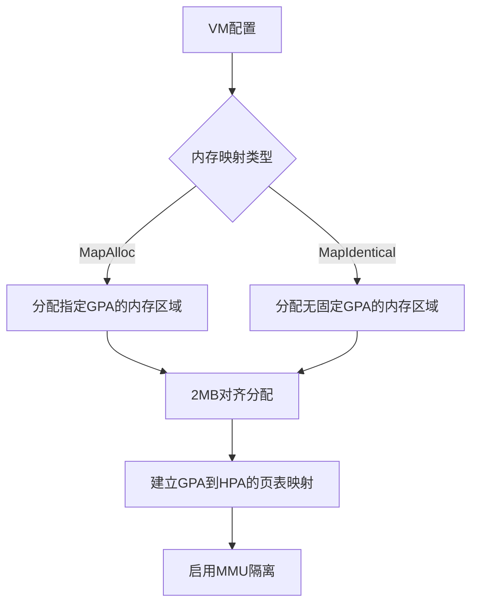
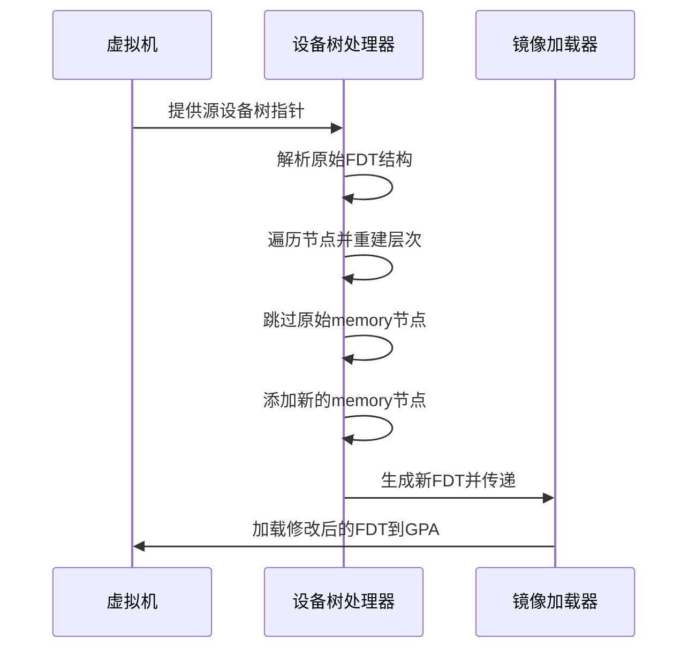
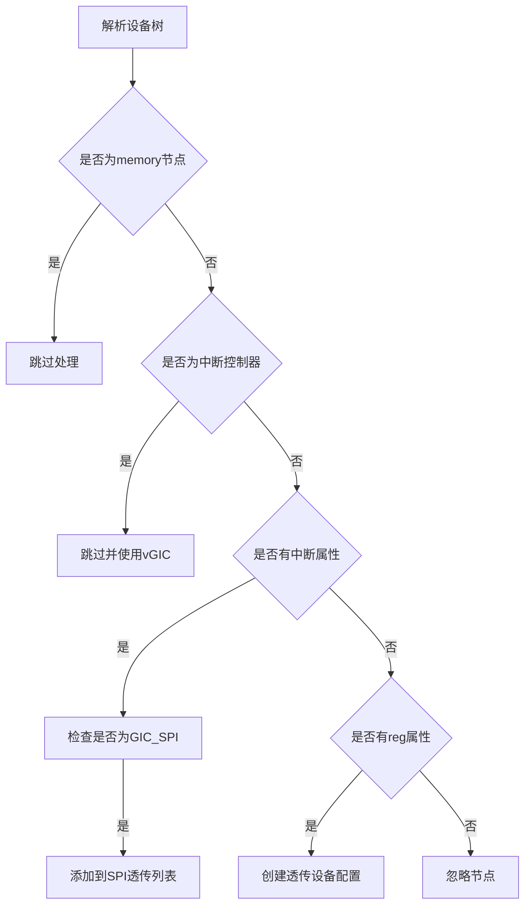
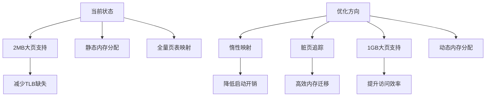

# 内存与设备管理

<cite>
**本文档引用文件**  
- [fdt.rs](file://src/vmm/fdt.rs)
- [linux.rs](file://src/vmm/images/linux.rs)
- [config.rs](file://src/vmm/config.rs)
- [mod.rs](file://src/vmm/mod.rs)
- [main.rs](file://src/main.rs)
</cite>

## 目录
1. [内存区域分配机制](#内存区域分配机制)
2. [设备树动态构建与修改](#设备树动态构建与修改)
3. [设备透传实现路径](#设备透传实现路径)
4. [FDT节点操作序列](#fdt节点操作序列)
5. [常见错误解决方案](#常见错误解决方案)
6. [内存性能优化方向](#内存性能优化方向)

## 内存区域分配机制

axvisor的内存虚拟化通过客户机物理地址空间（GPA）的精确规划和页表映射策略实现。系统在初始化阶段根据VM配置创建内存区域，采用`MapAlloc`和`MapIdentical`两种映射类型。

`MapAlloc`模式为虚拟机分配独立的内存区域，并指定具体的GPA地址；`MapIdentical`模式则允许虚拟机使用主机物理地址相同的内存映射。所有内存分配均以2MB对齐，确保大页支持的有效性。

MMU隔离通过硬件辅助虚拟化技术保障，利用ARM架构的二级转换（Stage 2 Translation）机制，将客户机物理地址（GPA）转换为主机物理地址（HPA），实现了严格的地址空间隔离。



**Section sources**
- [config.rs](file://src/vmm/config.rs#L264-L283)

## 设备树动态构建与修改

设备树（FDT）的动态构建是axvisor设备虚拟化的关键环节。系统通过`updated_fdt`函数处理原始设备树，在保留原有结构的基础上进行必要的修改。

流程首先解析源设备树，遍历所有节点并重建节点层次结构。在此过程中，原有的"memory"节点被跳过，因为内存区域信息将根据VM的实际配置重新生成。其他所有节点及其属性都被完整保留，确保了设备树的兼容性。

内核镜像加载时的FDT注入过程由`load_vm_image_from_memory`完成。修改后的设备树被加载到预分配的客户机物理地址中，作为启动参数传递给客户机操作系统。



**Diagram sources**
- [fdt.rs](file://src/vmm/fdt.rs#L40-L96)
- [config.rs](file://src/vmm/config.rs#L139-L162)

**Section sources**
- [fdt.rs](file://src/vmm/fdt.rs#L40-L96)
- [linux.rs](file://src/vmm/images/linux.rs)

## 设备透传实现路径

设备透传机制允许虚拟机直接访问特定的物理设备，提升I/O性能。实现路径包括I/O内存区域映射、中断控制器（GIC）虚拟化及IRQ重定向。

在VM配置阶段，通过`parse_vm_dtb`函数分析设备树中的设备节点。对于reg属性定义的内存映射设备，系统创建`PassThroughDeviceConfig`配置，记录设备名称、基地址和长度。这些配置最终被添加到VM的透传设备列表中。

GIC虚拟化通过拦截和重定向中断实现。系统识别设备树中的中断控制器节点并跳过，改用虚拟GIC（vGIC）。当检测到GIC_SPI类型的中断时，相应的中断ID被添加到透传SPI列表中，实现中断的直接传递。



**Diagram sources**
- [config.rs](file://src/vmm/config.rs#L139-L201)
- [mod.rs](file://src/vmm/mod.rs)

**Section sources**
- [config.rs](file://src/vmm/config.rs#L139-L201)

## FDT节点操作序列

FDT节点的操作遵循严格的序列化流程，确保设备树结构的完整性。操作从根节点开始，逐级建立子节点栈来维护层次关系。

当进入新节点时，调用`begin_node`并将返回的节点句柄压入栈中。处理完节点的所有属性后，继续处理其子节点。当层级下降时，从当前层级到目标层级之间的所有节点都会被依次关闭，调用`end_node`完成节点定义。

内存节点的特殊处理体现在最后阶段。当节点层级回退到1级时，在根节点下插入新的"memory"节点。该节点的reg属性包含所有内存区域的GPA和大小信息，以大端序32位整数数组形式存储。

```mermaid
flowchart LR
Start([开始]) --> ParseFDT["解析源FDT"]
ParseFDT --> LoopNodes["遍历所有节点"]
LoopNodes --> CheckRoot{"是否为根节点?"}
CheckRoot --> |是| BeginRoot["begin_node(\"\")"]
CheckRoot --> |否| CheckMemory{"是否为memory节点?"}
CheckMemory --> |是| SkipNode["跳过"]
CheckMemory --> |否| HandleLevel["处理层级变化"]
HandleLevel --> BeginNode["begin_node(name)"]
BeginNode --> AddProps["添加所有属性"]
AddProps --> ContinueLoop["继续循环"]
ContinueLoop --> LoopNodes
LoopNodes --> EndCondition["循环结束"]
EndCondition --> CheckLevel{"层级==1?"}
CheckLevel --> |是| AddMemory["添加memory节点"]
CheckLevel --> |否| PopNode["弹出节点"]
PopNode --> EndNode["end_node()"]
EndNode --> CheckLevel
AddMemory --> FinishFDT["finish()"]
FinishFDT --> LoadImage["加载镜像"]
LoadImage --> End([结束])
```

**Diagram sources**
- [fdt.rs](file://src/vmm/fdt.rs#L40-L96)

**Section sources**
- [fdt.rs](file://src/vmm/fdt.rs#L40-L96)

## 常见错误解决方案

在设备树处理和内存分配过程中，可能遇到多种常见错误。地址冲突是最典型的问题，当设备树中定义的设备寄存器地址与已分配的内存区域重叠时，可能导致系统不稳定。

兼容性字符串不匹配问题通常发生在设备驱动与设备树节点的compatible属性不符时。解决方案是在设备树解析阶段严格验证compatible属性，或在虚拟化层提供兼容性适配。

对于中断配置错误，系统提供了详细的日志输出，包括中断类型、父节点和phandle信息。当检测到非GIC类型的中断或错误的phandle时，系统会发出警告，帮助开发者快速定位问题。

资源不足错误可通过合理的内存规划避免。建议在VM配置中预留足够的内存空间，并合理设置内存区域的对齐要求。

**Section sources**
- [config.rs](file://src/vmm/config.rs#L139-L201)
- [fdt.rs](file://src/vmm/fdt.rs)

## 内存性能优化方向

内存性能优化是axvisor持续改进的重点领域。当前实现已支持2MB大页，通过`ALIGN: usize = 2 * MB`的配置确保内存分配的大页对齐，减少TLB缺失。

惰性映射（Lazy Mapping）是一种潜在的优化方向，可以在实际访问时才建立页表映射，减少初始内存开销。这种机制特别适合内存密集型应用，在启动阶段只映射必要区域。

脏页追踪（Dirty Page Tracking）可用于高效的内存迁移和快照功能。通过监控页面的写入操作，系统可以精确识别被修改的内存区域，优化备份和同步过程。

未来扩展可考虑支持更多页大小选项，如1GB大页，进一步提升内存访问效率。同时，智能内存分配算法可以根据工作负载特征动态调整内存布局。



**Diagram sources**
- [config.rs](file://src/vmm/config.rs#L264-L283)
- [linux.rs](file://src/vmm/images/linux.rs#L105-L147)

**Section sources**
- [config.rs](file://src/vmm/config.rs#L264-L283)