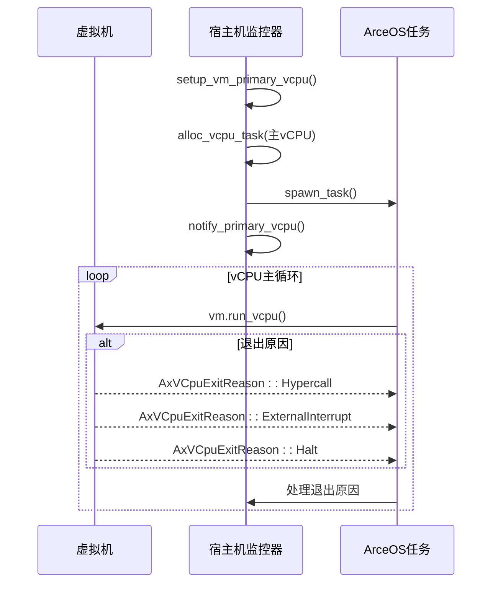
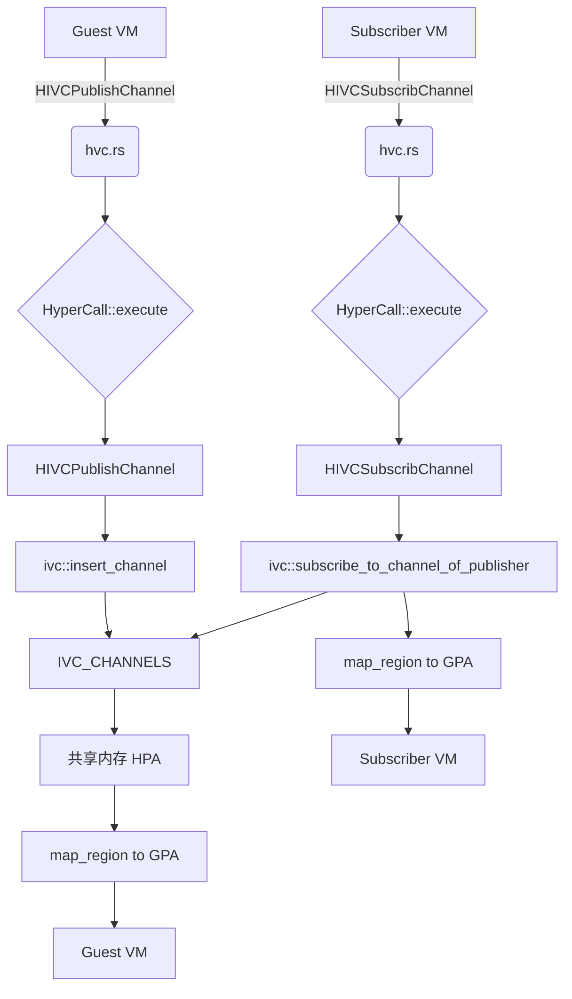

# 核心功能详解

<cite>
**本文档引用的文件**
- [vm_list.rs](file://src/vmm/vm_list.rs)
- [config.rs](file://src/vmm/config.rs)
- [vcpus.rs](file://src/vmm/vcpus.rs)
- [ivc.rs](file://src/vmm/ivc.rs)
- [hvc.rs](file://src/vmm/hvc.rs)
- [fdt.rs](file://src/vmm/fdt.rs)
- [mod.rs](file://src/vmm/mod.rs)
- [SMP.md](file://doc/SMP.md)
</cite>

## 目录
1. [虚拟机管理](#虚拟机管理)
2. [vCPU调度与SMP支持](#vcpu调度与smp支持)
3. [内存与设备处理](#内存与设备处理)
4. [通信机制](#通信机制)

## 虚拟机管理

axvisor的虚拟机（VM）生命周期管理通过`vm_list.rs`和`config.rs`模块实现。系统维护一个全局的`GLOBAL_VM_LIST`，使用`BTreeMap`以VM ID为键存储所有VM实例，确保线程安全访问。

虚拟机的创建流程始于`init_guest_vms()`函数，该函数解析TOML配置文件并初始化VM。首先，从静态配置中获取原始配置字符串，然后调用`AxVMCrateConfig::from_toml()`进行解析。接着，根据配置创建`VM`实例，并通过`push_vm()`将其添加到全局列表中。此过程还涉及内存分配、地址空间配置和镜像加载。

VM的启动由`vmm::start()`触发，遍历`get_vm_list()`返回的所有VM，调用其`boot()`方法，并通过`notify_primary_vcpu()`唤醒主vCPU任务。暂停和销毁操作则通过VM自身的状态管理和`shutdown()`方法实现，当所有VM退出后，VMM也随之终止。

**Section sources**
- [vm_list.rs](file://src/vmm/vm_list.rs#L0-L116)
- [config.rs](file://src/vmm/config.rs#L85-L179)
- [mod.rs](file://src/vmm/mod.rs#L91-L126)

## vCPU调度与SMP支持

vCPU的管理在`vcpus.rs`中实现，每个VM的vCPU被映射为ArceOS操作系统中的一个内核任务（`AxTaskRef`）。`setup_vm_primary_vcpu()`负责为主vCPU设置初始环境，包括创建`VMVCpus`结构体、分配任务并加入等待队列。

vCPU的调度基于事件驱动模型。`vcpu_run()`是vCPU任务的主循环，它首先等待VM进入运行状态，然后循环执行`vm.run_vcpu()`。当vCPU因超调用、外部中断或Halt指令等原因退出时，宿主机将根据`AxVCpuExitReason`进行相应处理。例如，收到`ExternalInterrupt`时会调用`axhal::irq::irq_handler`进行中断分发。

对于SMP多核支持，如`SMP.md`文档所述，每个vCPU通过`phys_cpu_sets`配置项绑定到特定的物理CPU核心上。`alloc_vcpu_task()`在创建任务时，会根据vCPU的`phys_cpu_set()`设置其CPU亲和性掩码（`AxCpuMask`），从而实现硬亲和性调度。次级vCPU的启动由`CpuUp`超调用触发，`vcpu_on()`函数会为目标vCPU创建新的任务并加入调度。

**Diagram sources**
- [vcpus.rs](file://src/vmm/vcpus.rs#L254-L300)
- [vcpus.rs](file://src/vmm/vcpus.rs#L329-L366)

**Section sources**
- [vcpus.rs](file://src/vmm/vcpus.rs#L72-L144)
- [vcpus.rs](file://src/vmm/vcpus.rs#L300-L335)
- [vcpus.rs](file://src/vmm/vcpus.rs#L395-L422)
- [SMP.md](file://doc/SMP.md#L57-L77)

## 内存与设备处理

内存管理方面，axvisor通过`vm_alloc_memorys()`函数为VM分配内存区域。这些区域可以是直接映射（`MapIdentical`）或独立分配（`MapAlloc`）。地址空间隔离通过硬件虚拟化技术（如ARM的Stage-2转换）实现，确保不同VM之间的内存互不干扰。

设备树（FDT）的动态修改是设备处理的核心。`updated_fdt()`函数会解析原始的DTB文件，跳过原有的"memory"节点，然后根据VM的实际内存布局调用`add_memory_node()`生成新的内存节点并重新注入。此外，`parse_vm_dtb()`还会扫描DTB中的设备节点，提取出需要透传的设备（如SPI中断和寄存器范围），并将它们添加到VM的配置中，以便后续进行直通处理。

**Section sources**
- [config.rs](file://src/vmm/config.rs#L199-L284)
- [fdt.rs](file://src/vmm/fdt.rs#L40-L96)
- [config.rs](file://src/vmm/config.rs#L41-L80)

## 通信机制

axvisor提供了两种核心通信机制：超调用（Hypercall）和跨虚拟机通信（IVC）。

### 超调用接口
超调用定义在`hvc.rs`中，作为Guest OS与VMM交互的主要方式。`HyperCall::execute()`方法根据`HyperCallCode`分发不同的请求。例如，`HIVCPublishChannel`用于发布一个共享内存通道，它会分配一个`IVCChannel`对象，并将其注册到全局的`IVC_CHANNELS`映射表中。

### IVC通道建立
IVC机制在`ivc.rs`中实现。`IVCChannel`结构体代表一个发布者-订阅者模式的共享内存通道。发布者调用`insert_channel()`注册通道，而订阅者通过`subscribe_to_channel_of_publisher()`加入。通道的共享内存区域在宿主机物理地址空间中分配，并通过`map_region()`映射到参与VM的客户机物理地址空间，实现高效的数据传输。

**Diagram sources**
- [hvc.rs](file://src/vmm/hvc.rs#L36-L68)
- [hvc.rs](file://src/vmm/hvc.rs#L104-L147)
- [ivc.rs](file://src/vmm/ivc.rs#L225-L284)

**Section sources**
- [hvc.rs](file://src/vmm/hvc.rs#L0-L148)
- [ivc.rs](file://src/vmm/ivc.rs#L0-L285)