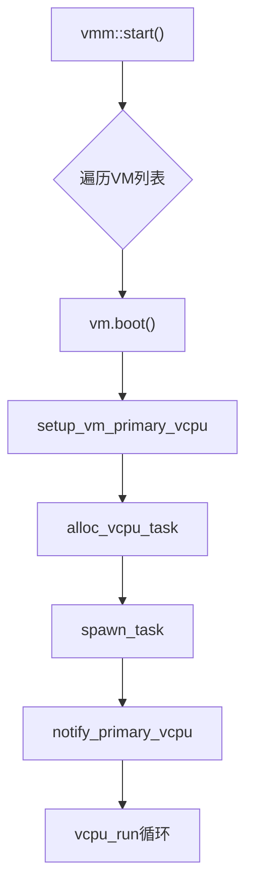
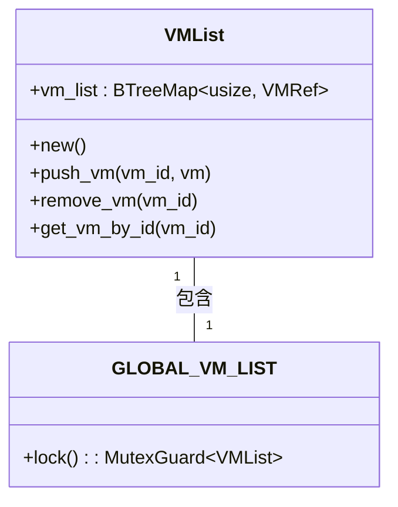
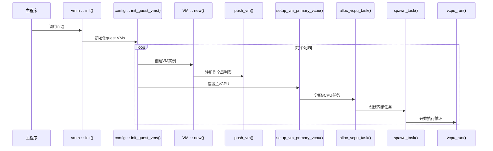

# 虚拟机管理

<cite>
**本文档中引用的文件**   
- [config.rs](file://src/vmm/config.rs)
- [vm_list.rs](file://src/vmm/vm_list.rs)
- [vcpus.rs](file://src/vmm/vcpus.rs)
- [mod.rs](file://src/vmm/mod.rs)
- [build.rs](file://build.rs)
- [arceos-aarch64-e2000-smp1.toml](file://configs/vms/arceos-aarch64-e2000-smp1.toml)
</cite>

## 目录
1. [引言](#引言)
2. [虚拟机生命周期](#虚拟机生命周期)
3. [配置解析机制](#配置解析机制)
4. [全局VM列表与索引管理](#全局vm列表与索引管理)
5. [VM启动流程调用链](#vm启动流程调用链)
6. [并发调度与资源管理](#并发调度与资源管理)
7. [异常处理策略](#异常处理策略)
8. [性能优化建议](#性能优化建议)
9. [结论](#结论)

## 引言
axvisor中的虚拟机管理模块实现了完整的虚拟机生命周期控制，涵盖从配置解析、实例创建、启动运行到最终销毁的全过程。该系统通过TOML配置文件定义虚拟机参数，利用全局VM列表进行实例管理，并通过任务调度机制实现多虚拟机并发执行。本文档深入分析其核心实现机制。

## 虚拟机生命周期

### 创建阶段：TOML配置解析为AxVMCrateConfig结构
虚拟机创建始于对TOML格式配置文件的解析过程。构建脚本`build.rs`在编译期读取由环境变量`AXVISOR_VM_CONFIGS`指定的配置文件路径，将其内容嵌入生成的`vm_configs.rs`中。运行时，`config.rs`中的`init_guest_vms`函数调用`AxVMCrateConfig::from_toml`将原始字符串解析为强类型的`AxVMCrateConfig`结构体实例，完成虚拟机初始配置的加载。

**Section sources**
- [build.rs](file://build.rs#L0-L309)
- [config.rs](file://src/vmm/config.rs#L43-L284)

### 启动阶段：调用vmm::start()初始化虚拟机环境
虚拟机启动由`vmm::start()`函数触发。该函数遍历全局VM列表，依次调用每个VM实例的`boot()`方法完成初始化。成功启动后，通过`notify_primary_vcpu`唤醒主vCPU任务，使其脱离等待状态并开始执行。此过程标志着虚拟机从静态配置转变为动态可执行实体。

**Diagram sources **
- [mod.rs](file://src/vmm/mod.rs#L47-L92)
- [vcpus.rs](file://src/vmm/vcpus.rs#L254-L298)

**Section sources**
- [mod.rs](file://src/vmm/mod.rs#L47-L92)

### 运行时状态维护：全局VM列表引用管理
所有活动虚拟机实例均注册于`vm_list.rs`中定义的全局`GLOBAL_VM_LIST`。该列表采用`spin::Mutex`保护的`BTreeMap<usize, VMRef>`结构，确保多线程访问的安全性。通过`push_vm`、`get_vm_by_id`和`remove_vm`等接口实现VM实例的增删查操作，构成整个系统运行时状态的核心数据结构。

**Section sources**
- [vm_list.rs](file://src/vmm/vm_list.rs#L0-L116)

### 销毁阶段：资源释放与内存回收
当虚拟机正常关闭或发生致命错误时，系统调用`vm.shutdown()`方法。该操作会触发vCPU退出循环，在`vcpu_run`函数中检测到`shutting_down()`状态后，逐步减少运行计数器`RUNNING_VM_COUNT`，最终通过`ax_wait_queue_wake`通知VMM主循环。相关内存区域和任务资源随后被自动回收。

**Section sources**
- [vcpus.rs](file://src/vmm/vcpus.rs#L395-L457)

## 配置解析机制

### config.rs中的配置加载逻辑
`config.rs`模块负责解析虚拟机配置参数。`init_guest_vms`函数首先获取`static_vm_configs()`返回的配置字符串数组，然后逐个解析为`AxVMCrateConfig`对象。关键参数如镜像路径、内存大小、vCPU数量等均从中提取。例如，`memory_regions`字段用于分配GPA空间，`cpu_num`决定vCPU数量，而`kernel_path`和`dtb_path`则指向固件映像位置。

### arceos-aarch64-e2000-smp1.toml配置映射关系
以`arceos-aarch64-e2000-smp1.toml`为例：
- `base.id = 2` 映射为VM唯一标识符
- `base.cpu_num = 1` 设置单核vCPU
- `memory_regions` 定义了起始地址`0x20_2000_0000`、大小`0x2000_0000`（512MB）的直通内存区域
- `kernel.kernel_path` 指定内核二进制文件路径
- `kernel.dtb_path` 提供设备树二进制文件路径

这些参数共同构成一个完整可用的虚拟机配置。

**Section sources**
- [config.rs](file://src/vmm/config.rs#L43-L284)
- [arceos-aarch64-e2000-smp1.toml](file://configs/vms/arceos-aarch64-e2000-smp1.toml#L0-L71)

## 全局VM列表与索引管理

### VM实例注册机制
新创建的VM实例通过`push_vm(vm: VMRef)`函数注册到全局列表。该函数内部调用`GLOBAL_VM_LIST.lock().push_vm(vm.id(), vm)`，先检查ID是否已存在（避免重复），再插入`BTreeMap`。若ID冲突，则记录警告并拒绝添加。

### 唯一ID索引查询
通过`get_vm_by_id(vm_id: usize)`接口可根据ID快速检索VM实例。底层使用`self.vm_list.get(&vm_id).cloned()`实现高效查找，返回`Option<VMRef>`类型结果，便于安全地处理不存在的情况。

**Diagram sources **
- [vm_list.rs](file://src/vmm/vm_list.rs#L0-L116)

**Section sources**
- [vm_list.rs](file://src/vmm/vm_list.rs#L0-L116)

## VM启动流程调用链

### 从配置解析到vCPU任务创建的关键调用序列
1. `vmm::init()` → `config::init_guest_vms()`：初始化所有VM
2. `VM::new(vm_config)`：创建VM实例
3. `push_vm(vm.clone())`：注册到全局列表
4. `vcpus::setup_vm_primary_vcpu(vm)`：设置主vCPU
5. `alloc_vcpu_task(vm, primary_vcpu)`：分配任务结构
6. `axtask::spawn_task(vcpu_task)`：启动内核任务
7. `vcpu_run()`：进入主执行循环

此链条完整展示了虚拟机从无到有的初始化过程。

**Diagram sources **
- [mod.rs](file://src/vmm/mod.rs#L0-L45)
- [config.rs](file://src/vmm/config.rs#L43-L284)
- [vcpus.rs](file://src/vmm/vcpus.rs#L254-L300)

**Section sources**
- [mod.rs](file://src/vmm/mod.rs#L0-L45)
- [config.rs](file://src/vmm/config.rs#L43-L284)
- [vcpus.rs](file://src/vmm/vcpus.rs#L254-L300)

## 并发调度与资源管理

### 多VM并发调度机制
系统通过`VM_VCPU_TASK_WAIT_QUEUE`为每个VM维护独立的`VMVCpus`结构，其中包含`WaitQueue`和`vcpu_task_list`。每个vCPU作为独立的`AxTaskRef`被调度器管理，支持跨物理CPU绑定（通过`set_cpumask`）。`RUNNING_VM_COUNT`原子计数器协调多个VM的生命周期同步。

### 资源分配与隔离
内存资源通过`vm.alloc_memory_region()`按布局分配；中断资源通过`add_pass_through_spi()`注册直通；设备I/O通过`emu_devices`和`passthrough_devices`列表配置。各VM间通过GPA空间划分实现资源隔离。

**Section sources**
- [vcpus.rs](file://src/vmm/vcpus.rs#L0-L506)
- [config.rs](file://src/vmm/config.rs#L200-L220)

## 异常处理策略

### 配置错误处理
- TOML语法错误：`parse::<Table>()`失败时直接panic
- 文件读取失败：构建脚本输出`compile_error!`
- 缺失必要字段：使用`?`操作符传播`Option`/`Result`

### 重复ID冲突
`push_vm`函数在插入前检查`contains_key(&vm_id)`，若存在则发出警告并返回，防止覆盖已有实例。

### 资源不足情况
- 内存分配失败：`alloc_memory_region`返回`Err`并在`expect`处panic
- 任务创建失败：`spawn_task`内部处理错误
- vCPU状态非法：`vcpu_on`使用`assert_eq!`强制校验

**Section sources**
- [vm_list.rs](file://src/vmm/vm_list.rs#L20-L30)
- [config.rs](file://src/vmm/config.rs#L43-L284)
- [vcpus.rs](file://src/vmm/vcpus.rs#L218-L225)

## 性能优化建议

### 减少锁竞争提升多VM并发效率
- **细粒度锁定**：当前`GLOBAL_VM_LIST`为全局大锁，可考虑分片锁或RCU机制降低争用。
- **无锁数据结构**：对于只读频繁的操作（如`get_vm_list`），可引入双缓冲或版本化机制。
- **批处理操作**：批量注册/注销VM以减少锁获取次数。
- **异步销毁**：延迟释放资源，避免在关键路径上长时间持锁。

这些改进将显著提升高密度虚拟机场景下的系统吞吐量。

## 结论
axvisor的虚拟机管理模块设计清晰、层次分明，完整实现了虚拟机的全生命周期管理。其基于TOML的配置体系灵活易用，全局列表机制保障了运行时状态的一致性，而任务驱动的vCPU模型则提供了良好的并发支持。未来可通过优化同步原语进一步提升大规模部署下的性能表现。