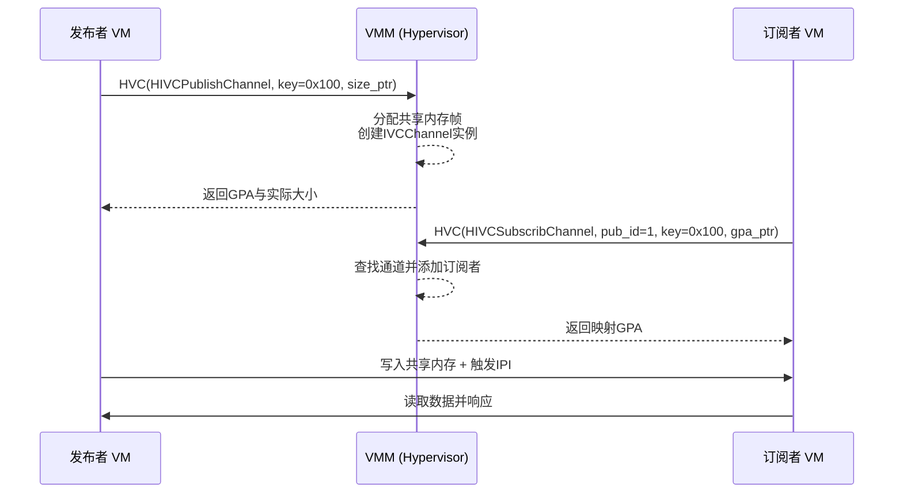

# 通信机制

<cite>
**本文档中引用的文件**
- [hvc.rs](file://src/vmm/hvc.rs)
- [ivc.rs](file://src/vmm/ivc.rs)
- [linux-aarch64-e2000-smp1.toml](file://configs/vms/linux-aarch64-e2000-smp1.toml)
- [arceos-aarch64-e2000-smp1.toml](file://configs/vms/arceos-aarch64-e2000-smp1.toml)
</cite>

## 目录
1. [引言](#引言)
2. [超调用（Hypercall）机制详解](#超调用hypercall机制详解)
3. [跨虚拟机通信（IVC）机制剖析](#跨虚拟机通信ivc机制剖析)
4. [点对点通信链路建立流程](#点对点通信链路建立流程)
5. [典型使用场景示例](#典型使用场景示例)
6. [安全与性能优化策略](#安全与性能优化策略)

## 引言
axvisor 提供了两类核心通信机制：超调用（Hypercall）和跨虚拟机通信（Inter-VM Communication, IVC），分别用于实现宿主机与虚拟机之间的控制交互以及多个虚拟机之间的高效数据交换。超调用作为 Host-VM 双向通信的桥梁，允许虚拟机通过特定指令请求宿主机执行特权操作；而 IVC 则基于共享内存环形缓冲区设计，支持低延迟、高吞吐量的 VM-to-VM 数据传输。本文将深入分析这两类机制的设计原理、实现细节及实际应用。

## 超调用（Hypercall）机制详解

`hvc.rs` 模块实现了 axvisor 的 HVC 接口，是宿主机与虚拟机之间进行双向通信的核心组件。当虚拟机需要执行某些无法在非特权级别完成的操作时（如获取系统信息、控制 VM 状态或注册共享内存通道），会触发一条特殊的异常指令（例如 AArch64 架构下的 `HVC` 指令）。该指令被捕获后，VMM 进入异常处理流程，解析寄存器中的调用号和参数，并分发至相应的处理函数。

### 主要 Hypercall 类型
根据代码实现，当前支持的主要 hypercall 类型包括：
- **HIVCPublishChannel**：发布一个 IVC 通信通道，由发布者 VM 分配共享内存区域并注册到全局通道表。
- **HIVCUnPublishChannel**：撤销已发布的 IVC 通道，释放相关资源。
- **HIVCSubscribChannel**：订阅另一个 VM 发布的 IVC 通道，建立本地映射以访问共享内存。
- **HIVCUnSubscribChannel**：取消对某个 IVC 通道的订阅。

这些 hypercall 类型构成了 IVC 机制的基础，使得 VM 间可以动态地建立和断开通信链路。

### 异常级别切换处理流程
在 AArch64 架构中，当 Guest VM 执行 `HVC #imm` 指令时，CPU 会从 EL1（Guest OS）陷入 EL2（Hypervisor）。这一过程由硬件自动完成，具体流程如下：
1. CPU 检测到 `HVC` 指令，触发异常。
2. 异常向量表跳转至 VMM 的异常处理入口。
3. VMM 保存当前上下文（vCPU 状态）。
4. 从 vCPU 寄存器中提取 hypercall 编号（通常为 X0/X16）和参数（X1-X7）。
5. 调用 `HyperCall::new()` 创建 hypercall 实例，并验证调用码合法性。
6. 执行 `hypercall.execute()` 分发至对应逻辑处理。
7. 将返回值写回 vCPU 寄存器（如 X0），恢复执行流。

此机制确保了从非特权环境到特权监控器的安全过渡，同时保持了良好的性能隔离性。

**Section sources**
- [hvc.rs](file://src/vmm/hvc.rs#L0-L148)
- [vcpus.rs](file://src/vmm/vcpus.rs#L368-L393)

## 跨虚拟机通信（IVC）机制剖析

`ivc.rs` 模块实现了基于共享内存的跨虚拟机通信机制。其核心思想是利用物理上连续的一段内存区域作为“共享通道”，并通过元数据结构管理生产者与消费者之间的同步关系。

### 共享内存环形缓冲区设计原理
IVC 通道采用固定大小的共享内存帧（目前限制为 4KB，即一页），其布局如下：
- **头部（Header）**：位于共享内存起始位置，包含 `publisher_id` 和 `key` 字段，用于标识通道归属。
- **数据区（Data Region）**：紧随头部之后，用于存放实际传输的消息帧。

该设计保证了跨 VM 映射的一致性和可寻址性。每个通道由唯一的 `(publisher_vm_id, key)` 组合索引，存储于全局 `IVC_CHANNELS` 静态哈希表中。

### 生产者-消费者同步机制
IVC 不依赖传统的信号量或锁机制，而是通过以下方式实现轻量级同步：
- **发布者（Publisher）**：调用 `HIVCPublishChannel` 分配共享内存帧，初始化通道头，并将其注册到全局表。
- **订阅者（Subscriber）**：调用 `HIVCSubscribChannel` 查询目标通道尺寸，分配本地 GPA 映射，并将自身 ID 和 GPA 记录在通道的 `subscriber_vms` 中。
- **数据写入/读取**：双方直接访问映射后的 GPA 地址空间进行读写，需外部协议保障顺序一致性（如轮询标志位或中断通知）。

当所有订阅者均取消订阅且通道被标记为未发布时，共享内存帧将被回收。

### 消息帧格式定义
虽然当前代码未显式定义消息帧格式，但可通过 `IVCChannelHeader` 推断出基础结构：
```rust
#[repr(C)]
struct IVCChannelHeader {
    publisher_id: u64,
    key: u64,
}
```
后续可在数据区自定义帧格式，例如添加长度前缀、校验和、时间戳等字段以支持更复杂的通信协议。

**Section sources**
- [ivc.rs](file://src/vmm/ivc.rs#L0-L285)

## 点对点通信链路建立流程

结合配置文件中 `enable_ivc` 字段的实际应用（尽管未直接出现在提供的 TOML 文件中，但从 hypercall 设计可推知其作用），两个 VM 建立点对点通信链路的完整步骤如下：

1. **配置启用 IVC 支持**  
   在目标 VM 的配置文件（如 `linux-aarch64-e2000-smp1.toml` 或 `arceos-aarch64-e2000-smp1.toml`）中声明启用 IVC 功能（假设存在类似 `enable_ivc = true` 的字段）。

2. **发布者 VM 创建通道**  
   - Guest 调用 `HVC` 指令，传入 `HIVCPublishChannel` 编号、唯一 `key`、共享内存大小地址指针。
   - VMM 分配一页物理内存作为共享区域，构造 `IVCChannel` 实例，设置头部信息。
   - 将通道映射至发布者 VM 的 GPA，并更新输出参数返回 GPA 和实际大小。

3. **订阅者 VM 加入通道**  
   - Guest 调用 `HVC` 指令，传入 `HIVCSubscribChannel` 编号、发布者 VM ID、`key` 及本地 GPA 指针。
   - VMM 查找全局通道表，验证存在性。
   - 分配本地 GPA 映射，指向同一物理页。
   - 将订阅者信息加入通道的 `subscriber_vms` 列表。

4. **通信就绪**  
   双方均可通过映射的 GPA 访问共享内存，开始数据交换。



**Diagram sources**
- [hvc.rs](file://src/vmm/hvc.rs#L36-L68)
- [ivc.rs](file://src/vmm/ivc.rs#L225-L284)

**Section sources**
- [hvc.rs](file://src/vmm/hvc.rs#L36-L147)
- [ivc.rs](file://src/vmm/ivc.rs#L72-L109)
- [ivc.rs](file://src/vmm/ivc.rs#L111-L147)
- [linux-aarch64-e2000-smp1.toml](file://configs/vms/linux-aarch64-e2000-smp1.toml)
- [arceos-aarch64-e2000-smp1.toml](file://configs/vms/arceos-aarch64-e2000-smp1.toml)

## 典型使用场景示例

### 宿主机监控代理
运行在专用轻量级 VM 中的监控代理可通过 IVC 通道接收来自其他 Guest VM 的性能指标（CPU 使用率、内存占用等），并通过超调用上报至 Host。由于通信路径绕过传统网络栈，显著降低了监控延迟。

### 实时数据交换服务
在自动驾驶或多传感器融合场景中，不同功能域的 VM（如感知、决策、控制）可通过预分配的 IVC 通道高速传递传感器数据或控制指令，满足毫秒级响应需求。

## 安全与性能优化策略

### 安全边界控制
- **通道命名空间隔离**：使用 `(publisher_vm_id, key)` 作为全局唯一标识，防止非法访问。
- **内存映射权限控制**：通过 `MappingFlags::READ | WRITE` 显式指定访问权限，避免执行或越权访问。
- **调用码合法性校验**：`HyperCall::new()` 对输入的 hypercall 编号进行枚举转换检查，拒绝无效调用。

### 消息完整性校验
虽然当前实现未内置校验机制，但可在应用层消息帧中加入 CRC32 或 SHA-256 哈希值，由收发双方验证数据完整性，防止共享内存被意外篡改。

### 性能瓶颈缓解策略
- **频繁上下文切换问题**：  
  当前基于轮询的通信模式可能导致不必要的 CPU 占用。可通过引入中断机制（如虚拟 IRQ）替代轮询，在有新数据到达时主动通知接收方，减少空转消耗。
- **共享内存竞争**：  
  多个订阅者同时写入可能引发冲突。建议采用单生产者-多消费者模型，或引入轻量级无锁队列（如 SPSC ring buffer）提升并发效率。
- **内存拷贝开销**：  
  当前设计虽避免了数据复制，但仍受限于单页大小（4KB）。未来可通过支持多页连续分配（`alloc_frames` API）扩展通道容量，适应大数据量传输需求。

**Section sources**
- [hvc.rs](file://src/vmm/hvc.rs#L0-L148)
- [ivc.rs](file://src/vmm/ivc.rs#L0-L285)