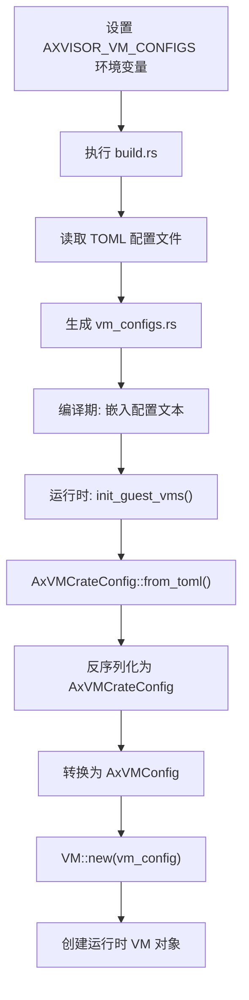

# 虚拟机配置

<cite>
**本文档引用文件**
- [linux-aarch64-qemu-smp1.toml](file://configs/vms/linux-aarch64-qemu-smp1.toml)
- [linux-qemu-aarch64-smp2.toml](file://configs/vms_bkp/linux-qemu-aarch64-smp2.toml)
- [defconfig.toml](file://configs/defconfig.toml)
- [config.rs](file://src/vmm/config.rs)
- [build.rs](file://build.rs)
</cite>

## 目录
1. [简介](#简介)
2. [虚拟机配置文件结构解析](#虚拟机配置文件结构解析)
3. [核心字段详解](#核心字段详解)
4. [命名规范演变与迁移指南](#命名规范演变与迁移指南)
5. [默认配置继承机制](#默认配置继承机制)
6. [配置加载与运行时实例化流程](#配置加载与运行时实例化流程)
7. [创建新虚拟机配置实战](#创建新虚拟机配置实战)
8. [结论](#结论)

## 简介
本章节深入解析`axvisor`中虚拟机（VM）的TOML配置系统，涵盖从文件结构、字段语义到运行时加载的完整生命周期。重点分析`configs/vms/`目录下针对ArceOS、Linux和Nimbos操作系统的配置实践，并结合源码揭示其背后的设计逻辑。

## 虚拟机配置文件结构解析

虚拟机配置文件采用TOML格式，主要分为三个逻辑区块：`[base]`、`[kernel]` 和 `[devices]`。

- **`[base]` 区块**：定义虚拟机的基础属性，如ID、名称、虚拟CPU数量等。
- **`[kernel]` 区块**：指定内核镜像、设备树（DTB）、内存区域等与启动相关的关键资源。
- **`[devices]` 区块**：描述传递给虚拟机的物理设备或模拟设备。

该结构清晰地分离了不同维度的配置，便于维护和扩展。

**Section sources**
- [linux-aarch64-qemu-smp1.toml](file://configs/vms/linux-aarch64-qemu-smp1.toml#L1-L69)

## 核心字段详解

### `kernel_image`
此字段在配置中体现为`kernel_path`，指定了客户操作系统内核二进制文件的路径。路径是相对于`configs/vms/`目录的相对路径。例如，在`linux-aarch64-qemu-smp1.toml`中，`kernel_path = "tmp/Image"` 表示内核位于`configs/vms/tmp/Image`。

### `rootfs`
虽然未在示例中直接出现，但可通过`disk_path`字段实现。该字段用于指定根文件系统的磁盘镜像路径，是客户机挂载根分区的基础。

### `vcpus`
对应`cpu_num`字段，定义了分配给虚拟机的虚拟CPU核心数。合法取值范围为正整数，且不应超过宿主机可用的物理CPU核心数及Hypervisor全局`smp`配置。

### `memory_mb`
内存大小由`memory_regions`数组中的`size`字段决定。例如`0x1000_0000`表示4GB。开发者需确保该值在宿主机物理内存范围内，并与其他虚拟机配置协调，避免资源冲突。

### `dtb_overlay`
通过`dtb_path`字段指定设备树二进制文件（DTB）的位置。该文件在启动时被加载到`dtb_load_addr`指定的地址，供客户机内核解析硬件拓扑。

### `serial_console`
串口控制台功能由`passthrough_devices`列表中的`pl011@9000000`条目实现。该条目将物理串口设备透传给虚拟机，使其能够进行输入输出。

**Section sources**
- [linux-aarch64-qemu-smp1.toml](file://configs/vms/linux-aarch64-qemu-smp1.toml#L15-L69)

## 命名规范演变与迁移指南

历史版本的配置文件存放在`configs/vms_bkp`目录中，其命名采用下划线分隔法（snake_case），如`linux-qemu-aarch64_smp2.toml`。现行规范已统一改为连字符分隔法（kebab-case），如`linux-aarch64-qemu-smp2.toml`。

这种变更旨在提高文件名的一致性和可读性。对于用户而言，迁移过程只需重命名文件并更新任何引用该文件的脚本或环境变量即可。建议使用以下命令批量转换：
```bash
for file in configs/vms_bkp/*_*.toml; do
    mv "$file" "$(echo $file | sed 's/_/-/g')"
done
```

**Section sources**
- [linux-aarch64-qemu-smp1.toml](file://configs/vms/linux-aarch64-qemu-smp1.toml#L1)
- [linux-qemu-aarch64-smp2.toml](file://configs/vms_bkp/linux-qemu-aarch64-smp2.toml#L1)

## 默认配置继承机制

`defconfig.toml`并非直接作为虚拟机的默认配置，而是影响Hypervisor的全局行为。它定义了如`smp`（CPU数量）和`ticks-per-sec`（定时器频率）等平台级参数。

当创建多个虚拟机时，这些全局配置会作为基础设置被所有虚拟机继承。然而，每个虚拟机的`.toml`文件可以覆盖这些设置。例如，即使`defconfig.toml`中`smp = 1`，一个特定的VM配置仍可设置`cpu_num = 2`来请求双核。

这种设计实现了“全局默认 + 局部覆盖”的灵活策略，既保证了配置的一致性，又允许针对特定场景进行优化。

**Section sources**
- [defconfig.toml](file://configs/defconfig.toml#L1-L11)
- [linux-aarch64-qemu-smp1.toml](file://configs/vms/linux-aarch64-qemu-smp1.toml#L15)

## 配置加载与运行时实例化流程

虚拟机配置的加载始于`build.rs`构建脚本。该脚本读取`AXVISOR_VM_CONFIGS`环境变量指定的配置文件路径，将其内容嵌入生成的`vm_configs.rs`中。

在运行时，`src/vmm/config.rs`中的`init_guest_vms`函数被调用。它首先通过`AxVMCrateConfig::from_toml`将TOML字符串反序列化为`AxVMCrateConfig`结构体实例。随后，该实例被转换为`AxVMConfig`，并最终用于创建`VM`对象。

整个流程如下所示：



**Diagram sources**
- [build.rs](file://build.rs#L1-L310)
- [config.rs](file://src/vmm/config.rs#L1-L285)

**Section sources**
- [build.rs](file://build.rs#L1-L310)
- [config.rs](file://src/vmm/config.rs#L1-L285)

## 创建新虚拟机配置实战

以下步骤演示如何为QEMU AArch64环境创建一个双核Linux虚拟机，并挂载额外磁盘镜像。

1.  **复制模板**：以`linux-aarch64-qemu-smp1.toml`为基础，复制并重命名为`linux-aarch64-qemu-smp2-custom.toml`。
2.  **修改基础信息**：
    ```toml
    [base]
    id = 2
    name = "linux-qemu-custom"
    cpu_num = 2
    ```
3.  **调整内核与内存**：根据需要更新`kernel_path`和`memory_regions`的大小。
4.  **添加磁盘设备**：在`[kernel]`区块中取消注释并设置`disk_path`：
    ```toml
    [kernel]
    disk_path = "tmp/custom_disk.img"
    ```
5.  **启用必要设备**：在`[devices]`的`passthrough_devices`中取消对`pl011@9000000`等设备的注释。
6.  **构建与运行**：设置`AXVISOR_VM_CONFIGS`指向新文件并重新构建项目。

此过程展示了配置系统的灵活性和可扩展性。

**Section sources**
- [linux-aarch64-qemu-smp1.toml](file://configs/vms/linux-aarch64-qemu-smp1.toml#L1-L69)

## 结论
`axvisor`的虚拟机配置系统通过结构化的TOML文件、清晰的命名规范和强大的运行时加载机制，为管理多客户机环境提供了坚实的基础。理解其核心字段、继承逻辑和加载流程，是高效利用该Hypervisor的关键。