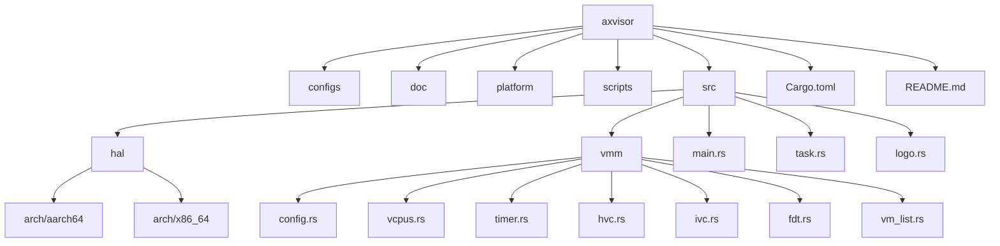
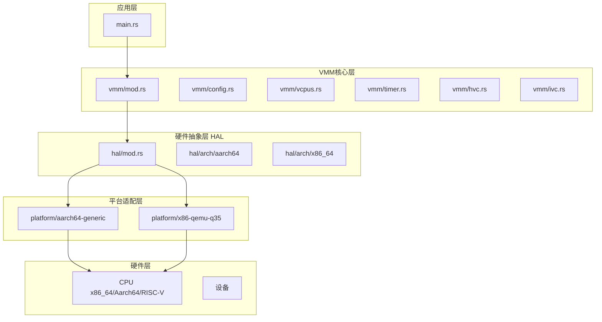
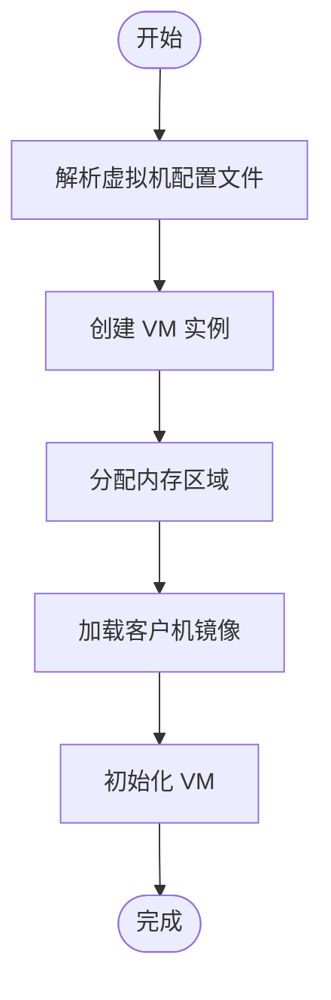
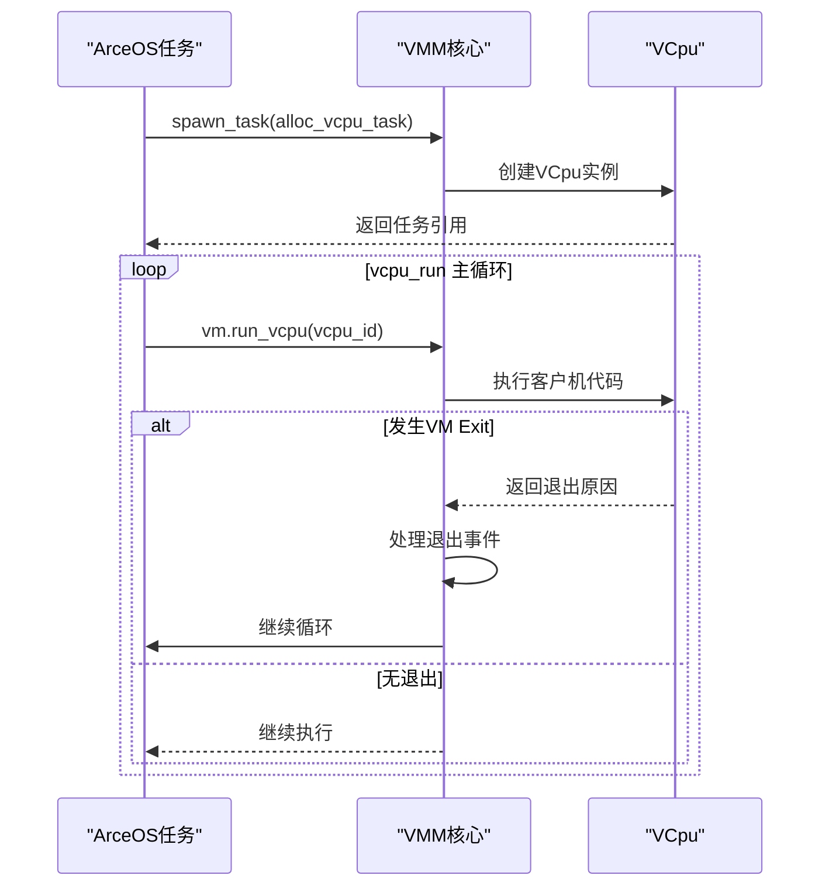
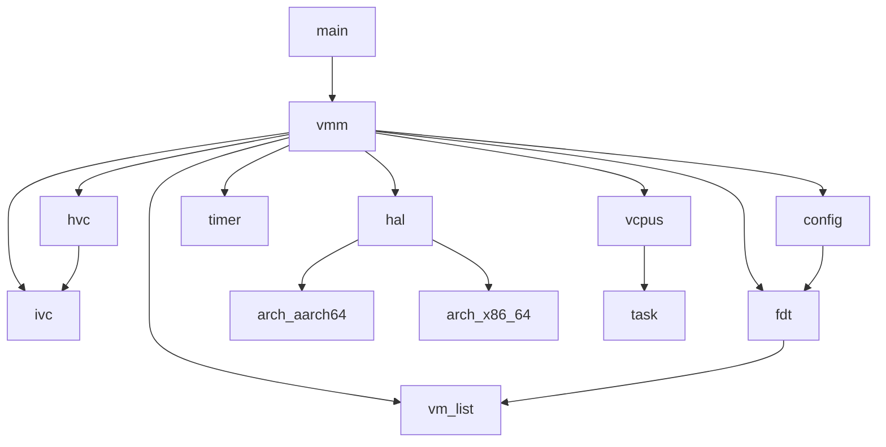

# 项目概述

<cite>
**本文档引用的文件**
- [main.rs](file://src/main.rs)
- [mod.rs](file://src/vmm/mod.rs)
- [hal/mod.rs](file://src/hal/mod.rs)
- [config.rs](file://src/vmm/config.rs)
- [linux.rs](file://src/vmm/images/linux.rs)
- [vcpus.rs](file://src/vmm/vcpus.rs)
- [timer.rs](file://src/vmm/timer.rs)
- [hvc.rs](file://src/vmm/hvc.rs)
- [ivc.rs](file://src/vmm/ivc.rs)
- [fdt.rs](file://src/vmm/fdt.rs)
- [vm_list.rs](file://src/vmm/vm_list.rs)
- [task.rs](file://src/task.rs)
- [logo.rs](file://src/logo.rs)
- [README.md](file://README.md)
</cite>

## 目录
1. [引言](#引言)
2. [项目结构](#项目结构)
3. [核心组件](#核心组件)
4. [架构概览](#架构概览)
5. [详细组件分析](#详细组件分析)
6. [依赖关系分析](#依赖关系分析)
7. [性能考量](#性能考量)
8. [故障排除指南](#故障排除指南)
9. [结论](#结论)

## 引言

AxVisor 是一个基于 ArceOS 单体内核框架实现的轻量级虚拟机监视器（Hypervisor）。其设计目标是利用 ArceOS 提供的基础操作系统功能，构建一个统一且模块化的 Hypervisor 系统。该项目旨在为嵌入式系统、操作系统研究以及资源受限环境提供高效的硬件虚拟化支持。

AxVisor 的核心哲学体现在“统一”与“模块化”两个方面。“统一”意味着使用同一套代码库支持三种主流架构：x86_64、Arm（aarch64）和 RISC-V，最大化地复用与架构无关的代码，简化开发和维护工作。“模块化”则指将 Hypervisor 的功能分解为多个独立可复用的组件，各组件通过标准化接口进行通信，实现解耦和高内聚。

本项目不仅服务于 ArceOS 操作系统的虚拟化需求，还支持运行其他操作系统如 Starry-OS、NimbOS 和 Linux 作为客户机。通过灵活的配置机制和强大的跨平台能力，AxVisor 成为了一个理想的虚拟化研究和教学平台。

## 项目结构

AxVisor 项目采用清晰的分层目录结构，便于管理和扩展。主要包含以下部分：

- `configs`：存放平台和虚拟机的 TOML 配置文件。
- `doc`：项目文档，包括使用说明和开发指南。
- `platform`：不同硬件平台的适配层实现。
- `scripts`：自动化构建和运行脚本。
- `src`：核心源代码，包含主程序、VMM 核心、硬件抽象层等。
- 根目录下的 `Cargo.toml`、`README.md` 等为项目元数据和入口脚本。



**图示来源**
- [main.rs](file://src/main.rs)
- [mod.rs](file://src/vmm/mod.rs)
- [hal/mod.rs](file://src/hal/mod.rs)

**本节来源**
- [README.md](file://README.md)

## 核心组件

AxVisor 的核心由应用层、VMM 核心层、硬件抽象层（HAL）和平台适配层构成。`main.rs` 作为程序入口，负责初始化日志、打印 Logo、检测硬件虚拟化支持并启用虚拟化功能。随后调用 VMM 层的 `init()` 和 `start()` 函数启动虚拟机管理流程。

VMM 核心层（`vmm/mod.rs`）定义了 VM、VCpu 等核心类型，并管理虚拟机的生命周期。它通过静态变量 `RUNNING_VM_COUNT` 跟踪正在运行的虚拟机数量，并在所有虚拟机退出后才终止 VMM 进程。

硬件抽象层（`hal/mod.rs`）为上层提供统一的硬件操作接口，屏蔽底层架构差异。它实现了 `AxVMHal` 和 `AxVCpuHal` 特性，处理物理到虚拟地址转换、时间获取、中断注入等关键操作。

**本节来源**
- [main.rs](file://src/main.rs#L0-L37)
- [mod.rs](file://src/vmm/mod.rs#L0-L127)
- [hal/mod.rs](file://src/hal/mod.rs#L0-L282)

## 架构概览

AxVisor 采用五层软件架构，从上至下分别为：应用层、VMM 核心层、硬件抽象层（HAL）、平台适配层和硬件层。各层之间通过明确定义的接口进行交互，确保了系统的模块化和可维护性。



**图示来源**
- [main.rs](file://src/main.rs)
- [mod.rs](file://src/vmm/mod.rs)
- [hal/mod.rs](file://src/hal/mod.rs)
- [platform/aarch64-generic](file://platform/aarch64-generic)
- [platform/x86-qemu-q35](file://platform/x86-qemu-q35)

## 详细组件分析

### VMM 初始化与配置分析

VMM 的初始化始于 `vmm::init()` 函数，该函数首先调用 `config::init_guest_vms()` 来解析配置文件并创建虚拟机实例。配置解析过程会读取静态或文件中的 TOML 配置，生成 `AxVMConfig` 对象，并根据设备树（DTB）信息自动添加直通设备和中断配置。



**图示来源**
- [config.rs](file://src/vmm/config.rs#L0-L284)

**本节来源**
- [config.rs](file://src/vmm/config.rs#L0-L284)
- [mod.rs](file://src/vmm/mod.rs#L0-L127)

### 虚拟 CPU (VCPU) 管理分析

VCPU 管理是 VMM 的核心功能之一。`vcpus.rs` 模块负责 VCpu 的创建、调度和状态管理。每个 VCpu 被封装为一个 ArceOS 任务（`AxTaskRef`），通过 `alloc_vcpu_task` 函数分配内核栈并设置入口函数为 `vcpu_run`。

`vcpu_run` 是 VCpu 任务的主循环，它不断调用 `vm.run_vcpu(vcpu_id)` 执行客户机代码，当发生 VM Exit 时，根据退出原因进行相应处理，如超调用（Hypercall）、外部中断、停机等。



**图示来源**
- [vcpus.rs](file://src/vmm/vcpus.rs#L0-L506)

**本节来源**
- [vcpus.rs](file://src/vmm/vcpus.rs#L0-L506)
- [mod.rs](file://src/vmm/mod.rs#L0-L127)

### 定时器与中断处理分析

定时器模块（`timer.rs`）为 VMM 提供了高精度的定时服务。它使用 per-CPU 的 `TimerList` 来管理定时器事件，并通过 `register_timer` 和 `cancel_timer` 接口供其他模块注册和取消定时器。

中断处理由 `hal` 层的 `irq_hanlder` 函数触发，最终调用 `axhal::irq::irq_handler` 进行处理。VCPU 在处理 `ExternalInterrupt` 退出时也会调用此函数。

```mermaid
classDiagram
class TimerList~VmmTimerEvent~ {
+set(deadline, event)
+expire_one(now)
+cancel(token)
}
class VmmTimerEvent {
-token : usize
-timer_callback : Box<dyn FnOnce(TimeValue)>
+callback(now)
}
class timer {
+register_timer(deadline, handler)
+cancel_timer(token)
+check_events()
+init_percpu()
}
TimerList~VmmTimerEvent~ <-- VmmTimerEvent : 包含
timer ..> TimerList~VmmTimerEvent~ : 使用
timer ..> VmmTimerEvent : 创建
```

**图示来源**
- [timer.rs](file://src/vmm/timer.rs#L0-L113)

**本节来源**
- [timer.rs](file://src/vmm/timer.rs#L0-L113)
- [hal/mod.rs](file://src/hal/mod.rs#L0-L282)

### 超调用 (Hypercall) 与 IVC 通信分析

超调用是客户机与 VMM 通信的主要方式。`hvc.rs` 模块实现了多种超调用命令，如 `HIVCPublishChannel` 和 `HIVCSubscribChannel`，用于建立虚拟机间的共享内存通信通道（IVC）。

IVC 模块（`ivc.rs`）使用全局的 `BTreeMap` 存储发布的通道，并管理发布者与订阅者的关系。通过共享内存页和元数据头，实现了高效安全的跨虚拟机通信。

```mermaid
flowchart LR
GuestA -- HIVCPublishChannel --> VMM
VMM -- 分配共享内存 --> Memory[(共享内存页)]
VMM -- 返回 GPA --> GuestA
GuestB -- HIVCSubscribChannel --> VMM
VMM -- 映射共享内存 --> GuestB
GuestA < --> |读写共享内存| GuestB
```

**图示来源**
- [hvc.rs](file://src/vmm/hvc.rs#L0-L148)
- [ivc.rs](file://src/vmm/ivc.rs#L0-L285)

**本节来源**
- [hvc.rs](file://src/vmm/hvc.rs#L0-L148)
- [ivc.rs](file://src/vmm/ivc.rs#L0-L285)

## 依赖关系分析

AxVisor 各组件间存在明确的依赖关系。VMM 核心层依赖于硬件抽象层（HAL）提供的底层服务，而 HAL 又依赖于具体的平台实现。虚拟机配置、VCPU 管理、定时器、超调用和 IVC 模块均属于 VMM 核心的一部分，它们相互协作共同完成虚拟化功能。



**图示来源**
- [main.rs](file://src/main.rs)
- [mod.rs](file://src/vmm/mod.rs)
- [hal/mod.rs](file://src/hal/mod.rs)

**本节来源**
- [main.rs](file://src/main.rs)
- [mod.rs](file://src/vmm/mod.rs)
- [hal/mod.rs](file://src/hal/mod.rs)

## 性能考量

AxVisor 在设计上注重性能优化。通过使用 Rust 语言的零成本抽象和所有权模型，避免了不必要的内存拷贝和运行时开销。per-CPU 数据结构（如 `AXVM_PER_CPU` 和 `TIMER_LIST`）减少了锁竞争，提高了多核环境下的并发性能。

IVC 通信机制直接使用物理内存映射，绕过了传统网络协议栈，实现了极低的通信延迟。同时，模块化的架构允许开发者根据具体应用场景裁剪不必要的功能，进一步减小系统开销。

## 故障排除指南

常见问题包括硬件虚拟化未启用、配置文件错误、镜像加载失败等。建议首先检查 CPU 是否支持虚拟化技术（VT-x/AMD-V 或 ARM Virtualization Extensions），并确保在 BIOS/UEFI 中已开启。

对于配置问题，应仔细核对 TOML 文件的语法和路径是否正确。镜像加载失败通常与内存分配或地址映射有关，可通过增加日志级别（`LOG=debug`）来获取更详细的调试信息。

**本节来源**
- [README.md](file://README.md)
- [main.rs](file://src/main.rs#L0-L37)
- [hal/mod.rs](file://src/hal/mod.rs#L0-L282)

## 结论

AxVisor 作为一个轻量级、模块化的 Hypervisor，成功地将 ArceOS 的优势与硬件虚拟化技术相结合。其统一的多架构支持和清晰的分层设计，使其成为一个强大且灵活的虚拟化平台。Rust 语言的安全特性从根本上保障了系统的可靠性和稳定性，为嵌入式虚拟化和操作系统研究提供了坚实的基础。未来的发展方向可能包括对更多硬件平台的支持、更高级的调度策略以及更完善的管理工具链。